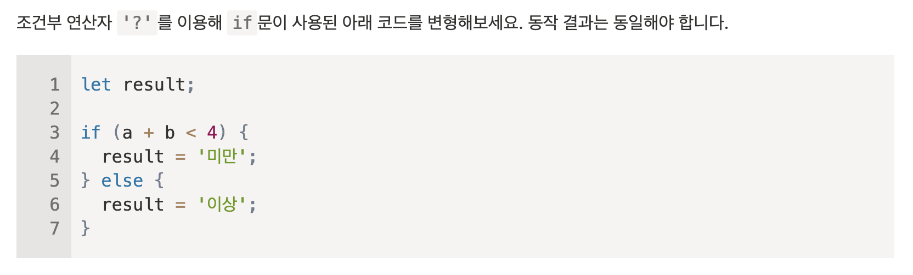

(모던 JavaScript에 [자바스크립트 기본 파트](https://ko.javascript.info/first-steps)에서 새롭게 알게 된 내용을 정리한 것입니다.)

## 2.1 Hello, world!

JavaScript 코드가 들어있는 script 태그는 HTML 문서 대부분의 위치에 들어갈 수 있다.
script 태그엔 type과 language라는 속성이 있다.

- type: HTML4 에선 스크립트에 JavaScript를 사용할 땐 type에 "text/javascript"를 명시해주는게 필수였으나 모던 HTML 표준에선 필요가 없어지 자바스크립트 모듈을 사용할 수 있도록 해주는 속성으로 의미가 바뀌었다.
- language: 현재 사용하는 스크립트 언어를 나타내면, 지금은 자바스크립트가 기본 언어이므로 쓸모 없어진 속성이다.

외부 JavaScript 파일을 불러올 땐 src 속성을 통해 불러올 수 있다.
이때 src 속성이 있는 script 태그 내부의 JavaScript 코드는 작동하지 않는다.

### 2.1 과제

1. [alert 창 띄우기](https://codesandbox.io/s/innerjavascript-y1ur6h?file=/index.html)
2. [외부 스크립트를 이용해 alert 창 띄우기](https://codesandbox.io/s/outerjavascript-u17o2n)

---

## 2.2 코드 구조

자바스크립트는 코드 뒤에 세미콜론을 생략할 수 있다. 그러나 세미콜론을 사용하는게 더 안전하다.
아래와 같은 코드를 가정해보면

```
alert("ASDF")
[1, 2].forEach(alert)
```

세미콜론이 각각 alert() 뒤에, .forEach() 뒤에 찍힐 것 같지만, 자바스크립트는 대괄호 앞에는 세미콜론이 없다고 판단하기 때문에 `alert()[].forEach()`가 되어 에러가 발생한다.

자바스크립트는 중첩 주석을 지워하지 않는다. 때문에 `/* /* 중첩된 주석 */ */` 코드는 에러가 발생한다.

---

## 2.3 엄격 모드

2009년에 ES5 버전이 발표되면서 새로운 기능이 추가되었고, 기존의 기능 중 일부가 변경되었다. 기존의 기능의 일부가 바꼈기에 호환성 문제가 발생할 수 있었기에 대부분 기본으로 ES5가 활성화 되지 않도록 설계되었다.
그래서 ES5를 활성화 하기 위해 `use strict` 라는 지시자를 통해 엄격 모드를 활성화 시켰을 때만 변경사항이 활성화되게 해놓았다.

최상단에 "use strict" / 'use strict' 문자열을 놓으면 활성화 되고, 특정 함수만 엄격모드로 활성화시키고 싶다면 함수 본문 맨 앞에 놓으면 된다.

```js
function f() {
  "use strict";
}
```

최상단이 아닌 위치에 놓았을 경우, 엄격 모드는 활성화되지 핞는다. 또한 엄격 모드를 다시 돌이키는 지시자는 없기 때문에 엄격 모드를 활성화시켰다면 최소시킬 수 없다.

코드내에서 클래스나 모듈을 사용하고 있다면 자동으로 use strict가 적용된다.

---

## 2.4 변수

자바스크립트에 변수명에는 하이폰(-)이 올 수 없고, 숫자가 먼저 올 수도 없다. 그외의 \$, \_는 사용할 수 있고 다양한 나라의 언어들 또한 사용할 수 있다.

`use strict`를 사용하지 않았을 땐 let 키워드 없이 파이썬 처럼 `num = 5`처럼 단순 할당으로 변수를 생성할 수 있었다.
이렇게 변수를 생성하는 것은 나쁜 관습이기에 엄격 모드에선 에러를 일으킨다.

const는 상수를 생성하는 키워드지만, 별칭을 만들 때도 사용한다. 별칭은 대문자와 언더바(\_)로 구성되어 있고 다음과 같이 쓸 수 있다.

```js
const COLOR_RED = "#F00";
```

이렇게 사용할 경우, 실수로 "#F00" 문자열을 잘못 적었을 때 일어나지 않는 에러를 변수명이 존재하지 않는다는 에러를 통해 확인할 수 있고, 가독성도 좋아지며 기억하기도 쉬워진다.

(대문자와 언더바(\_)로 구성된) 별칭과 일반 상수의 차이는 런타임 전에 이 값을 이미 알고 있느냐의 차이로 볼 수도 있다.
위에 COLOR_RED의 경우 해당 색상은 #F00이라는 것을 미리 알 수 있지만, 입력을 통해 받는 개개인의 고유 정보의 경우, 런타임 전까지는 알 수 없기 때문이다.

변수를 재사용보다는 새로 변수를 만드는 게 좋은 습관이다. 재사용을 하게 될 경우, 해당 변수에 무슨 값이 들어있는지 확인해야하고 디버깅에 더 많은 시간을 쏟을 수 있기 때문이다.

### 2.4 과제

1. [변수 가지고 놀기](https://codesandbox.io/s/playwithvariables-siu7ez?file=/index.html)
2. [올바른 이름 선택하기](https://codesandbox.io/s/selectcorrectname-7qp2f3?file=/index.html)
3. 대문자 상수 올바로 사용하기
   
   내 생각: ~~birthday와 age 둘다 대문자 상수로 바꾸는 것은 좋지 않은 선택이라고 생각한다. 대문자 상수는 별칭으로써 사용하는데 birthday 같은 경우, 사람마다 생일이 다 다르고 birthday 단어 하나만으로 봤을 때, 담고 있는 값이 무엇인지 알기 어렵기 때문에 대문자 상수로 사용하기 부적절하다고 생각한다. 같은 이유에서 age 또한 대문자 상수로 사용하면 안된다고 생각하며, 추가로~~ age는 런타임 중에 값이 할당되므로 더욱이 대문자 상수로 사용할 수 없다고 생각한다.
   (해답을 보니 birthday는 이미 값을 알고 있는 하드 코딩된 변수이기에 별칭으로 사용할 수 있다고 하네요.😅 많이 공부해야겠습니다)

---

## 2.5 자료형

JS에선 숫자형의 범위는 -(2^53 -1) (-9,007,199,254,740,991) 부터 2^53-1 (9,007,199,254,740,991) 사이로 이 외의 범위는 숫자형으로 표현할 수 없다.
이를 BigInt 자료형을 통해 해결할 수 있다.

BigInt는 크기에 상관없이 정수를 입력할 수 있는 표준으로 채택된 지 얼마 안 된 자료형이다. 숫자 뒤에 `n`을 붙여서 만들 수 있다.

이 외에도 JS에는 객체형과 심볼형이 존재한다.

변수의 자료형을 반환하는 typeof 연산자는 `typeof(x)`, `typeof x` 이렇게 두가지 형태로 사용할 수 있다.

### 2.5 과제

1. 문자열 따옴표
   
   각각 'hello 1', 'hello name', 'hello Ilya'가 출력될 것이다.

---

## 2.6 alert, prompt, confirm을 이용한 상호작용

- alert 함수는 확인을 누르기 전까지 메세지 창을 계속해서 띄운다.
  이때 나오는 창을 모달 창이라고도 부르는데 모달 창이 떴다면 확인 버튼을 누르기 전까지 바깥에 어떤 영역도 상호작용 할 수 없게 된다.

- prompt 함수는 입력 필드와 확인, 취소 버튼이 있는 모달 창을 띄운다.
  첫번째 인자에 사용자에게 보여줄 메세지, 두번째 인자에는 입력 필드의 기본값이 들어간다.
  이때 두번째 인자는 있어도 되고 없어도 되는 선택값인데 이를 표현할 땐 `prompt(title, [default])`처럼 대괄호로 묶어서 표현할 수 있다.<br>
  prompt는 사용자가 입력필드에 입력한 문자열을 반환한다. 만약 취소를 했을 경우엔 null을 반환한다.

- confirm 함수는 질문과 함께 확인, 취소 버튼이 달린 모달창을 띄운다.
  질문은 confirm 함수의 인자에 입력하면 되고 confirm은 확인을 눌렀을 땐 true, 그 외엔 false를 반환한다.

### 2.6 과제

1. [간단한 페이지 만들기](https://codesandbox.io/s/makeasimplepage-4qvrzy?file=/index.html)

---

## 2.7 형변환

형변환은 자료형 형태를 바꾸는 것을 의미하는데 형변환은 연산자나 함수에 의해 자동으로 형변환이 일어나기도 하고 명시적으로 형변환이 일어나기도 한다.

- 문자열로 변환
  String() 함수를 쓰면 인자에 값을 문자열로 변환해서 반환해준다.
  ```js
  // 예시
  String(false); // "false"
  String(null); // "null"
  ```
- 숫자로 변환
  "1" - "2" 나 "6" / "3" 같이 숫자를 뜻하는 문자열로 연산을 했을 때 자동으로 숫자로 형변환이 일어난다. 또는 Number() 함수를 이용하면 인자를 숫자형으로 바꾸어 반환해준다. 만약 숫자로 바꿀 수 없는 값이 Number() 함수의 인자로 들어가면 NaN이 반환된다.
  ```js
  // 예시
  Number("     123123   "); // 123123
  Number(true); // 1
  Number(false); // 0
  Number("1234V"); // NaN
  ```
- 불린형으로 변환
  간단하게 Boolean() 함수를 사용하여 인자에 따라 true, false를 반환하며,
  0, null, ""(빈문자열), undefined, NaN 인자값에는 false를 반환하고 그렇지 않다면 true를 반환한다.
  ```js
  // 예시
  Boolean([]); // true
  Boolean(""); // false
  ```

---

## 2.8 기본 연산자와 수학

연산자에는 피연산자를 하나만 받는 단항 연산자와 피연산자를 두개를 받는 이항 연산자가 있다.

단항 연산자

- \- (부호를 뒤집음)
- \+ (숫자형으로 바꿔줌)

이항 연산자

- \+ (덧셈)
- \- (뺄셈)
- \* (곱셈)
- / (나눗셈)
- % (나머지 연산)
- \*\* (거듭제곱)

이항 연산자 + 로 문자열을 연결할 수도 있다. 만약 문자열에 숫자를 더한다면 그 숫자는 자동으로 문자열로 변환된다.

```js
1 + "2"; // "12"
"3" + 4; // "34"
5 + 6 + "7"; // 117
```

위에 5 + 6 + "7"이 117이 나왔는데 이건 JS가 문자열 여부와 상관없이 앞에서부터 차례대로 연산을 수행했기 때문에
숫자 5 + 숫자 6은 숫자 11이 되고, 숫자 11 + 문자 7은 문자 117이 되어 저렇게 되는 것이다.

단항 연산자에 + 단항 연산자가 있는데 불린이나 문자 앞에 해당 연산자가 붙으면 숫자로 반환해주는 역할을 한다.

```js
+true + // 1
  "" + // 0
  "123"; // 123
```

때문에 문자 1과 문자 2를 숫자 연산으로 더할 때 길게 Number() 함수로 캐스팅할 필요 없이 \+ 단항 연산자를 사용할 수 있다.

```js
let a = "1",
  b = "2";
console.log(+a + +b); // 3
```

이게 가능한 것은 \+ 단항 연산자가 덧셈을 수행하는 \+ 이항 연산자보다 우선순위가 높기 때문이다.

할당 연산자 = 는 값을 변수에 값을 할당하는 것 외에도 그 값을 반환하는 역할도 가지고 있다.

```js
let a = 2,
  b;
let c = 1 + (b = a + 2);
b; // 4
c; // 5
```

먼저 괄호 안에 `b = a + 2`가 먼저 실행되기 때문에 변수 b에 a + 2의 값이 할당되는데, 할당 연산자는 그 값을 반환하는 하기 때문에 c에는 1 + a + 2가 할당이 된다.
따라서 b는 4, c는 5가 출력되는 것이다.
이런 방식은 코드의 가독성을 떨어뜨리기에 좋은 코드는 아니다.

할당 연산자는 여러 변수에 같은 값을 넣을 수 있게 여러개를 연결할 수도 있다.

```js
let a, b, c;
a = b = c = 7;
a; // 7;
b; // 7;
c; // 7;
```

얘 또한 가독성을 위해 여러줄로 나눠 쓰는 게 좋다.

쉼표 연산자는 여러 표현식을 코드 한 줄에 평가해주고, 마지막 평가를 반환하는 연산자이다.

```js
let a = (1 + 2, 3 + 4);
a; // 7
```

쉼표 연산자는 할당 연산자보다 우선순위가 낮기 때문에 괄호로 묶어줘야 한다. 그렇지 않다면 위 a 선언문은 `(a = 1 + 2), 3 + 4`처럼 연산이 된다.

쉼표 연산자는 코드 가독성에 도움이 되지 않지만 자바스크립트 여러 프레임워크에서 볼 수 있는 연산자이기에 알고 넘어가야 한다.

### 2.8 과제

1. 전위형과 후위형
   
   a = 2
   b = 2
   c = 2
   d = 1

2. 할당 후 결과 예측하기
   
   a = 4
   x = 5

3. 형변환
   

- 1. 1
- 2. -1
- 3. 1
- 4. 2
- 5. 6
- 6. "9px" (문자형)
- 7. "$45" (문자형)
- 8. 2
- 9. NaN
- 10. Infinity
- 11. " -9 5" (문자형)
- 12. -14
- 13. 1
- 14. 1
- 15. -2

4. 덧셈 고치기
   

```js
let a = prompt("덧셈할 첫 번째 숫자를 입력해주세요.", 1);
let b = prompt("덧셈할 두 번째 숫자를 입력해주세요.", 2);

alert(+a + +b);
```

alert내에 a, b앞에 단항 연산자 \+ 를 붙여 숫자형으로 변환한 후 덧셈 연산을 했다.

---

## 2.9 비교 연산자

자바스크립트는 비교하려는 값의 자료형이 다르면 이 값들을 숫자형으로 바꾼다.

```js
alert("2" > 1); // 2 > 1
alert("01" == 1); // 1 == 1
alert(true > 0.5); // 1 > 0.5
alert(false == ""); // 0 == 0
```

null과 undefined를 다른 값들과 비교할 땐 몇몇 규칙들이 있다.

```js
null == undefined; // true
```

### null vs 0

```js
null == 0; // false
null > 0; // false
null < 0; // false
null >= 0; // true
null <= 0; // true
```

이런 결과가 나오는 이유는 동등 연산자 `==`와 비교 연산자 `<`, `>`, `<=`, `>=`의 동작 방식이 다르기 때문이다.

`null > 0`, `null < 0`일 때 거짓을, `null >= 0`, `null <= 0`일 때 참을 반환하는 이유는 이때는 null이 숫자형 0으로 변환되기 때문이다.

그러나 `==` 동등 연산자를 사용하여 null이나 undefined를 연산할 땐 JS가 형변환을 하지 않기 false를 반환하는 것이다.

### 비교할 수 없는 undefined

```js
undefined == 0; // false
undefined > 0; // false
undefined < 0; // false
```

`undefined > 0` 또는 `undefined < 0` 에선 `undefined`는 NaN이 되어 false를 반환하게 된다.

`undefined == 0`에선 `undefined`는 null 또는 undefined 외엔 다르기 때문에 false를 반환한다.

### 2.9 과제

1. 비교
   

true<br>
false<br>
true<br>
true<br>
false<br>
false<br>
false<br>

---

## 2.10 if와 '?'를 사용한 조건 처리

0, ""(빈문자열), null, undefined, NaN 들은 if문의 조건문에 넣으면 JS가 false로 판단하는데 이런 값들을 falsy(거짓 같은) 값이라고 부른다.
그 외에 값들은 JS가 true로 인식하는데 이런 값들을 truthy(참 같은) 값이라고 한다.

삼항 연산자를 사용할 때 결과를 변수에 할당하지 않고, 결과에 따라 실행되는 표현식이 달라지게 하면 좋지 않은 코드가 된다.
예를 들어

```js
age > 18 ? alert("Welcome!") : alert("You can't drink beer");
```

위 같은 경우는 좋지 않은 코드이다.

코드를 읽을 때 우리 눈은 수직으로 움직이기 때문에 수평으로 길게 늘여진 코드보단 여러줄로 나뉘어져 작성된 코드가 가독성에 좋다.

또한 삼항 연산자는 조건에 따라 반환값을 달리하려는 목적으로 만들어졌기에 이에 맞게 사용해야한다.

(위 코드 같은 경우, if문을 사용하는게 더 적절하다.)

### 2.10 과제

1. if와 문자열 0
   

실행된다. 숫자 0이 실행이 안되지 문자열 0은 실행 안되지 않는다.

2. [자바스크립트의 공식 이름](https://codesandbox.io/s/javascriptofficialname-kmgs9n?file=/index.html)
   

3. [입력받은 숫자의 부호 표시하기](https://codesandbox.io/s/printsignofnumber-9x6s8l?file=/index.html)
   

4. 'if'를 '?'로 교체하기
   

```js
let result = a + b < 4 ? "미만" : "이상";
```

5. 'if..else'를 '?'로 교체하기
   

```js
let message =
  login == "직원"
    ? "안녕하세요."
    : login == "임원"
    ? "환영합니다."
    : login == ""
    ? "로그인이 필요합니다."
    : "";
```

---

## 2.11 논리 연산자

체인으로 연결된 &&는 먼저 나온 falsy 값을 반환하고, ||는 먼저 나온 truthy 값을 반환한다.
만약 해당하는 값이 없을 경우 마지막 값을 반환한다.

AND(&&)와 OR(||) 연산 중 AND 연산자가 OR 연산자보다 우선순위를 갖는다.
아래와 같은 코드는

```js
(a && b) || (c && d);
```

다음 코드와 같다.

```js
(a && b) || (c && d);
```

### 2.11 과제

1. 다음 OR 연산의 결과는 무엇일까요?
   
   2

2. OR 연산자의 피연산자가 alert 라면?
   
   alert()는 반환값이 없는 함수이므로 먼저 1이 출력된 후 2가 출력될 것이다.

3. 다음 AND 연산의 결과는 무엇일까요?
   
   null

4. AND 연산자의 피연산자가 alert 라면?
   
   1이 출력된 후 undefined가 출력될 것이다. && 뒤에 alert는 && 앞에 값이 truthy 값이어야 실행되므로 2는 출력되지 않는다.

5. OR AND OR 연산자로 구성된 표현식
   
   위 식은 `null || (2 && 3) || 4`로 볼 수 있고 `2 && 3`은 3을 반환하므로 `null || 3 || 4`가 돼고, || 는 첫번째 truthy 값을 반화하므로 최종적으로 3이 출력된다.

6. [사이 범위 확인하기](https://codesandbox.io/s/checkarangebetween-xz2pok?file=/index.html)
   

7. [바깥 범위 확인하기](https://codesandbox.io/s/checkaoutofrangebetween-x26fmt)
   

8. "if"에 대한 고찰
   
   첫번째 if에선 ||는 첫번째 truthy 값을 반환하므로 -1이 반환되고 first가 출력된다.
   두번째 if에선 &&는 첫번째 falsy 값을 반환하므로 0이 반환되고 second는 출력되지 않는다.
   세번째 if에선 &&가 ||보다 우선수위가 높으로 `null || (-1 && 1)`로 볼 수 있고 `-1 && 1`은 falsy값이 없으므로 1이 반환되므로 결국엔 `null || 1`이 된다. ||는 첫번째 truthy 값을 반환하므로 1이 반환되고 1은 truthy 값이므로 third가 출력된다.
   즉, first, third가 출력된다.

9. [로그인 구현하기](https://codesandbox.io/s/if-elselogin-507v25?file=/index.html)
   

---

## 2.12 nullish 병합 연산자 '??'

??는 이항 연산자로 `a ?? b`로 쓰이고 a가 null 또는 undefined면 b를, 그렇지 않다면 a를 반환하는 연산자이다.
때문에 ??는 변수에 기본값을 할당하는 용도로 쓰인다.

```js
// data가 없다면 더미 데이터로 초기화하고 그렇지 않다면 data로 초기화함
const listData = data ?? ["dummy1", "dummy2"];
```

??는 =와 삼항 연산자보다 우선순위가 높고 대부분의 연산자 보단 낮다.

??는 안정성의 이유로 &&와 || 연산자와 함께 사용할 수 없다.
이는 사람들이 ||를 ?? 연산자로 바꾸기 시작하면서 만드는 실수를 방지하고자 이러한 제약이 추가된 것이다.

```js
const x = a && b ?? c; // SyntaxError: Unexpected token '??'
```

제약을 피하려면 &&나 || 부분을 괄호로 묶으면 된다.

```js
const x = (a && b) ?? c;
```

---

## 2.13 while과 for 반복문

삼항 연산자에는 표현식이 아닌 문법 구조를 사용할 수 없다. 때문에 삼항 연산자에는 `break` 나 `continue` 같은 지시자를 사용할 수 없다.

```js
i % 2 === 0 ? count++ : continue;
```

삼항 연산자를 if문 대용으로 사용하면 안되는 이유이기도 하다.

### break/continue와 레이블

만약 현재 이중 반복문을 돌리고 있는 상황에서 안쪽 반복문 내에서 break를 통해 바깥쪽 반복문까지 끝내려고 한다면 추가적인 변수와 조건문을 추가해야해서 상당히 복잡할 수 있다.
레이블을 쓰면 특정 반복문을 지정하여 그 반복문에 break와 continue를 실행시킬 수 있다.
`<labelName>: for(...) {...}`로 반복문에 레이블을 줄 수 있고 `break <labelName>` `continue <labelName>`으로 그 반복문에 break와 continue를 실행시킬 수 있다.

이중 반복문을 사용하고 있고 안쪽 반복문에서 이 이중 반복문 자체를 끝내는 코드는 다음처럼 짤 수 있다.

```js
outer: for (let i = 0; i < 10; i++) {
  for (let j = 0; j < 10; j++) {
    const ok = confirm(`(${i}, ${j})`);
    if (!ok) break outer;
  }
}
```

레이블 뒤에 줄바꿈을 해줄 수도 있다.

```js
outer: for (let i = 0; i < 10; i++) {
  for (let j = 0; j < 10; j++) {
    const ok = confirm(`(${i}, ${j})`);
    if (!ok) break outer;
  }
}
```

이때 반복문 바깥쪽에서 break와 continue를 사용할 수 없기에 바깥에서 특정 레이블이 달린 반복문을 끝낼 수도 없고, 레이블과 함께 break나 continue를 실행시킬 특정 반복문은 그 break나 continue보다 반드시 위에 그 레이블이 위치해야 한다.

```js
break outer; // (X) 접근하고 있는 레이블의 위치보다 위에 있으면서 함수 바깥에 있기에 에러가 발생함
outer: for(...) {...}
```

### 2.13 과제

1. 반복문의 마지막 값
   
   1

2. while 반복문의 출력값 예상하기
   
   첫번째: 1, 2, 3, 4
   두번째: 1, 2, 3, 4, 5

3. 'for' 반복문의 출력값 예상하기
   
   첫번째: 0, 1, 2, 3, 4
   두번째: 0, 1, 2, 3, 4

4. for 반복문을 이용하여 짝수 출력하기

```js
for (let i = 2; i <= 10; i += 2) {
  alert(i);
}
```

5. 'for' 반복문을 'while' 반복문으로 바꾸기

```js
let i = 0;
while (i < 3) {
  alert(`number ${i}!`);
  i++;
}
```

6. 사용자가 유효한 값을 입력할 때까지 프롬프트 창 띄우기

```js
while (true) {
  const number = prompt("Enter the number bigger than 100");
  if (number == null || number == "" || number > 100) break;
}
```

7. 소수 출력하기

```js
const number = prompt("Enter the number");
const primeIdxs = new Array(number + 1).fill(false);
const primes = [];
for (let i = 2; i <= number; i++) {
  if (!primeIdxs[i]) {
    primes.push(i);
    for (let j = i; j <= number; j += i) {
      primeIdxs[j] = true;
    }
  }
}

for (const prime of primes) {
  alert(prime);
}
```

---

## 2.14 switch문

switch는 일치 비교로 값을 비교하기 때문에 동등 비교로 같아도 자료형이 다르면 실행되지 않는다.

### 2.14 과제

1. "switch"문을 "if"문으로 변환하기

```js
if (browser === "Edge") alert("Edge를 사용하고 계시네요!");
else if (browser === "Chrome" || "Firefox" || "Safari" || "Opera")
  alert("저희 서비스가 지원하는 브라우저를 사용하고 계시네요.");
else alert("현재 페이지가 괜찮아 보이길 바랍니다!");
```

2. "if"문을 "switch"문으로 변환하기

```js
let a = +prompt("a?", "");

switch (a) {
  case 0:
    alert(0);
    break;
  case 1:
    alert(1);
    break;
  case 2:
  case 3:
    alert("2,3");
    break;
}
```

---

## 2.15 함수

함수에 파라미터에 기본값은 그 함수가 호출될 때 평가된다.
파라미터가 특정 함수의 반환값을 기본값으로 하고 있을 때 만약 그 파라미터에 값이 들어갔다면 그 특정 함수는 실행되지 않는다.
값이 들어가지 않아서 기본값이 필요할 때 그 특정 함수가 실행된다.

```js
function getText() {
  alert("get Text"); // f()가 호출될 때 실행됨
  return "Default Text";
}
function f(text = getText()) {
  alert(text);
}
f("asdf"); // text에 값을 반환해주는 getText()는 실행되지 않음
f(); // text에 값을 반환해주는 getText()는 실행됨
```

### 함수명 짓기

- show~: 뭔가를 보여줌
- get~: 값을 반환함
- calc~: 뭔가를 계산함
- create~: 뭔가를 생성함
- check~/is~: 뭔가를 확인하고 불린 값을 반환함

하나의 함수는 하나의 동작만을 정확히 수행해야한다. 그 이외의 동작을 수행해서는 안된다.
예를 들면 get~() 함수는 값을 반환해주는 역할을 수행해야하지만 뭔가를 출력하거나 생성하는 동작은 하지 않는게 좋다.

때문에 함수를 주석처럼 볼 수도 있다. 주석이 어떤 코드블록에 대해 설명하듯이 함수의 이름도 함수 내 코드에 대해 충분히 설명할 수 있기 때문이다.

### 2.15 과제

1. "else"는 정말 필요한가요?
   
   동일하게 작동한다. 함수내 코드를 보면 if문에 조건식이 성립을 하면 return문을 수행하는데 return문은 값을 반환하면서 동시에 함수도 끝내기 때문이다.

2. '?'나 '||'를 사용하여 함수 다시 작성하기
   
   첫번째

```js
function checkAge(age) {
  return age > 18 ? true : confirm("보호자의 동의를 받으셨나요?");
}
```

두번째

```js
function checkAge(age) {
  return age > 18 || confirm("보호자의 동의를 받으셨나요?");
}
```

3. min(a, b) 함수 만들기

```js
function min(a, b) {
  return a < b ? a : b;
}
```

4. pow(x,n) 함수 만들기

```js
function pow(x, n) {
  if (n >= 0 && Number.isInteger(n)) return x ** n;
  alert("n은 1이상의 자연수이어야 합니다.");
}
```

---

## 2.17 화살표 함수 기본

화살표 함수는 본문이 한 줄인 함수를 작성할 때 유리하다.

### 2.17 과제

1. 화살표 함수로 변경하기

```js
const ask = (question, yes, no) => (confirm(question) ? yes() : no());

ask(
  "동의하십니까?",
  function () {
    alert("동의하셨습니다.");
  },
  function () {
    alert("취소 버튼을 누르셨습니다.");
  }
);
```

**잘못된 부분이 있으면 알려주세요😁**
