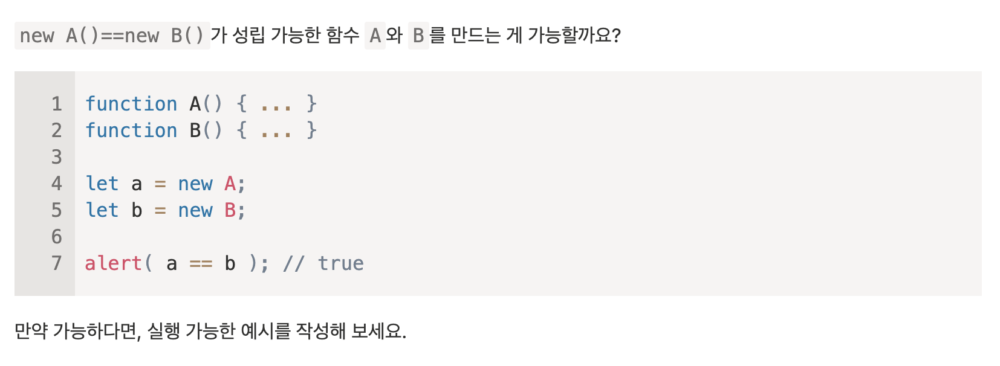

(모던 JavaScript에 [객체 파트](https://ko.javascript.info/object)에서 새롭게 알게 된 내용을 정리한 것입니다.)

## 4.1 객체

자바스크립트에는 7가지 원시 타입(Boolean, Null, Undefined, Number, BigInt, String, Symbol)과 객체 타입이 존재한다.
객체 타입은 중괄호를 이용해 만들 수 있고 키: 값 쌍으로 구성된 프로퍼티들로 이루어져 있다.
키엔 문자형, 값에 모든 자료형이 들어올 수 있으며 프로퍼티 키는 프로퍼티 이름이라고도 블린다.

빈 객체를 만드는 방법에는 두가지가 있다.

```js
let obj1 = new Object();
let obj2 = {};
```

중괄호를 이용해 객체를 선언하는 방법을 객체 리터럴이라고 한다. 객체를 선언할 때 주로 사용되는 방법이다.

객체 내 프로퍼티를 삭제하려면 `delete obj.(프로퍼티 키 명)`으로 삭제할 수 있다.

마지막 프로퍼티 끝에 쉼표를 쓸 수가 있는데 이런 쉼표를 trailing(길게 늘어지는) 또는 hanging(매달리는) 쉼표라고 부른다.

```js
let obj = {
  cat: "🐱",
  dog: "🐶",
  mouse: "🐭", // trailing 쉼표
};
```

이런식으로 짤 경우, 프로퍼티를 추가, 삭제, 이동하는게 편리해진다.

### 계산된 프로퍼티

```js
const animal = prompt("제일 좋아하는 동물은 무엇인가요?");
let animals = {
  [animal]: "favorite",
};

alert(animals.cat);
```

대괄호 내에 animal은 animal 변수의 값을 키로 쓰겠다는 뜻이다.

프로퍼티 키 이름에는 제약이 없다.

```js
let obj = {
  let: 1,
  for: 2,
  const: 3,
};
```

키에 숫자를 넣으면 문자형으로 자동으로 변환된다.

```js
let obj = {
  0: "ASDF", // "0": "ASDF"
};
alert(obj["0"]); // ASDF
alert(obj[0]); // ASDF
```

in 연산자로 키의 존재 여부를 확인할 수 있다.

```js
let obj = {
  cat: "kitty",
};
alert("cat" in obj); // true
```

프로퍼티가 있는데 키의 값이 undefined이더라도 존재한다고 판단한다.

```js
let obj = {
  cat: undefined,
};
alert("cat" in obj); // true
```

### 'for...in' 반복문

아래처럼 쓴다

```js
for (key in obj) {
}
```

obj의 키값을 key에 하나씩 할당하면서 반복문 내 코드를 실행한다.

```js
let animals = {
  cat: "🐱",
  dog: "🐶",
  mouse: "🐭",
};
for (let animal in animals) {
  // let을 생략해도 작동한다.
  alert(animals[animal]);
}
// 출력
// 🐱
// 🐶
// 🐭
```

### 객체 정렬 방식

프로퍼티의 키가 정수이거나 정수로 변환이 가능한 문자형인 경우, 키의 오름차순으로 객체가 정렬되고, 그렇지 않다면 작성한 순서대로 정렬된다. 이때 키가 정수이거나 정수로 변환가능 한 문자형인 프로퍼티를 정수 프로퍼티라고 한다.

```js
let numbers = {
  3: 3,
  1: 1,
  4: 4,
  2: 2,
};

for (number in numbers) {
  console.log(number);
}

// 출력
// 1,
// 2,
// 3,
// 4
```

만약 정수 프로퍼티가 그렇지 정수 프로퍼티가 아닌 프로퍼티가 섞여있을 경우, 정수 프로퍼티가 우선으로 앞쪽으로 정렬되고, 정수 프로퍼티가 아닌 프로퍼티는 작성한 순서데로 뒤로 밀려난다.

```js
let obj = {
  3: 3,
  "+9": 9,
  1: 1,
  asdf: "asdf",
  4: 4,
  2: 2,
};

for (key in obj) {
  console.log(key);
}

// 출력
// 1
// 2
// 3
// 4
// +9
// asdf
```

자바스크립트에는 일반 객체 외에도 다양한 객체가 존재한다.

- Date: 날짜, 시간 정보를 저장할 때 쓰임
- Error: 에러 정보를 저장할 때
- Array: 정렬된 데이터 컬렉션을 저장할 때 쓰임

### 4.1 과제

1. 객체야 안녕?
   

```js
// 1.
let user = {};

// 2.
user.name = "John";

// 3.
user["surname"] = "Smith";

// 4.
user.name = "Pete";

// 5.
delete user["name"];
```

2. 객체가 비어있는지 확인하기
   

```js
function isEmpty(obj) {
  return Object.keys(obj).length === 0;
}
```

3. 변하지 않는 객체?
   
   에러 없이 실행된다. 상수는 그 값 자체를 바꾸는 건 안되지만 그 값 내에 요소를 바꾸는 건 가능하기 때문이다.

4. 프로퍼티 합계 구하기
   

```js
let salaries = {
  John: 100,
  Ann: 160,
  Pete: 130,
};

function getSumSalaries(salaries) {
  return Object.values(salaries).reduce((sum, cur) => sum + cur, 0);
}

let sum = getSumSalaries(salaries);
```

5. 프로퍼티 값 두 배로 부풀리기
   

```js
function multiplyNumeric(obj) {
  for (let key in obj) {
    if (typeof obj[key] === "number") obj[key] *= 2;
  }
}
```

---

## 4.2 참조에 의한 객체 복사

어떤 변수의 원시값을 특정 변수에 할당할 때 값이 복사가 되어 a 따로 b 따로 값을 가지게 된다.

```js
let a = "HELLO!";
let b = a;
```

그러나 객체는 원시타입과 가르게 변수에 객체의 참조값이 저장된다.

```js
let a = {
  prop: 123,
};
let b = a;
```

때문에 위처럼 값을 대입할 때 참조값이 들어가며, 객체는 복사되지 않는다.
메모리에서 객체는 그대로지만 그 객체의 메모리 주소가 복사된다는 것이다.

그래서 위 코드에서 `b.prop`의 값을 수정하게 되면 `a.prop`을 출력할 때 수정된 값이 출력되게 된다.

```js
let a = {
  prop: 123,
};
let b = a;

b.prop = 456;

console.log(a.prop); // 456
```

### 객체 비교

`{} == {}`는 false를 반환하는데 이는 위에서도 적혀있듯이 객체는 값이 아니며 객체가 반환하는건 객체의 참조값이기 때문이다.
두 객체는 서로 다른 객체이므로 서로 다른 참조값을 가지므로 false가 반환되는 것이다.

### 객체 복제하기

만약 같은 객체 값에 전혀 다른 참조값을 갖는 객체를 가지고 싶다면 아래 두가지 방법을 사용할 수 있다.

- for문 사용하기

  ```js
  let a = { prop: 123, msg: "Hello!" };
  let b = {};
  for (let key in a) {
    b[key] = a[key];
  }

  b.msg = "World!";
  console.log(a.msg); // Hello!
  ```

- Object.assign을 사용하여 객체를 복제할 수도 있다.
  ```js
  let a1 = { msg: "Hello!" };
  let a2 = { prop: 123 };
  let b = {};
  Object.assign(b, a1, a2); // a 객체를 b에다 복제함
  a1.msg = "World!";
  console.log(b.msg); // Hello!
  ```
  Object.assign()에 첫번째 인자엔 복제한 객체의 참조값을 할당할 변수, 두번째 인자부턴 복제할 객체들을 인자로 여러개 넣을 수 있다. 또한 Object.assign() 메소드는 이렇게 만들어진 객체를 반환하기도 한다.

### 중첩 객체를 복사할 때

만약 아래 같이 프로퍼티 값이 객체인 객체가 있고 이를 복제한 뒤, 객체 내 객체 값을 바꾸면 어떻게 될까?

```js
let a = {
  obj: {
    msg: "Hello!"
  };
}
let b = Object.assign({}, a);
b.obj.msg = "World!";
```

위 코드를 실행한 뒤 `a.obj.msg`를 실행하면 문자열 World!가 출력되는 것을 볼 수 있다.
조금만 생각해보면 알 수 있는데 객체 a를 복제할 때 obj의 참조값은 변하지 않기 때문이다. 그래서 a의 참조값, b의 참조값이 다르더라고 두 객체의 obj 객체 참조값이 같기 때문에 `a.obj.msg`의 값이 달라지는 것이다.

이를 해결하기 위해서 반복문을 이용해 `a[key]`의 각 값들을 검사하면서 객체인 경우, 객체를 복제하여 할당하는 알고리즘을 사용해야한다.
이런 방식을 깊은 복사라고 한다.

자바스크립트 라이브러리인 lodash에서 `_cloneDeep(obj)` 함수를 사용해 위 알고리즘을 그래도 사용할 수 있다.

---

## 4.3 가비지 컬렉션

가비지 컬렉션은 메모리에서 더 이상 사용하지 않는 데이터를 삭제하는 역할을 한다.
가비지 컬렉션이 루트를 기준으로 메모리에서 사용하지 않는 것들을 찾아내 삭제한다.
여기서 루트는 다음 값들을 의미한다.

1. 현재 함수의 지역/매개변수
2. 중첩함수의 체인에 있는 함수 내에서 사용되는 변수/매개변수
3. 전역변수
4. 기타 등등...

### 예시

```js
let a = { name: "James" };
```

위 코드를 실행하면 메모리에 객체가 하나 만들어지고, 전역변수로서 루트인 a엔 그 객체의 참조값이 들어간다.

<Object\> {name: "James"} <- <global\> a

이때 a에 null을 대입하게 되면, 메모리에 만들어진 객체의 참조값을 잃었으므로 이 객체는 메모리에서 삭제되게 된다.

~~<Object\> {name: "James"}~~ <(X)- <global\> a

만약 또 다른 전역변수가 해당 참조값을 가지고 있다면 객체를 잃지 않았으므로 메모리에서 삭제되지 않는다.

### 내부 알고리즘

가비지 컬렉션은 'mark-and-sweep'이라는 알고리즘을 이용해 메모리에서 사용하지 않는 데이터를 삭제한다.

루트부터 시작해 참조하는 것들을 마크하면서 이동한다.
마크를 하고 다 하고 난 후 마크가 없는 데이터는 삭제한다.

최적화 기법:

- generational collection(세대별 수집) - 객체를 새로운 객체, 오래된 객체로 나눈다. 객체 상당수는 생성되고 금방 없어지는데, 가비지 컬렉터는 이렇게 새로 만들어진 객체를 오래된 객체보다 더 공격적으로 메모리에서 삭제한다. 일정시간이 지나면 새로운 객체는 오래된 객체가 되고 가비지 컬렉터가 덜 감시하게 된다.
- incremental collection(점진적 수집) - 가비지 컬렉션을 여러 부분으로 분리한 뒤, 별도로 수행하는 방법이다. 작업을 분리하고, 변경사항을 찾아야하는 일이 생기지만, 긴 지연을 짧은 지연 여러개로 분산시킬 수 있다는 장점이 있다.
- idle-time collection(유휴 시간 수집) - 실행에 영향을 최소화하기 위해 CPU가 유휴상태일 때만 가비지 컬렉션을 실행한다.

---

## 4.4 메서드와 this

메서드는 아래처럼 만들어낼 수 있다.

```js
let a = {};
a.greet = function () {
  alert("Hi");
};
```

또는 객체에 직접 익명함수를 넣어줄 수도 있다.

```js
let a = {
  greet: function () {
    alert("Hi");
  },
};
```

위 코드는 아래처럼 단축시킬 수 있다.

```js
let a = {
  greet() {
    alert("Hi");
  },
};
```

### 메서드와 this

this는 메서드를 호출할 때 사용된 객체를 가리킨다.

```js
let a = {},
  b = {};
function f() {
  alert(this);
}
a.fn = f;
b.fn = f;

a.fn(); // this == a
b.fn(); // this == b

a["fn"](); // 이렇게도 호출할 수 있다.
```

객체 없이 그냥 f 함수를 호출하면 this는 undefined가 된다.

```js
f(); // this == undefined
```

엄격모드가 아닐 때는 전역 객체를 참조하는데 되게 이런 경우는, 실수일 확률이 크다.

### this가 없는 화살표 함수

화살표 함수의 this는 외부 함수에서 this값을 가져온다.

```js
let a = {
  prop: "James",
  greet() {
    let f = () => console.log(this.prop);
    f();
  },
};

a.greet(); // James
```

만약 위 코드에서 함수 f를 함수 선언식으로 작성한다면, f는 greet() 함수 내에서 어떤 객체를 통해 호출되고 있지 않으므로 undefined가 출력될 것이다.

### 4.4 과제

1. 객체 리터럴에서 'this' 사용하기
   
   여기서 user에 반환값을 주는 makeUser()는 어떤 객체의 메소드로써 호출된게 아니므로 this는 undefined가 될 것이다.
   때문에 결과값은 안나오고 에러가 나올 것 같다.

2. 계산기 만들기
   

```js
let calculator = {
  read() {
    this.a = Number(prompt("첫번째 값을 입력하세요"));
    this.b = Number(prompt("두번째 값을 입력하세요"));
  },
  sum() {
    return this.a + this.b;
  },
  mul() {
    return this.a * this.b;
  },
};
```

3. 체이닝
   

```js
let ladder = {
  step: 0,
  up() {
    this.step++;
    return this;
  },
  down() {
    this.step--;
    return this;
  },
  showStep: function () {
    alert(this.step);
  },
};
```

---

## 4.5 new 연산자와 생성자 함수

`new` 연산자와 생성자 함수를 사용하면 유사한 객체 여러개를 쉽게 만들어낼 수 있다.

### 생성자 함수

생성잠 함수와 일반 함수는 생김새가 같지만 생성자 함수에는 관례가 존재한다.

1. 첫글자를 대문자로 적는다.
2. new 연산자와 함께 호출한다.

아래는 생성자 함수를 사용한 예시이다.

```js
function Player(name) {
  this.name = name;
}

let p1 = new Player("James");
alert(p1.name); // James
```

new 연산자를 사용하면 함수에서 내부적으로 다음과 같이 처리된다.

```js
function Player(name) {
  // this = {};

  this.name = name;

  // return this;
}
```

빈 객체를 this에 할당한 후 this를 반환하는 형태이다.
최종적으로 변수 p1에는 다음 객체를 참조하게 된다.

```js
let p1 = {
  name: "James",
};
```

같은 방식으로 name 파라미터만 변경해서 보다 쉽게 다양한 객체들을 생성해낼 수 있다.

재사용할 필요없는 복잡한 객체를 만들 때는 new와 함께 익명함수를 사용할 수 있다.

```js
let map = new (function () {
  this.name = "map1";
  // 지역변수, 복잡한 로직 등등 다양한 코드가 들어감
})();
```

### new.target과 생성자 함수

함수 내에서 new.target을 출력하면 그 함수가 new로 호출됐는지 그냥 호출됐는지 판단할 수 있다.
잘 쓰이지 않는 문법이라고 한다.

```js
function Player() {
  alert(new.target);
}
Player(); // undefined
new Player(); // function Player() { ... }
```

일반함수처럼 호출했을 때 자동으로 new를 붙여주게도 할 수 있다.

```js
function Player(name) {
  if (!new.target) {
    return new Player(name);
  }
  this.name = name;
}
let p1 = Player("James"); // new Player("James");
alert(p1.name); // James
```

### 생성자와 return

생성자 함수(생성자)은 this를 자동으로 반환하기에 보통 return 문이 없는데 만약 return 문이 있다면 아래 규칙이 적용된다.

- 객체를 반환한다면 this 대신 반환된다.
- 원시값을 반환하거나 그냥 값 없이 반환하려고 한다면 this가 대신 반환됨.

```js
function Player() {
  this.name = "James";
  return { name: "Jack" };
}
let p1 = new Player();
alert(p1.name); // Jack
```

위 코드에서 만약 원시값을 반환하려고 한다면 무시되고 this가 반환된다.

```js
function Player() {
  this.name = "James";
  return; // this가 대신 반환됨.
}
let p1 = new Player();
alert(p1.name); // Jamems
```

인수가 없는 생성자 함수는 소괄호를 생략할 수 있다.

```js
function Player() {
  this.name = "James";
}
let p1 = new Player(); // == new Player();
```

좋은 스타일은 아니다.

생성자 내 메서드도 this에 프로퍼티를 주는 식으로 만들 수 있다.

### 4.5 과제

1. 함수 두 개로 동일한 객체 만들기
   
   위에 객체 하나를 만들고 그 객체의 참조값을 생성자 함수 내에서 반환하는 식으로 만들면 될 것 같다.0

```js
const obj = {};

function A() {
  return obj;
}
function B() {
  return obj;
}
```

생성자 함수에서 직접 객체를 반환한다면 this대신 반환되기에 바깥에 객체 하나를 두고 그 객체를 똑같이 반환한다면 true가 나올 것 같다.

2. 계산기 만들기

```js
function Calculator() {
  let a, b;
  this.read = function () {
    a = Number(prompt("첫번째 값을 입력하세요"));
    b = Number(prompt("두번째 값을 입력하세요"));
  };
  this.sum = function () {
    return a + b;
  };
  this.mul = function () {
    return a * b;
  };
}
```

3. 누산기 만들기
   

```js
function Accumulator(initialValue) {
  this.value = initialValue;
  this.read = () => {
    this.value += Number(prompt("더할 값을 입력하세요"));
  };
}
```

---

## 4.6 옵셔널 체이닝 '?.'

### ?.()와 ?.[ ]

?.는 연산자가 아니다. 함수나 대괄호와 함께 사용하는 특별한 문법 구조체이다.
?.()는 다음 예시처럼 사용할 수 있다.

```js
let video = {
  play() {
    alert("playing video...");
  },
};
let audio = {};

video.play?.(); // playing video...
audio.play?.();
```

위 코드에서 video의 객체엔 play() 메서드가 있지만 audio의 객체엔 play() 메서드가 존재하지 않는다. ?.()은 앞에 메서드가 존재한다면 그 메서드를 실행하라는 문법이다.

?.[ ]는 객체에 프로퍼티에 대괄호로 접근할 때 사용한다.
다음 예시처럼 사용할 수 있다.

```js
let cat = {
  name: "James",
};
let dog = null;

alert(cat?.["name"]); // James
alert(dog?.["name"]); // undefined
```

만약 ?.[ ] 앞에 값이 참조할 수 있는 값이라면 뒤에 프로퍼티를 가져오고, 그렇지 않다면 undefined를 반환한다.
만약 ?.[ ] 대신 [ ]만 썼다면 프로퍼티 name에 접근할 수 없다는 에러가 발생했을 것이다.

객체 내 프로퍼티를 삭제할 때도 `delete cat?.name`처럼 하면 name 프로퍼티가 존재할 때 삭제하게 할 수 있다.

옵셔널 체이닝(?.)은 값을 읽을 때만 쓸 수 있고 값을 쓸 때는 사용할 수 없다.

```js
cat?.name = "James"
```

위 코드를 실행하면 `Uncaught SyntaxError: Invalid left-hand side in assignment`에러가 발생할 것이다.

따라서 위 예시에 따라 옵셔널 체이닝은 3가지 형태로 사용할 수 있다.

1. obj?.prop: obj가 존재한다면 prop 프로퍼티를 가지고 온다.
2. obj?.\[prop\]: 얘 또한 obj가 존재한다면 prop 프로퍼티를 가지고 온다.
3. obj.method?.(): obj에 method라는 메서드가 존재한다면 실행시킨다.

---

## 4.7 심볼형

### 심볼

심볼은 유일한 식별자를 만들 때 사용된다.
심볼은 다음 `Symbol()` 써서 만들어낼 수 있다. 괄호 안에는 심볼의 이름을 달 수 있다.

```js
let id = Symbol();
let id = Symbol("id"); // 심볼 이름은 어떤 영향도 끼치지 않고 그냥 이름표 역할을 한다.
```

심볼은 유일한 식별자를 만들 때 사용되기에 어떤 두 심볼을 동등 연산해도 false가 나온다.

```js
Symbol() == Symbol(); // false
```

심볼은 문자형으로 변환되지 않는다.

```js
alert(Symbol()); // Uncaught TypeError: Cannot convert a Symbol value to a string
alert(Symbol("name").toString()); // SymbolId(name)
```

`.description` 프로퍼티로 심볼의 이름을 가지고 올 수 있다.

```js
alert(Symbol("symbolName").description); // symbolName
```

### ‘숨김’ 프로퍼티

아래처럼 심볼을 이용하면 숨김 프로퍼티를 만들 수 있다.

```js
const id = Symbol("id");

const obj = {
  [id]: 1,
};
```

이때 `obj\["id"\]`나 `obj.id`로는 접근할 수 없고, 꼭 심볼을 할당한 id 변수를 통해서만 `obj[id]`로 가지고 올 수 있다.
이렇게 할 경우, 만약 어떤 라이브러리에 있는 객체에 프로퍼티를 추가할 때, 이미 존재했던 프로퍼티라 값이 덮어씌어져서 에러가 발생하는 경우를 막을 수 있다.

또한 객체에서 키를 하나씩 가져오는 for...in 반복문에서 배제된다.

```js
const id = Symbol("id");

const player = {
  name: "James",
  age: 30,
  [id]: 123,
};

for (let key in player) alert(key); // name, age만 출력됨
```

Object.assign()은 심볼 키도 포함해서 복사해준다.

```js
const id = Symbol("id");

const p1 = {
  name: "James",
  age: 30,
  [id]: 1,
};

const p2 = Object.assign({}, p1);

alert(p2[id]); // 1
```

### 전역 심볼

만약 현재 파일에서 다른 파일에 있는 심볼을 쓰고 싶은 경우처럼 멀리 떨어진 상태일 땐 전역 심볼을 사용할 수 있다. `Symbol.for(key)`처럼 사용하는데 key 부분만 같은면 동일한 심볼이 된다.
`Symbol.for()`은 전역 심볼 레지스터안에 심볼을 만드는데, key가 같은 심볼이 전역 심볼 레지스터 안에 존재하면 그 심볼을 반환하고, 그렇지 않다면 레지스터레 새로 생성한다.

```js
const id1 = Symbol.for("id"); // 전역 심볼 레지스터에 동일한 키의 심볼을 찾고, 없으니 새로 생성함
const id2 = Symbol.for("id"); // 전역 심볼 레지스터에 존재하므로 그 심볼을 반환함

// 두 심볼이 같기에 true가 출력됨
alert(id1 === id2); // true
```

### Symbol.keyFor()

`Symbol.keyFor(Symbol())`은 전역 심볼 레지스터에서 전역 심볼을 통해 키를 얻는다. 만약 인자가 전역 심볼이 아니라면 undefined가 반환된다.

```js
const id = Symbol.for("idKey");
const sym = Symbol("sym");

alert(Symbol.keyFor(id)); // idKey
alert(Symbol.keyFor(sym)); // undefined
```

.description 프로퍼티로 가져올 수 없다고 하는데 해보니 가져올 수 있었다.
(이 부분은 찾아볼 필요가 있을 것 같네요😅)

### 시스템 심볼

시스템 심볼은 자바스크립트 내부에서 사용되는 심볼로, 객체를 미세 조정할 수 있다.

명세서 내의 표에 [잘 알려진 심볼](https://tc39.es/ecma262/#sec-well-known-symbols)에서 어떤 시스템 심볼이 있는지 살펴볼 수 있다.
잘 알려진 심볼에서 `Symbol.toPrimitive()`를 알면 객체가 어떻게 원시형으로 변환되는지 알 수 있다.

## 4.8 객체를 원시형으로 변환하기

객체 형변환은 3종류가 있는데 hint라는 값이 구분 기준이 된다. 형변환의 목표가 되는 자료형이라 볼 수 있다.

자바스크립트에서 객체 형변환 과정은 아래와 같다.

1. 객체에 `obj[Symbol.toPrimitive](hint)` 메서드가 있는지 찾고 있다면 메서드를 호출한다. 없다면 2, 3번 규칙에 따른다.
2. hint가 "string"이라면 `obj.toString()`, 없다면 `obj.valueOf()`를 호출한다.
3. 2에 해당하지 않고, hint가 "default" 혹은 "number"라면 `obj.valueOf()`, 없다면 `obj.toString()`를 호출한다.

### Symbol.toPrimitive

자바스크립트엔 Symbol.toPrimitive라는 내장 심볼이 존재하는데, 아래와 같이 hint를 명명하는데 사용된다.

```js
obj[Symbol.toPrimitive] = function(hint) {...};
```

아래처럼 활용할 수 있다.

```js
const player = {
  name: "James",
  age: 30,
  [Symbol.toPrimitive](hint) {
    alert(hint);
    if (hint === "string") return this.name;
    else return this.age;
  },
};
alert(player); // hint == "string": James
alert(+player); // hint == "number": 30
alert(player + 10); // hint == "default": 40
```

Symbol.toPrimitive 프로퍼티가 없다면 위에 2, 3번 규칙에 따라 toString(), valueOf() 메서드를 호출한다고 했는데 아래 규칙처럼 객체를 형변환한다.

- toString()은 문자열 "\[object Object\]"를 반환한다.
- valueOf()는 객체 자기자신을 반환한다.

```js
let obj = { name: "James" };

alert(obj); // [object Object]
alert(obj.valueOf() === obj); // true
```

toString(), valueOf()를 객체 내에 프로퍼티로 줘서 덮어쓸 수 있다.

```js
let obj = {
  name: "James",
  age: 30,
  toString() {
    return `{name: "${this.James}"};
  },
  valueOf() {
	return this.age;
  }
};
alert(obj); // toString(): {name: "James"}
alert(+obj); // valueOf(): 30
alert(obj + 10); // valueOf(): 40
```

만약 `[Symbole.toPrimitive]`처럼 한 곳에서 처리하고 싶을 땐 `toString()`만 써주면 된다.
(`valueOf()`만 써준다면 hint가 "string"일 때 처리가 안됨)

```js
let obj = {
  toString() {
    return "James";
  },
};

alert(obj); // James
alert(obj + 123); // James123
```

> toString이나 valueOf()는 객체를 반환해도 에러가 발생하지 않는다. 단, 이땐 반환값이 무시되고 메서드가 덮어써지지 않는다. 과거 자바스크립트엔 에러라는 개념이 잘 정립되어 있지 않았기 때문이다.

```js
let obj = {
  toString() {
    return { name: "James" };
  },
};
alert(obj);
```

> \[Symbol.toPrimitive]는 무조건 원시자료형을 반환해야하며, 객체를 반환할 경우 에러가 발생한다.
> (라는데 콘솔창에 출력해보니 똑같이 toString()도 객체를 원시값으로 변환할 수 없다는 에러가 발생했다. 단, valueOf()는 NaN이나 \[object Object]를 반환했다. 관련 내용을 찾아봐야할 것 같다.)

잘못된 부분이 있으면 알려주세요😁
