(모던 JavaScript에 [자료구조와 자료형 파트](https://ko.javascript.info/data-types)에서 새롭게 알게 된 내용을 정리한 것입니다.)

## 5.1 원시값의 메서드

원시형의 종류에는 `문자(string)`, `숫자(number)`, `BigInt`, `불린(boolean)`, `심볼(symbol)`, `null`, `undefined`로 총 7가지가 있다.

객체는 프로퍼티에 다양한 종류의 값을 저장할 수 있는 자료형이다. 함수도 객체의 일종이다.

### 원시값을 객체처럼 사용하기

자바스크립트 만든 개발자가 원시값에 메서드를 붙여 작업을 수월하게 하고 싶어서 "원시 래퍼 객체(object wrapper)"를 만들었다.
"원시 래퍼 객체(object wrapper)"는 원시값에 메서드나 프로퍼티로 접근을 할 때 만들어졌다가 사라지는 특수한 객체이다.

래퍼 객체는 원시 타입에 따라 종류가 다양한데, 원시형의 이름을 따서 String(), Number(), Boolean(), Symbol()가 존재한다. 래퍼 객체마다 제공하는 메서드 역시 다르다. 예를 들어, string형에는 문자 전체를 대문자로 바꿔주는 `.toUpperCase()`라는 메서드가 존재한다.

.toUpperCase()를 호출했는 때 내부에선 아래와 같이 작동한다.

1. string은 원시값이므로 원시값의 프로퍼티에 접근하는 순간 래퍼 객체가 만들어지는데, 이 객체는 원시값을 알고 있으면서, toUpperCase() 같은 메서드들을 가지고 있다.
2. 메서드가 실행되고, 새로운 원시값이 반환되면 래퍼 객체는 파괴되고, 원시값만 남게된다.

> 래퍼 객체는 생성자로는 사용하지 않는게 좋다.
> 몇몇 상황에서 혼동을 일으키기 때문이다.

```js
let num = new Number(0);
>
if (num) alert("num은 0이 아닌 값입니다.");
```

num은 객체기에 위 alert()가 실행되는 헷갈리는 상황이 발생한다.

추가로 null, undefined에는 메서드가 없다.

### 5.1 과제

1. 문자열에 프로퍼티를 추가할 수 있을까요?
   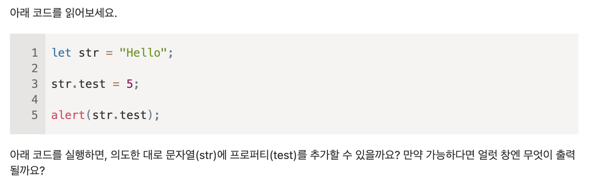
   안될 것 같다. 래퍼 객체에 특정 메소드나 프로퍼티를 덮어쓰려고 하면 자바스크립트 내에서 에러를 발생시킬 것 같기 때문이다.
   (답: 래퍼 객체의 test 프로퍼티에 5를 넣을 순 있지만, 래퍼 객체는 그 후에 바로 파괴되기 때문에 엄겨 모드에선 에러, 비엄격 모드에선 undefined가 출력된다고 한다. -> 원시값에 추가적인 데이터를 저장할 수 없다.)

---

## 5.2 숫자형

자바스크립트는 숫자를 나타낼 때 두가지 자료형을 제공한다.

1. 배정밀도 부동소수점 숫자(double precision floating point number)라 알려진 64비트 형식의 IEEE-754에 저장되는 일반적인 숫자
2. 숫자가 2^53 이상이거나 -2^53 이하일 때 사용하는 BigInt
   가 있다.

### 숫자를 입력하는 다양한 방법

자바스크립트에선 십억을 나타낼 때 `1000000000`이라고 나타낼 수도 있지만 `1e9`처럼 사용할 수도 있다. e는 왼쪽 숫자에다가 10의 오른쪽 숫자만큼의 거듭제곱한 수를 곱해준다.
반대로 `0.0001`을 표현할 때도 e를 사용해서 `1e-4`라고 표현할 수도 있다.

```js
alert(1.2e9); // 12억
alert(1.2e-4); // 12앞에 0이 4개인 소수: 1.2 / 10000
```

### 2진수, 8진수, 16진수

2, 8, 16진수는 각각 0b, 0o, 0x를 앞에 붙여 사용할 수 있다.
16진수에서 알파벳은 대, 소문자를 가리지 않는다.

```js
let a = 0xff;
let b = 0xff;
let c = 0o377;
let d = 0x11111111;
let e = 255;
// 모두 같은 255이다.
```

### .toString(base)

`.toString(base)`는 base 진법으로 숫자를 표현한 후 문자형으로 반환해준다.

```js
alert((123456).toString(36)); // 2n9c
```

위에서 점 두개를 사용했는데, 숫자형인 값에 직접 메서드와 프로퍼티를 사용할 때 숫자 뒤에 .을 하나만 붙이면 자바스크립트가 소수점으로 인식해 에러가 발생하기 때문에 저렇게 해줘야한다. `(123456).toString(36)`도 가능하다.

### 어림수 구하기

어림수 구하는 건 숫자 연산에서 제일 많이 사용되는 연산이다.

Math 객체를 사용하면 어림수를 구할 수 있다.
Math.floor(), Math.ceil(), Math.round()는 각각 소수부 첫째자리에서 내림, 올림, 반올림으로, 인자 숫자를 토대로 값을 반환한다.
Math.trunc()는 정수부 값만 반환한다.

|      | Math.floor() | Math.ceil() | Math.round() | Math.trunc() |
| ---- | ------------ | ----------- | ------------ | ------------ |
| 2.1  | 2            | 2           | 2            | 2            |
| 2.6  | 2            | 3           | 3            | 2            |
| -2.1 | -3           | -2          | -2           | -2           |
| -2.6 | -3           | -2          | -3           | -2           |

`.toFixed()` 메서드도 Math.round() 와 같은 역할을 수행한다.

```js
alert((1.23).toFixed(1)); // 1.2
```

`.toFixed()`에 인자 값이 숫자의 소수 길이보다 크다면 0으로 채워진다.

```js
alert((1.23).toFixed(5)); // 1.23000
```

### 부정확한 계산

숫자는 64비트 형식인 IEEE-754로 표현되기에 만약 숫자가 64비트를 넘어가면 Infinity로 처리된다.
이때 64비트 중 52비트는 숫자를 저장하는데 사용되고, 11비트는 소수점 위치를(정수는 0비트), 1비트는 부호를 저장하는데 사용된다.

표현 가능한 범위는 대략 최대 ±1.79e308에서 최소 ±5e-324 정도 된다.

꽤 자주 발생하는 정밀도 손실 현상도 있다.

```js
alert(0.1 + 0.2 === 0.3); // false
```

위 코드에서 `0.1 + 0.2`는 `0.30000000000000004`으로 처리된다.

IEEE-754에선 가능한 가장 가까운 숫자로 반올림하는 방법으로 이 문제를 해결한다.
때문에 아래와 같은 방법으로 정밀도 손실을 확인해볼 수 있다.

```js
alert((0.1).toFixed(20)); // 0.10000000000000000555
```

때문에 소수를 더하면 더할 수록 정밀도 손실도 더해진다.
이게 0.1 + 0.2가 0.3이 아닌 이유이다.
PHP, Java, C, Perl, Ruby에서도 자바스크립트와 똑같은 형식을 사용하기에 같은 결과가 나온다.

이 문제를 해결하는 방법에는 다음이 있다.

- `.toFixed()` 사용하기
  `0.1 + 0.2`를 예로 다음과 같이 코드를 짜면 된다.
  ```js
  let sum = 0.1 + 0.2;
  alert(+sum.toFixed(2)); // 0.3
  ```
  `toFixed()`로 특정 소수점 까지 반올림한 값을 만들고 + 로 숫자형으로 변환한다.
- 정수로 치화한 후 계산하기
  똑같이 `0.1 + 0.2`를 예시로
  ```js
  let sum = (0.1 * 10 + 0.2 * 10) / 10;
  alert(sum); // 0.3
  ```
  이 방법은 오류를 줄여주긴 하지만 완전히 없애진 못한다.

> 9999999999999999는 1이 더해진 10000000000000000와 같다.

```js
alert(9999999999999999 === 10000000000000000); // true
```

실제 숫자를 저장하는 52비트에 위 숫자를 담기엔 너무 작아서 최소 유효 숫자가 손실돼 버렸기 때문이다. 자바스크립트는 숫자 손실이 나도 오류를 발생시키지 않는다.

> 자바스크립트에는 0과 -0이 존재한다. 부호비트를 사용하기 때문에 그렇다. 두 0을 일치 연산해보면 true가 출력된다.

```js
alert(0 === -0); // true
```

### isNaN()과 isFinite()

`isNaN()`은 인자값을 숫자로 변환한 후, NaN인지 체크해준다.
`NaN`은 동등/일치 연산하면 false를 반환하기에 필요한 함수이다.

`isFinite()`는 인자값을 숫자로 변환한 후, NaN/Infinity/-Inifinity를 제외한 숫자인지 체크해준다.
값이 일반 숫자인지 검사할 때 사용된다.

> Object.is()는 === 와 비슷하지만 아래 두가지 케이스에서 차이를 보인다.

```js
Object.is(NaN, NaN); // true
Object.is(0, -0); // false
```

이 케이스 외에는 Object.is(a, b)는 a === b와 같다. 이것때문에 Object.is()는 비교가 정확해야할 때 === 대신 사용된다.

### parseInt()와 parseFloat()

parseInt()와 parseFloat()은 문자열에서 정수, 실수를 파싱해 반환하는 함수이다.
CSS 문법이나 통화 기호가 붙은 문자에서 숫자만 뽑아낼 때 사용할 수 있다.

```js
alert(parseInt("123px")); // 123
alert(parseInt("12.3px")); // 12 (정수부분만 반환됨)

alert(parseFloat("12.3px")); // 12.3
alert(parseFloat("1.2.3")); // 1.2 (두번째 점에서 읽기를 끝냄)
```

parseInt()의 두번째 인자에는 진수가 들어가는데 첫번째 인자값의 진수를 설정해줄 수 있다.

```js
alert(parseInt("0xff", 16)); // 255
alert(parseInt("ff", 16)); // 255 (0x가 없어도 동작함)
alert(parseInt("2n9c", 36)); // 123456
```

### 5.2 과제

1. 수를 입력받아 덧셈하기
   사용자에게 두 수를 입력받고, 두 수의 합을 출력해주는 스크립트를 작성해보세요.

```js
let a = +prompt("첫번째 숫자를 입력하세요");
let b = +prompt("두번째 숫자를 입력하세요");
alert(a + b);
```

2. 6.35.toFixed(1) == 6.3인 이유는 무엇일까요?
   6.35.toFixed(16)을 출력해보니 "6.3499999999999996"가 출력돼었다.
   이것때문에 `6.35.toFixed(1)`가 올림이 안돼고 내림이 된 것 같다.
   6.35에 1e-15를 더하니 해결되었다.

```js
alert((6.35 + 1e-15).toFixed(1)); // 6.4
```

해답
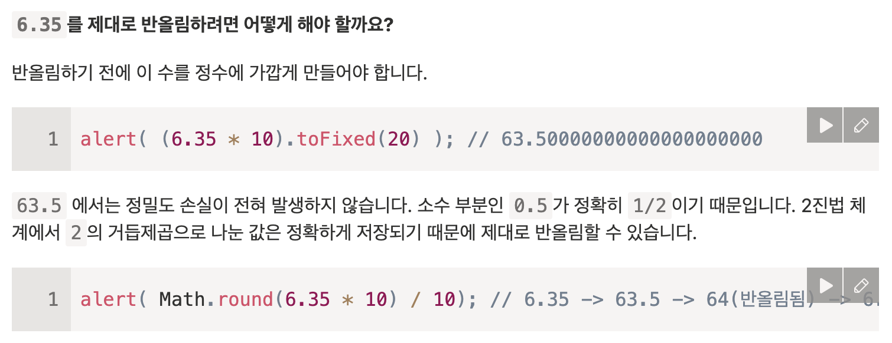

3. 숫자를 입력할 때까지 반복하기
   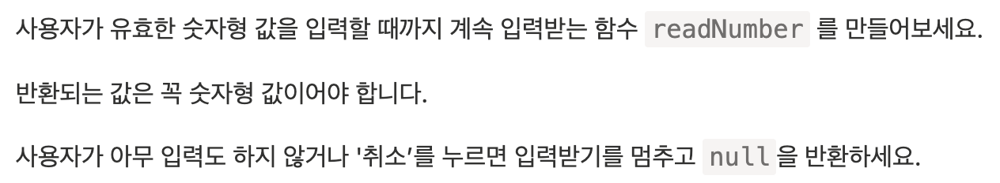
   isFinite()는 인자값이 일반 숫자이거나 일반 숫자로 변환가능한 문자열일 때 true를 반환하므로 이 함수를 활용해 구현할 수 있다.

```js
function readNumber() {
  let num;

  do {
    num = prompt("숫자를 입력하세요");

    if (num === null) return null;
  } while (!isFinite(num));

  return +num;
}
```

4. An occasional infinite loop
   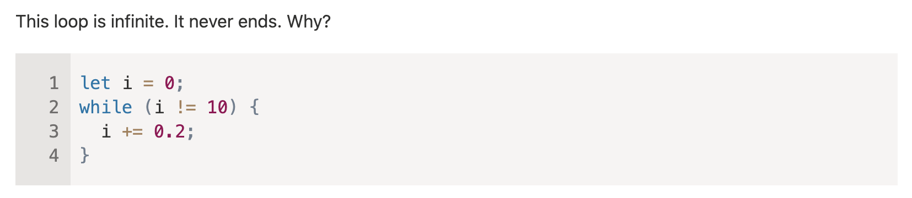
   `0.2.toFixed(20)`을 살펴보면 `0.2`의 실제 값은 `0.20000000000000001110`인 것을 알 수 있다. 이런 정밀도 손실 문제 때문에 위 반복문은 끝나지 않는 것이다.

5. A random number from min to max
   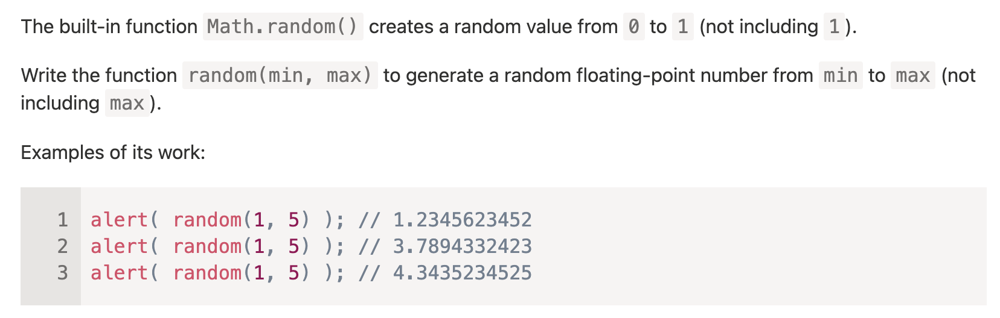

```js
function random(min, max) {
  return Math.random() * (max - min) + min;
}
```

6. A random integer from min to max
   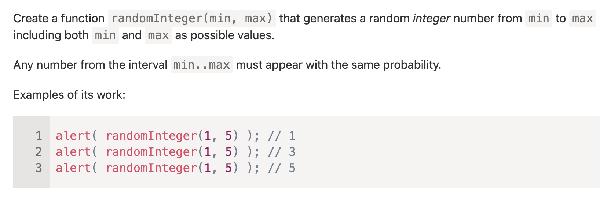

```js
function randomInteger(min, max) {
  return Math.floor(Math.random() * (max - min + 1)) + min;
}
```

---

## 5.3 문자열

### 특수기호

| 특수 문자      | 설명                                                                                                                                                 |
| -------------- | ---------------------------------------------------------------------------------------------------------------------------------------------------- |
| \b, \f, \v     | 각각 백스페이스(Backspace), 폼 피드(Form Feed), 세로 탭(Vertical Tab)을 나타내며 호환성 유지를 위해 남아있는 기호로 요즘엔 사용하지 않는 문자이다.   |
| \xXX           | 16진수 유니코드 XX로 표현한 특수 문자이다. (알파벳 z는 \x7A와 같다.)                                                                                 |
| \uXXXX         | UTF-16 인코딩 규칙을 사용하는 16진수 코드 XXXX로 표현한 유니코드 문자이다. 반드시 4개의 16진수로 구성되어 있어야 한다. (저작권 기호 ⓒ는 \u00A9이다.) |
| \u{X ~ XXXXXX} | UTF-32로 표현할 수 있는 유티코드 문자이다. 몇몇 특수문자는 두 개의 유티코드 기호를 사용하기에 4바이트를 차지한다. (웃는 얼굴 😍는 \u{1F60D}이다.)    |

### 특정 글자에 접근하기

str.charAt(idx)은 하위 호환성을 위해 남아 있는 메서드로 str\[idx]와 똑같은 역할을 한다. 두 개의 차이는 .charAt()은 문자열 범위를 벗어난 인덱스엔 빈 문자열을, str\[ ]은 undefined를 반환한다.

for..of 반분문의 반복자에 문자열을 넣으면 문자가 하나씩 변수에 대입한다.

```js
for (let char of "asdf") alert(char);
// 출력
// a
// s
// d
// f
```

문자열은 불변성의 성질을 가지고 있다.

```js
let name = "James";
name[0] = "G"; // Uncaught TypeError: Cannot assign to read only property '0' of string 'James'
alert(str); // 비엄격 모드에선 James가 출력되고, 엄격 모드에선 동작하지 않는다.
```

### 부분 문자열 추출하기

| 메서드                   | 추출할 부분 문자열           | 음수 허용 여부(인수) |
| ------------------------ | ---------------------------- | -------------------- |
| slice(start\[, end])     | start부터 (end까지)          | 음수 허용            |
| substring(start\[, end]) | start부터 / start와 end 사이 | 음수는 0으로 취급    |

(substr은 브라우저 이외의 호스트 환경에선 동작하지 않을 수 있다하여 안적었습니다.)

### 문자열 비교하기

`str.codePointAt(pos)`는 문자열의 pos에 위치한 문자의 아스키 코드를 반환한다.

```js
let str = "asdf";
alert(str.codePointAt(0)); // 97
alert(str.codePointAt(3)); // 102
```

`String.fromCodePoint(code)`은 code에 해당하는 아스키 코드 문자를 반환한다.

```js
alert(String.fromCodePoint(97)); // a
alert(String.fromCodePoint(102)); // f
```

### 문자열 제대로 비교하기

str.localeCompare(str2)로 문자열을 비교할 수 있는데
str이 str2보다 작으면 음수,
str이 str2보다 크면 양수,
같으면 0을 반환한다.

### 문자열 심화

#### 서로게이트 쌍

문자의 대다수는 2바이트 코드를 사용하고 있지만, 현존하는 모든 기호를 표현하기엔 2바이트 코드, 65,536개는 충분하지 못했다.
때문에 서로게이트 쌍이라는 2바이트 글자들의 쌍을 이용해 인코딩한다.

```js
alert("😀".length); // 2
```

자바스크립트가 나왔을 당시엔 서로게이트 쌍이라는 개념이 존재하지 않았기 때문에 서로게이트 쌍으로 표현되 글자는 제대로 처리하지 못한다.
위 예시에 웃는 이모티콘의 길이가 2인 까닭이 그렇다.

서로게이트 쌍은 구성하는 글자들이 붙어있을 때만 의미가 있으므로 따로 출력해보면 쓰레기 기호가 출력된다.

```js
alert("😀"[0]); // �
alert("😀"[1]); // �
```

글자의 코드가 0xd800~0xdbff 사이에 있으면 서로게이트 쌍에서의 첫번째 글자라는 것을 나타낸다. 이 경우에 두번째 글자의 코드는 0xdc00~0xdfff 사이에 있어야 한다.
0xd800~0xdbff와 0xdc00~0xdfff는 표준에서 서로게이트 쌍을 위해 일부러 비워둔 코드이다.

```js
alert("😀".charCodeAt(0).toString(16)); // d83d : 0xd800~0xdbff 사이에 있음
alert("😀".charCodeAt(1).toString(16)); // de00 : 0xdc00~0xdfff 사이에 있음
```

#### 발음 구별 기호와 유니코드 정규화

발음 구별 기호같은 합성 글자는 UTF-16 테이블에서 독자적인 코드를 갖는다. 조합 가능한 수가 너무 많기에 모든 합성 글자에 부여되진 않는다.
유니코드 문자 \u0307를 붙이면 윗 점을 만들 수 있다.

```js
alert("A\u0307"); // Ȧ
```

여기서 또다른 합성 글자를 붙일 수 있다.
\u0323를 붙이면 아래 점을 추가할 수 있다.

```js
alert("S\u0307\u0323"); // Ṩ
```

단점도 존재하는데, `'S\u0307\u0323'`와 `'S\u0323\u0307'`는 윗 점과 아래 점의 위치가 달라 동등 비교하면 false가 반환된다.

```js
alert("S\u0307\u0323" == "S\u0323\u0307"); // false
```

이런 문제를 해결하려면 유니코드 정규화라는 알고리즘으로 각 문자를 동일한 형태로 정규화 해야한다.
`str.normalize()`를 사용하면 된다.

```js
alert("S\u0307\u0323".normalize() == "S\u0323\u0307".normalize()); // true
```

`'S\u0307\u0323'`를 .normilize()로 하면 세 글자가 하나로 합쳐진다. 이때 합쳐진 `Ṩ`는 유니코드로 `\u1e68`인데 동등연산 해보면 true가 나오는 것을 볼 수 있다.

```js
alert("S\u0307\u0323".normalize() == "\u1e68"); // true
```

근데 항상 .normalize()가 한글자로 만들어주는 건 아니고, UTF-16 테이블을 만드는데 기여한 사람들이 해당 글자가 충분히 나타날 수 있을 것 같다고 판단해 넣은 글자만 그렇다.

### 5.3 과제

1. 첫 글자를 대문자로 변경하기

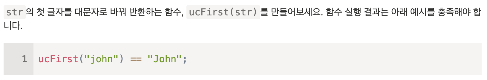

```js
function ucFirst(str) {
  return str[0].toUpperCase() + str.slice(1);
}
```

2. 스팸 문자열 걸러내기

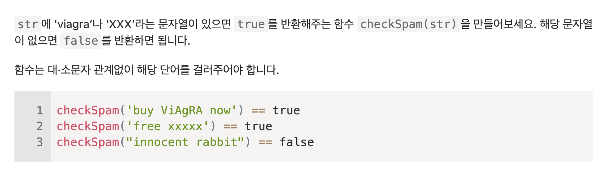

```js
function checkSpam(str) {
  const lowerStr = str.toLowerCase();
  if (lowerStr.includes("viagra") || lowerStr.includes("xxx")) return true;
  return false;
}
```

3. 문자열 줄이기

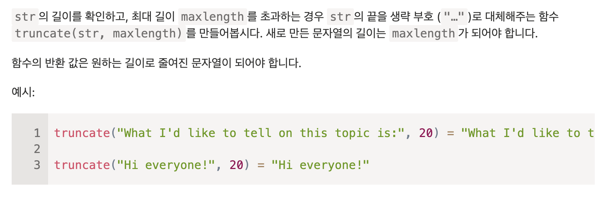

```js
function truncate(str, len) {
  if (str.length > len) {
    return str.slice(0, len - 1) + "…";
  } else {
    return str;
  }
}
```

4. 숫자만 추출하기

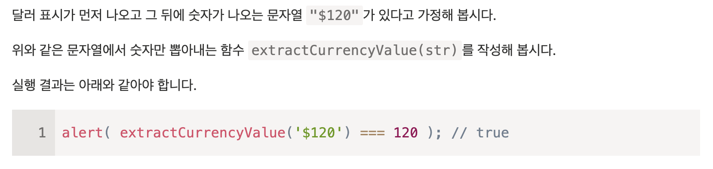

```js
function extractCurrencyValue(str) {
  let num = "";

  for (let char of str) {
    if ("0" <= char && char <= "9") num += char;
  }

  return +num;
}
```

해답:
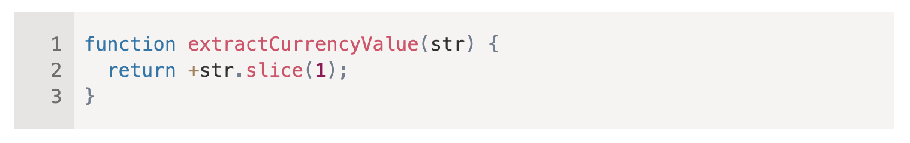
(너무 방대하게 생각한 것 같다...)

---

## 5.4 배열

배열은 특별한 종류의 '객체'이다. 대괄호를 이용하는 것도 객체에서 왔다. 숫자를 사용해 접근한다는 점만 다르다.

배열은 원시 자료형이 아닌 객체에 속하기에 객체처럼 행동한다.

```js
let a = [1, 2, 3];

let b = a;

b.push(4);

alert(a); // 1,2,3,4
```

배열도 객체이기에 프로퍼티를 추가할 수 있지만, 그러면 배열을 다룰 때만 작동하는 최적화 기법이 동작하지 않아 배열의 이점이 사라진다.

배열엔 .toString()이 구현돼 있어 문자열로 출력하면 요소가 쉼표로 구분된 문자열이 출력된다.

```js
alert([1, 2, 3]); // 1,2,3
```

new Array()로 배열을 선언하는 것보다 대괄호를 사용하는 방식보다 많이 쓰인다.

### 5.4 과제

1. 배열은 복사가 될까요?
   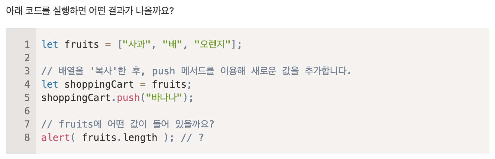
   fruits엔 `["사과", "배", "오렌지", "바나나"]`가 들어있기에 fruits.length는 4가 된다.

2. 배열과 관련된 연산
   

```js
// 1.
const styles = ["Jazz", "Blues"];

// 2.
styles.push("Rock-n-Roll");

// 3.
function changeCenterTo(str, arr) {
  const center = Math.floor((arr.length - 1) / 2);
  arr[center] = str;
}
changeCenterTo("Classics", styles);

// 4.
alert(styles.shift());

// 5.
styles.unshift("Rap", "Reggae");
```

3. 배열 컨텍스트에서 함수 호출하기
   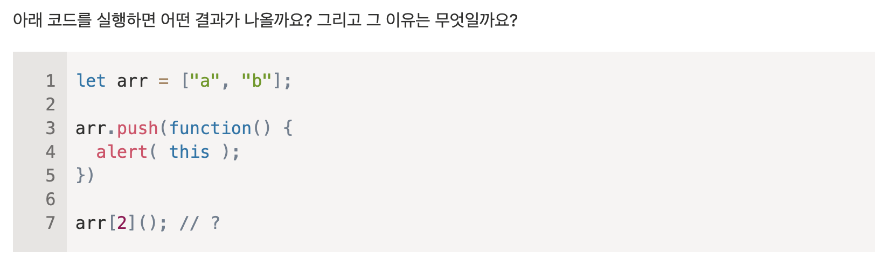
   배열이 출력될 것 같다. this는 메서드를 호출한 객체 자신을 가리키기 때문이다.
   해답:
   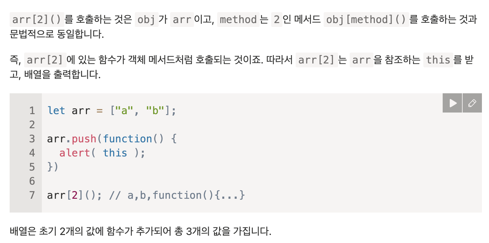

4. 입력한 숫자의 합 구하기
   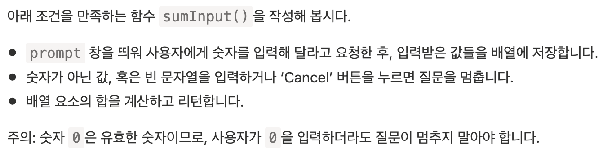

```js
function sumInput() {
  const arr = [];
  let num;
  while (true) {
    num = prompt("숫자를 입력해주세요");
    if (num === null || num === "" || !isFinite(num)) break;
    arr.push(+num);
  }
  return arr.reduce((acc, cur) => acc + cur, 0);
}
```

5. 최대합 부분 배열
   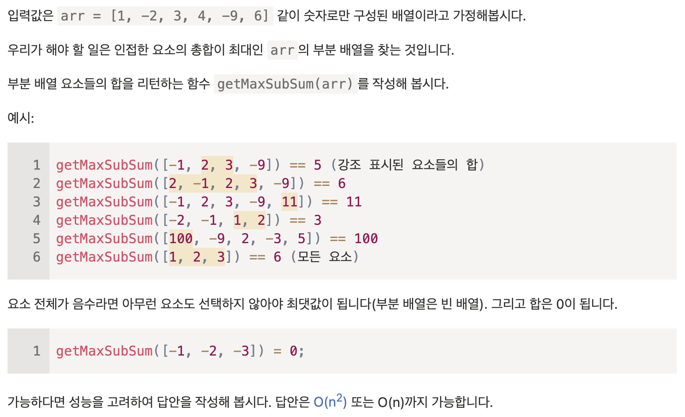

```js
function getMaxSubSum(arr) {
  let max = arr[0];
  for (let i = 1; i < arr.length; i++) {
    arr[i] = Math.max(arr[i], arr[i] + arr[i - 1]);
    if (max < arr[i]) max = arr[i];
  }
  return max < 0 ? 0 : max;
}
```

해답:
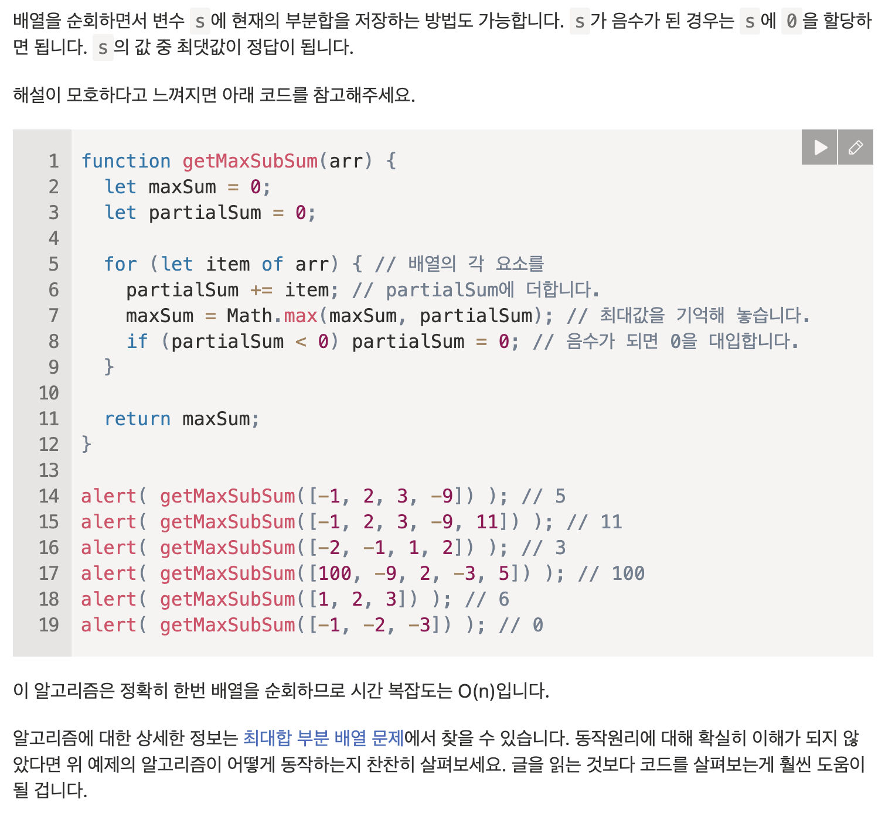

## 5.5 배열과 메서드

### .splice()

.splice() 메서드는 실행만으로 배열의 형태를 바꾼다.<br>
.splice() 메서드의 인자는 다음과 같다.<br>
`.splice(index[, deleteCount, elem1, elem2])`

index는 삭제할 요소들 중 첫번째 요소의 인덱스, deleteCount는 삭제할 개수, 세번째 인자부터 index에 추가할 요소들이 들어간다.<br>
이때 인덱스 인자, index에는 음수가 들어올 수 있다.<br>
이 외에도 .slice(), .indexOf()와 같이 인덱스를 사용하는 메서드는 음수 인덱스를 사용할 수 있다.

### .concat()

.concat() 메서드는 실행만으로 배열의 형태를 바꿀 수 없다.<br>
.concat() 메서드는 배열 뒤쪽에 요소를 합칠 때 사용하는데, 이때 인자로는 배열 또는 요소가 들어올 수 있다.

```js
let arr = [1, 2, 3];

alert(arr.concat([4, 5], 6, 7, 8)); // 1,2,3,4,5,6,7,8
```

### .indexOf(), .lastIndexOf(), .includes()

세 메서드 모두 인자는 다음 형태를 띈다.<br>
indexOf | lastIndexOf | includes(item, from)<br>
이때 .indexOf()와 .lastIndexOf()는 배열 내 요소를 찾을 때 일치연산자 `===` 을 사용하기에 NaN을 찾을 수 없지만 .includes()는 NaN을 감지할 수 있다.

### .find(), .findIndex()

.find(), .findIndex()는 인자로 함수가 들어오는데, 이 함수가 반환하는 값이 true라면 탐색을 멈추고 해당 요소나 인덱스를 반환한다.

```js
let fruits = {
  { name: "orange", color: "orange" },
  { name: "apple", color: "red" },
  { name: "lemon", color: "yellow" }
};

let redFruit = fruits.find(item => item.color === "red");

let redFruitIndex = fruits.find(item => item.color === "red");

alert(redFruit.name); // apple
alert(redFruitIndex); // 1
```

### .sort()

.sort() 메서드는 실행만으로 배열의 형태를 변형시킨다.<br>
.sort() 메서드는 그냥 쓰면 오름차순 정렬이 되는데 추가로 배열 인자로 배열을 정렬하는 함수를 넣을 수 있다.<br>
주의할 점은 숫자 배열에 그냥 .sort() 메서드를 실행시키면 배열 내 요소들을 "문자열"로 변환한 후 정렬하기 때문에 다음과 같은 오류가 발생한다.

```js
let arr = [2, 1, 15];

arr.sort();

alert(arr); // 1,15,2
```

때문에 숫자 배열을 정렬시킬 대는 따로 인자에 함수를 넣어줘야한다.<br>
이때 인자에 들어가는 함수는 다음과 같이 사용한다.

```js
function compare(a, b) {
  return a - b;
}
```

이 함수엔 비교할 요소 2개가 인자로 들어오는데, 첫번째 인자가 두번째 인자보다 클 때 양수를, 같을 때는 0을, 작을 때 음수를 반환시키면 올므차순 정렬이 된다.

```js
let arr = [2, 1, 15];

arr.sort((a, b) => a - b);

alert(arr); // 1,2,15
```

문자열을 정환하게 비교할 때는 .localCompare() 메서드를 사용하면 좋다. 유니코드를 기준으로 글자를 비교하기에 정확하다.

```js
let names = ["Ben", "Özmen", "Vance"];
alert(names.sort((a, b) => (a > b ? 1 : -1))); // Ben,Vance,Özmen 제대로 정렬이 되지 않음

alert(names.sort((a, b) => a.localeCompare(b))); // Ben,Özmen,Vance 제대로 정렬됨
```

### .reverse()

.reverse()도 실행만으로 배열의 형태를 변형시키는 메서드이다.

배열의 요소를 역순으로 정렬시키는 메서드이다.

```js
let arr = [1, 3, 2];

arr.reverse();

alert(arr); //2,3,1
```

### .split()

만약 문자열을 하나씩 나눠 배열로 만들고 싶다면 다음처럼 인자로 빈 문자열을 주면 된다.

```js
let str = "adsf";

alert(str.split("")); // a,s,d,f
```

### Array.isArray()

배열도 객체이기 때문에 typeof로 배열을 출력해보면 object라고 뜬다.

```js
alert(typeof {}); // object
alert(typeof []); // object
```

Array.isArray()를 쓰면 인자의 값이 배열인지 확인할 수 있다.

### 함수를 인자로 하는 배열 메서드의 'thisArg'

thisArg는 함수를 인자로 하는 배열 메서드(.sort() 제외)는 두번째 인자로 thisArg라는 인자를 옵션으로 받을 수 있다.<br>
이 인자는 첫번째 인자의 함수 내의 this가 된다.

```js
let requirement = {
  minHeight: 150,
  maxHeight: 190,
  isPossible(user) {
    return user.height >= this.minHeight && user.height <= this.maxHeight;
  },
};

let users = [
  { name: "Amy", height: 148 },
  { name: "Ben", height: 183 },
  { name: "Charles", height: 163 },
  { name: "David", height: 192 },
];

let possibleUsers = users.filter(requirement.isPossible, requirement);

alert(possibleUsers.map((user) => user.name)); // Ben,Charles
```

`users.filter(user => requirement.isPossible(user))` 처럼 사용할 수도 있지만 thisArg를 사용하는 방식이 좀 더 이해하기 쉬워 더 자주 사용된다.

### 5.5 과제

1. border-left-width를 borderLeftWidth로 변경하기
   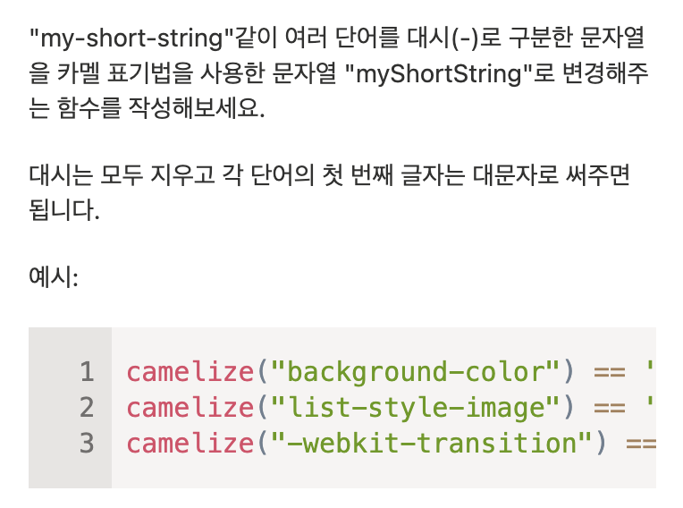

```js
function camelize(str) {
  str = str.split("-");
  return str.reduce(
    (camelStr, curStr) => camelStr + curStr[0].toUpperCase() + curStr.slice(1)
  );
}
```

2. 특정 범위에 속하는 요소 찾기
   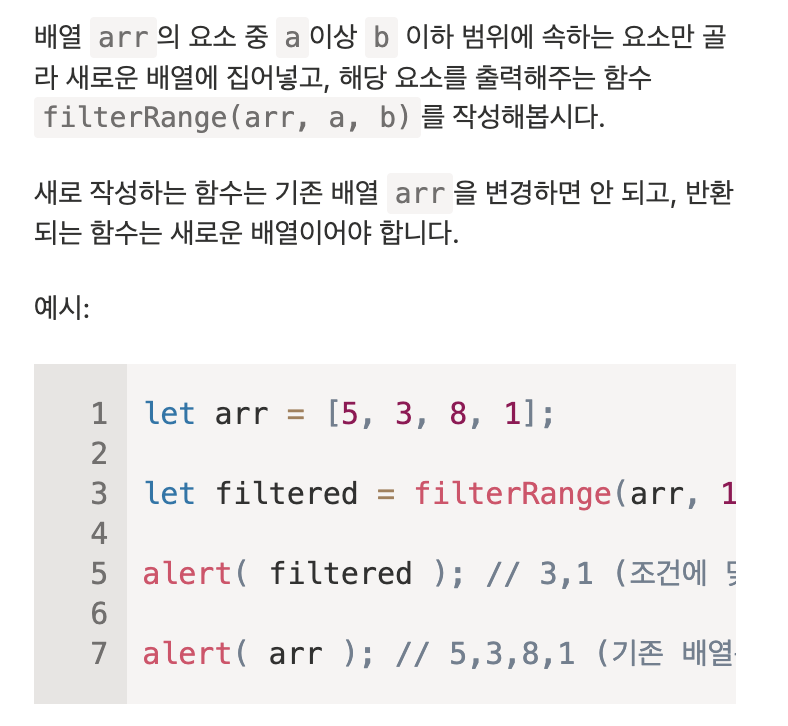;

```js
function filterRange(arr, min, max) {
  return arr.filter((num) => num >= min && num <= max);
}
```

3. 특정 범위에 속하는 요소 찾기(배열 변경하기)
   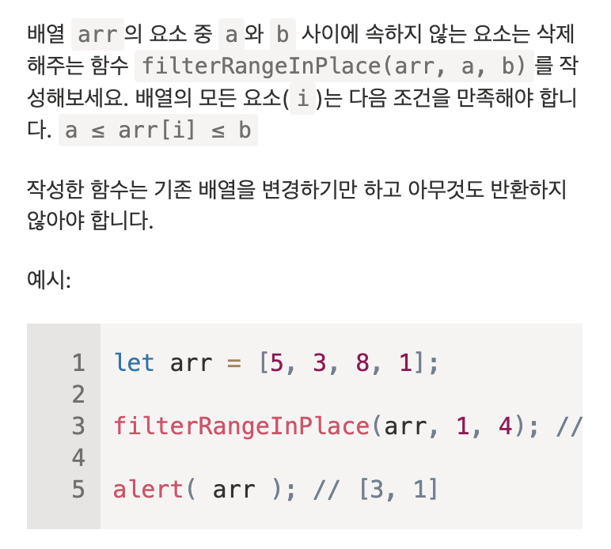;

```js
function filterRangeInPlace(arr, min, max) {
  for (let i = 0; i < arr.length; i++) {
    if (!(arr[i] >= min && arr[i] <= max)) {
      arr.splice(i, 1);
    }
  }
}
```

4 내림차순으로 정렬하기

```js
let arr = [5, 2, 1, -10, 8];

// 요소를 내림차순으로 정렬해주는 코드를 여기에 작성해보세요.
arr.sort((a, b) => b - a);

alert(arr); // 8, 5, 2, 1, -10
```

5. 배열 복사본을 정렬하기
   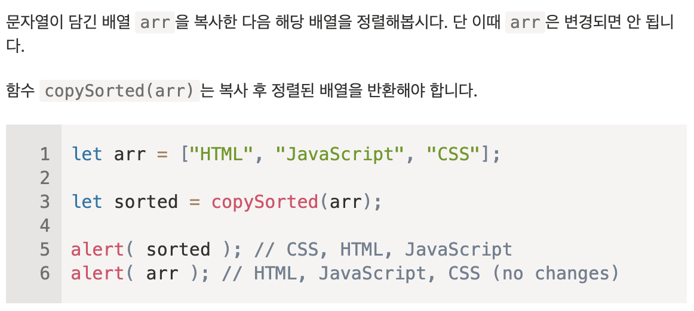;

```js
function copySorted(arr) {
  arr = [...arr];
  arr.sort((a, b) => a.localeCompare(b));
  return arr;
}
```

6. 확장 가능한 계산기
   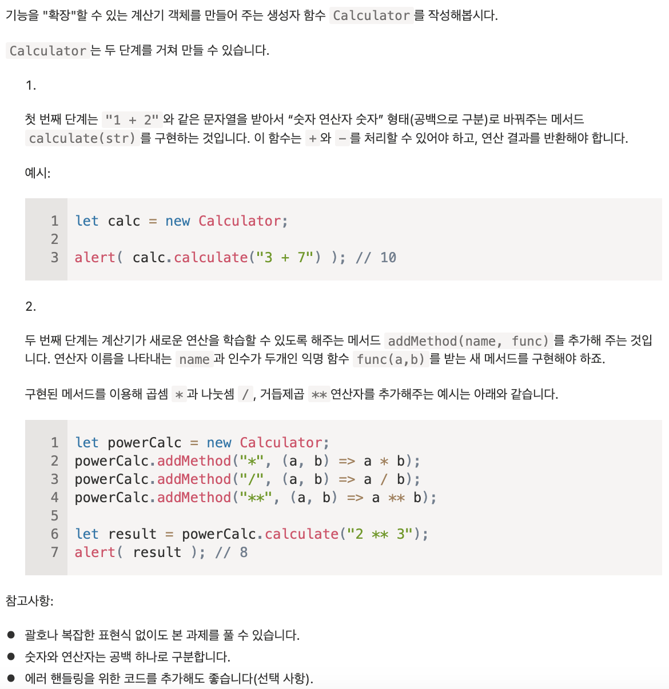

```js
// 첫번째 단게
function Calculator() {
  this.calculate = function (exp) {
    exp = exp.split(" ");
    switch (exp[1]) {
      case "+":
        return +exp[0] + +exp[2];
      case "-":
        return +exp[0] - +exp[2];
    }
  };
}
```

```js
// 두번째 단계
function Calculator() {
  this.methods = {
    "+": (a, b) => a + b,
    "-": (a, b) => a - b,
  };
  this.calculate = function (exp) {
    exp = exp.split(" ");
    const sign = exp[1];

    if (sign in methods) return this.methods[sign](+exp[0], +exp[2]);
  };

  this.addMethod = function (sign, method) {
    this.methods[sign] = method;
  };
}
```

7. 이름 매핑하기
   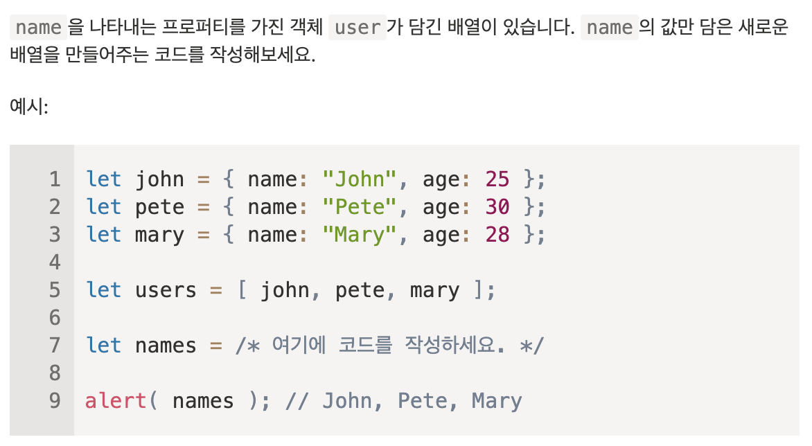

```js
let john = { name: "John", age: 25 };
let pete = { name: "Pete", age: 30 };
let mary = { name: "Mary", age: 28 };

let users = [john, pete, mary];

let names = users.map((user) => user.name);

alert(names); // John, Pete, Mary
```

8. 객체 매핑하기
   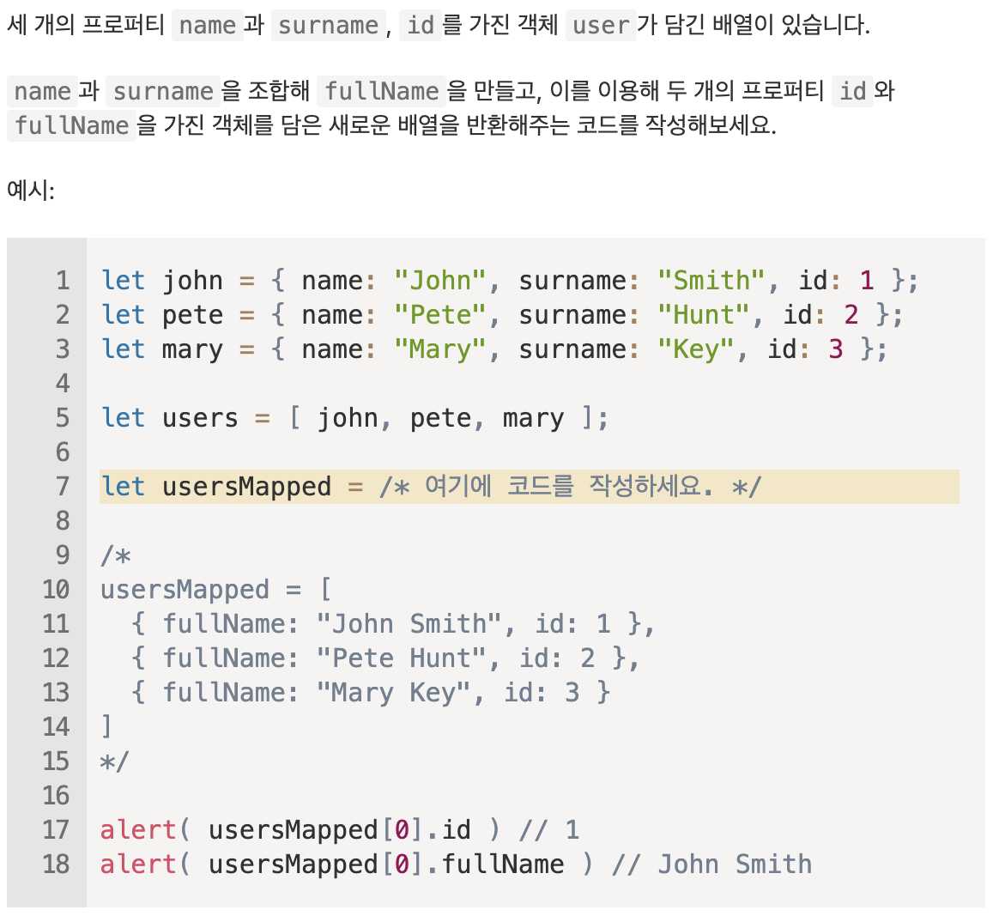

```js
let john = { name: "John", surname: "Smith", id: 1 };
let pete = { name: "Pete", surname: "Hunt", id: 2 };
let mary = { name: "Mary", surname: "Key", id: 3 };

let users = [john, pete, mary];

let usersMapped = users.map((user) => ({
  fullName: `${user.name} ${user.surname}`,
  id: user.id,
}));

/*
usersMapped = [
  { fullName: "John Smith", id: 1 },
  { fullName: "Pete Hunt", id: 2 },
  { fullName: "Mary Key", id: 3 }
]
*/

alert(usersMapped[0].id); // 1
alert(usersMapped[0].fullName); // John Smith
```

9. 나이를 기준으로 객체 정렬하기
   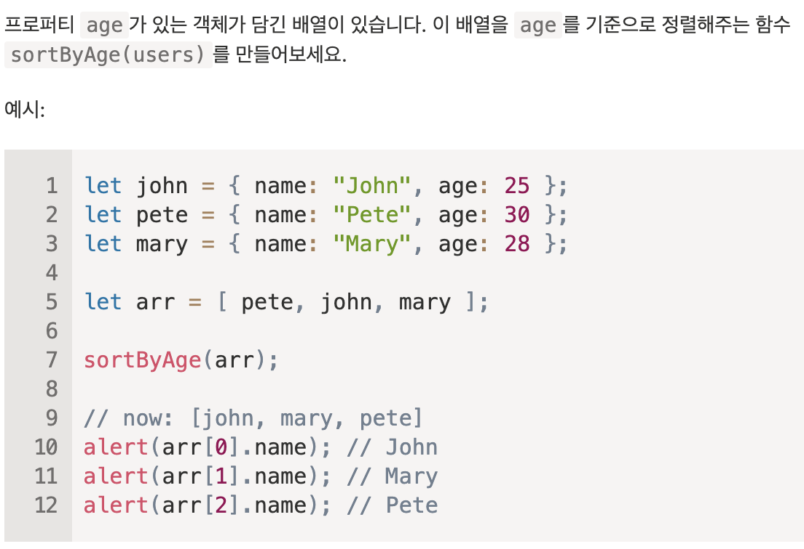

```js
function sortByAge(arr) {
  arr.sort((a, b) => a.age - b.age);
}
```

10. 배열 요소 무작위로 섞기

```js
function shuffle(arr) {
  arr.sort(() => Math.random() - 0.5);
}
```

11. 평균 나이 구하기
    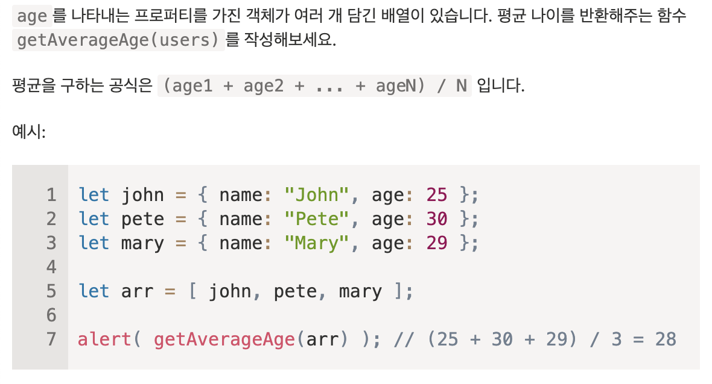

```js
function getAverageAge(arr) {
  let sum = arr.reduce((acc, cur) => acc + cur.age, 0);
  return sum / arr.length;
}
```

12. 중복 없는 요소 찾아내기
    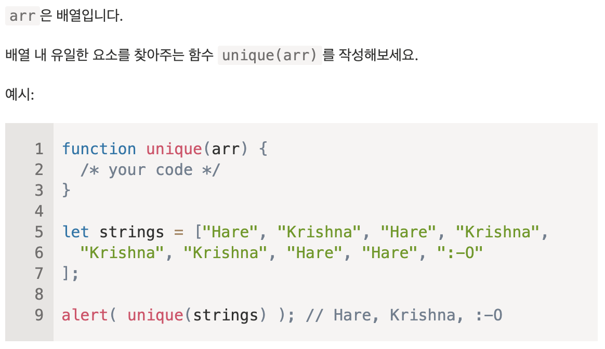

```js
function unique(arr) {
  return Array.from(new Set(arr));
}

let strings = [
  "Hare",
  "Krishna",
  "Hare",
  "Krishna",
  "Krishna",
  "Krishna",
  "Hare",
  "Hare",
  ":-O",
];

alert(unique(strings)); // Hare, Krishna, :-O
```

13. Create keyed object from array
    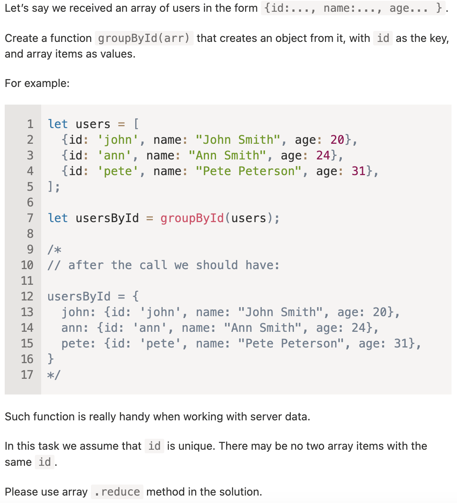

```js
function groupById(arr) {
  return arr.reduce((obj, cur) => {
    obj[cur.id] = cur;
    return obj;
  }, {});
}
```

## 5.6 iterable 객체

for..of 반복문을 적용할 수 있는 반복 가능한 객체를 iterable 객체라고 한다.

배열은 대표적인 iterable 객체이다. 문자열도 iterable의 예이며, 어떤 것들의 컬렉션(목록, 집합 등)이든 for..of 문법을 적용할 수만 있다면 iterable 객체이다.

### Symbol.iterator

일박전인 객체를 반복가능한 iterable 객체로 만드려면 Symbol.iterator라는 메서드를 추가해 만들 수 있다.

```js
let range = {
  to: 1,
  from: 5,
};

range[Symbol.iterator] = function () {
  return {
    current: this.from,
    last: this.to,

    next() {
      if (this.current <= this.last) {
        return { done: false, value: this.current++ };
      } else {
        return { done: true };
      }
    },
  };
};

for (let num of range) {
  alert(num);
}
```

이때 위 코드에서 range 객체를 for..of로 돌렸을 때 동작 과정은 다음과 같다.

1. for..of는 시작되자마자 Symbol.iterator를 호출한다(Symbol.iterator가 없으면 에러가 발생함). 여기서 Symbol.iterator는 반드시 이터레이터(next() 메서드가 있는 객체)를 반환해야 한다.
2. 이후 for..of는 반환된 객체(이터레이터)를 대상으로 동작한다.
3. for..of에 다음 값이 필요하면 for..of는 이터레이터의 next() 메서드를 호출한다.
4. next()의 반환값은 { done: Boolean, value: any }와 같은 형태이어야 한다. done이 true일 때는 반복이 종료되었음을 의미한다. done=false 일땐 value에 다음 값이 저장된다.

다음처럼 이터레이터 객체와 반복 대상 객체를 합쳐서 range 자체를 이터레이터로 만들면 코드가 더 간단해진다.

```js
let range = {
  from: 1,
  to: 5,
  [Symbol.iterator]() {
    this.current = this.from;
    return this;
  },
  next() {
    if (this.current <= this.to) {
      return { done: false, value: this.current++ };
    } else {
      return { done: true };
    }
  },
};
```

### 문자열은 이터러블

배열과 마찬가지로 문자열도 광범위하게 쓰이는 내장 이터러블이다.

for..of는 문자열의 각 글자를 순회한다.

```js
for (let char of "asdf") {
  alert(char); // a, s, d, f가 차례대로 출력됨
}
```

서로게이트 쌍인 문자열에도 잘 동작한다.

```js
for (let char of "😀😃😄😁") {
  alert(char); // 😀, 😃, 😄, 😁가 차례대로 출력됨
}
```

### 이터레이터를 명시적으로 호출하기

이터레이터를 다음처럼 명시적으로 호출할 수도 있다.

```js
let str = "Hello";

let iterator = str[Symbol.iterator]();

while (true) {
  let result = iterator.next();
  if (result.done) break;
  alert(result.value); // H, e, l, l, o가 차례대로 출력됨
}
```

이터레이터를 명시적으로 호출하는 경우는 거의 없는데,<br>
위처럼 하면 반복 과정을 더 잘 통제할 수 있어<br>
반복을 시작하다가 멈춰 다른 작업을 하다가 다시 반복을 시작하는 것과 같은 세부적인 작업을 할 수 있다는 장점이 있다.

### 유사 배열

유사 배열은 인덱스와 length 프로퍼티가 있어 배열처럼 보이는 객체를 말한다.

```js
let fakeArray = {
  0: "Hello",
  1: "World",
  length: 2,
};
```

유사 배열은 배열이 아니기 때문에 push(), pop() 등의 메서드를 지원하지 않는다.

### Array.from

Array.from을 이용하면 이터러블이나 유사 배열을 받아 진짜 배열로 만들어준다.<br>
그러면 push()나 pop() 등의 배열 메서드를 사용할 수 있어진다.

```js
let fakeArray = {
  0: "Hello",
  1: "World",
  length: 2,
};
let realArray = Array.from(fakeArray);
alert(realArray.pop()); // World (배열 메서드가 제대로 동작함)
```

위에 range 변수도 Array.from()으로 감싸면 진정한 배열 형태로 전환된다.

Array.from()의 형태는 다음과 같다.

```js
Array.from(obj[, mapFn, thisArg])
```

두번째 인자의 mapFn에는 콜백함수가 오는데 각 요소를 대상으로 콜백함수의 반환값으로 바꿔줄 때 사용한다.<br>
세번째 인자의 thisArg는 각 요소의 this를 지정할 수 있도록 해준다.

```js
let arr = Array.from(range, (num) => num * 2);
alert(arr); // 2, 4, 6, 8, 10이 차례대로 출력됨
```

Array.from()은 str.split()과 달리, 문자열이 가진 이터러블 속성을 이용해 동작하기에 for..of처럼 서로게이트 쌍을 제대로 처리한다.

```js
let str = "😀😃";

let arrStr = Array.from(str);
for (let char of arrStr) {
  alert(char); // 😀, 😃가 차례대로 잘 출력됨
}
```

Array.from을 이용하면 서로게이트 쌍을 처리할 수 있는 slice 메서드도 구현할 수 있다.

```js
function slice(str, start, end) {
  return Array.from(str).slice(start, end).join("");
}

let str = "😀😃😄";

alert(slice(str, 1, 3)); // 😃😄
// 순수 메서드는 서로게이트 쌍을 지원하지 않음
alert(str.slice(1, 3)); // 쓰레깃값
```

## 5.7 맵과 셋

맵과 셋은 객체나 배열과 같은 또다른 구조의 자료구조이다.<br>

### 맵

맵에는 다음과 같은 메서드와 프로퍼티가 존재한다.

- `map.set(key, value)` key를 이용해 value를 저장함
- `map.get(key)` key에 해당하는 값을 반환함, key가 존재하지 않으면 undefined를 반환함
- `map.has(key)` key가 존재하면 true, 그렇지 않다면 false를 반환함
- `map.delete(key)` key에 해당하는 값을 삭제함
- `map.clear()` 맵 내 모든 요소들을 제겋마
- `map.size` 요소의 개수를 반환함

```js
let map = new Map();

map.set("1", "ADSF"); // 문자형 키
map.set(1, "QWER"); // 숫자형 키
map.set(true, "ZXCV"); // 불린형 키

// 객체는 키를 문자형으로 변환하는 특징이 있지만 Map은 키의 타입을 변환시키지 않기에 아래의 결과가 다르게 출력되는 것이다.
alert(map.get("1")); // ASDF
alert(map.get(1)); // QWER
alert(map.size); // 3
```

### 객체형 키

맵은 키로 객체를 허용한다.

```js
let user = { name: "James" };

let usersWithId = new Map();

usersWithId.set(user, 12);

alert(usersWithId.get(user)); // 12
```

이 객체형 키를 객체에서 사용한다면 위 코드를 다음처럼 써야한다.

```js
let user = { name: "James" };

let usersWithId = {};

usersWithId[user] = 12;

alert(usersWithId["[object Object]"]); // 12
```

객체를 문자형으로 변환시키기 때문에 위처럼 값을 가지고 와야한다.

### Map이 키를 비교하는 방식

맵은 SameValueZero라 불리는 알고리즘을 사용해 값이 서로 같은 확인한다. 이 알고리즘은 일치연산자와 비슷하지만 두 개의 NaN을 서로 비교했을 때 같다고 취급하는 점에서 차이가 있다. 때문에 맵에선 NaN도 키로 쓸 수 있다.

그리고 이 알고리즘은 수정하거나 커스터마이징 하는 것이 불가능하다.

### 체이닝

map.set()을 호출할 때 맵 자기자신을 반환하기에 아래처럼 체이닝을 할 수가 있다.

```js
map.set("1", "ASDF").set(1, "QWER").set(true, "ZXCV");
```

### 맵의 요소에 반복 작업하기

맵의 요소를 반복하기 위해선 아래의 세가지 메서드를 사용할 수 있다.

- `map.keys()` 각 요소의 키를 모은 이터러블 객체를 반환함
- `map.values()` 각 요소의 값을 모은 이터러블 객체를 반환함
- `map.entries()` 요소의 `[키, 값]`을 한 쌍으로 하는 이터러블 객체를 반환함

```js
let users = new Map([
  ["James", 12],
  ["John", 30],
  ["Jake", 18],
]);

for (let name of users.keys()) {
  alert(name); // James, John, Jake가 차례대로 출력됨
}

for (let age of users.values()) {
  alert(age); // 12, 30, 18이 차례대로 출력됨
}

for (let user of usres) {
  // users.entries()와 동일함
  alert(user); // James,12  John,30  Jake,18가 차례대로 출력됨
}
```

추가로 Map을 생성과 동시에 초기화하려면 위처럼 이중 배열을 사용해서 초기화할 수 있다.

맵은 객체와 다르게 삽입 순서를 기억하며 그 순서대로 순회를 실시한다.

```js
users.forEach((value, key) => {
  alert(`${key}: ${value}`); // James: 12, John: 30, ...
});
```

### Object.entries()로 객체를 맵으로 바꾸기

Object.entries()는 객체를 이중 배열 형태로 바꿔준다.<br>
이 특징으로 객체를 Map으로 변환할 수 있다.

```js
let user = {
  name: "John",
  age: 30,
};

let map = new Map(Object.entries(user)); // [['name', 'John'], ['aeg', 30]]
alert(map.get("name")); // John
```

### Object.fromEntries()로 맵을 객체로 바꾸기

Object.entries()와 반대로 맵을 객체로 바꿔주는 메서드이다.

```js
let user = Object.fromEntries([
  ["name", "John"],
  ["age", 18],
]);

alert(user.name);
```

map.entries()를 호출하면 `[키, 값]` 을 요소로 가지는 이터러블을 반환한다.

```js
let user = new Map([
  ["name", "John"],
  ["age", 18],
]);

let obj = Object.fromEntries(user.entries());

alert(obj.name); // John
```

아래처럼 단축시킬 수도 있다.

```js
let obj = Object.fromEntries(user);
```

Map 객체는 일반적인 반복가능한 키-값 쌍을 반환하기 때문이다.

### 셋

셋(Set)은 중복을 허용하지 않는 값을 모아놓은 컬렉션이다. 말 그대로 집합을 의미한다.<br>
아래와 같은 메서드들이 있다.

- `set.add(value)` 값을 추가하고 셋 자신을 반환함
- `set.delete(value)` 값을 제거함, 제거에 성공하면 true, 실패하면 false를 반환함
- `set.has(value)` 셋 내에 값이 존재하면 true, 그렇지 않다면 false를 반환함
- `set.clear()` 셋을 비움
- `set.size` 셋에 몇 개의 값이 있는지 세줌

셋은 중복을 허용하지 않기에 셋 내에 동일한 값을 계속 .add()로 추가해도 아무런 반응이 없다.

```js
let set = new Set();

const James = { age: 18 };
const Jake = { age: 30 };
const John = { age: 42 };

set.add(James);
set.add(Jake);
set.add(John);
set.add(James);
set.add(Jake);

alert(set.size); // 3

for (let user of set) {
  alert(user.age); // 18, 30, 42 순으로 출력됨
}
```

이터러블이기에 .forEach()를 사용할 수 있는데 이때 .forEach() 메서드는 다음과 같은 형태를 띈다.

```js
set.forEach((value, valueAgain, set) => {
  alert(value);
});
```

두번째 인자의 valueAgain은 첫번째 인자의 value와 같은 값을 나타내고, 세번째 인자는 set 자기자신을 가리킨다.<br>
두번째 인자가 굳이 있는 이유는 맵과의 호환성 때문이다.<br>
맵은 .forEach()에 쓰이는 콜백이 세 개의 인수를 받기 때문에 이렇게 구현해 놓아야 맵을 셋으로, 셋을 맵으로 교체하기기 쉬워진다.

셋에도 맵과 마찬가지로 반복 작업을 하기 위한 메서드들이 있다.

- `set.keys()` 셋 내의 모든 값을 포함하는 이터러블 객체를 반환함
- `set.values()` set.keys()와 동일하지만 맵과의 호환성을 위해 만들어짐
- `set.entries()` 셋 내의 값을 `[value, value]`들의 배열을 포함하는 이터러블 객체를 반환함. 얘 또한 맵과의 호환성을 위해 만들어짐

잘못된 부분이 있으면 알려주세요😁

### 5.7 과제

1. 배열에서 중복 요소 제거하기

   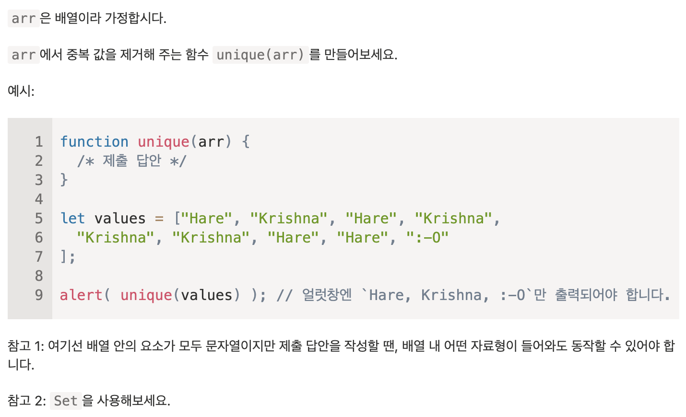

```js
function unique(arr) {
  return Array.from(new Set(arr).keys());
}
```

해답

```js
function unique(arr) {
  return Array.from(new Set(arr));
}
```

Set은 맵과 다르게 키-값 쌍으로 되어 있지 않기에 굳이 .keys()를 호출하지 않아도 `[value, value]`의 배열로 반환되지는 않는 것 같다.

2. 애너그램 걸러내기

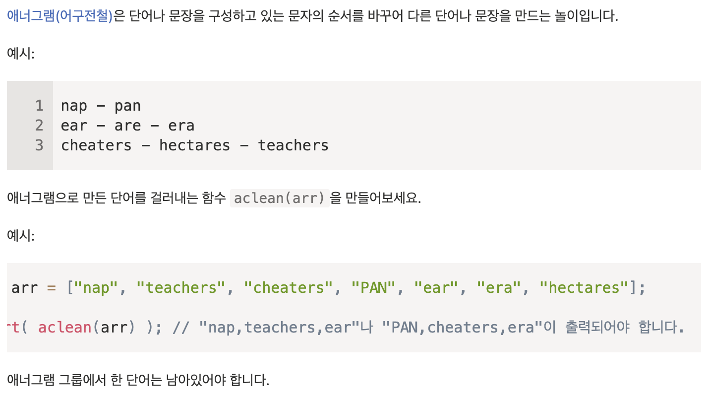

```js
function aclean(arr) {
  const words = {};

  for (let word of arr) {
    const key = word.toLowerCase().split("").sort().join("");
    words[key] = word;
  }

  return Object.values(words);
}
```

3. 반복 가능한 객체의 키

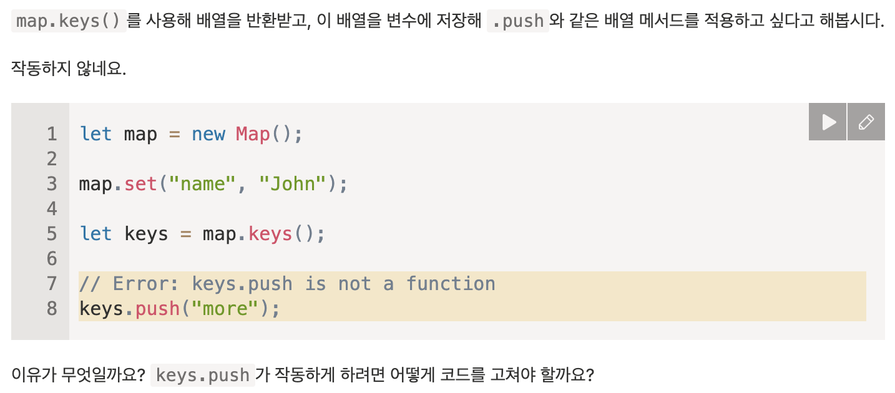

```js
// 5번째 라인을 아래처럼 고치면 된다.
let keys = Array.from(map.keys());
```

## 5.8 위크맵과 위크셋

### 위크맵

위크맵은 맵과 다르게 키가 반드시 객체여야 한다.<br>
키로 원시값이 올 수 없다.

```js
let weakMap = new WeakMap();

let obj = {};

weakMap.set(obj, "ASDF");

weakMap.set("ASDF", 1234); // TypeError: valid value used as weak map key
```

맵과의 또다른 차이점은 위크맵은 키로 사용된 객체를 참조하는 것이 아무 것도 없다면 해당 객체는 메모리에서 삭제된다는 것이다.

```js
let obj = {};
let weakMap = new WeakMap();
weakMap.set(obj, "ASDF");

obj = null;

// weakMap에서 obj를 키로 값이 메모리에서 삭제됨
```

그냥 맵으로 했을 경우엔 .keys() 메서드로 객체를 접근할 수 있기 때문에 메모리에서 삭제되지 않는다.<br>위크맵은 .keys() 메서드 포함 .value(), .entries() 메서드를 지원하지 않아 위 코드에서 접근할 방법이 없어 값이 삭제되는 것이다.

위크맵이 지원하는 메서드는 다음과 같다.

- `weakMap.get(key)`
- `weakMap.set(key, value)`
- `weakMap.delete(key)`
- `weakMap.has(key)`

### 활용 사례: 추가데이터

만약 객체에 데이터를 추가해줘야 하는데, 이 객체가 살아있는 동아에만 유효한 상황이라고 한다면 이 때 위크맵을 사용할 수 있다.

```js
let john = {
  age: 18,
};

let weakMap = new WeakMap();
weakMap.set(john, "계정");

john = null;
// john이 사망할 경우, john의 계정은 사라져야한다.
// weakMap에서 john을 접근할 방법이 없으니 john에 null이 들어왔을 때 값이 사라짐
```

만약 맵으로 위 코드를 구현한다면, 맵의 키를 통해 객체를 접근할 수 있어 삭제되지 않았을 것이다.

```js
let john = {
  age: 18,
};

let map = new Map();
map.set(john, "계정");

john = null;

// map.keys() 로 객체 키에 접근할 수 있기에 객체는 삭제되지 않는다.
```

### 활용 사례: 캐싱

캐싱은 시간이 오래 걸리는 작업의 결과를 저장해두어 연산 시간과 비용을 아끼는 기법이다.<br>
예를들어 아래처럼 객체를 연산하여 결과값을 반환하는 함수를 보면

```js
let cache = new WeakMap();

function process(obj) {
  if (!cache.has(obj)) {
    let result = obj.first * obj.second;

    cache.set(obj, result);
  }

  return cache.get(obj);
}

let obj = {
  first: 7,
  second: 8,
};

let result1 = process(obj); // obj를 키로 56이 cache에 저장됨

let result2 = process(obj); // 두번째 연산에선 cache에 저장된 값을 가져옴

obj = null; // 객체가 쓸모없어졌을 땐 null로 덮음

alert(cache.size); // 0: cache가 weakMap으로 선언되어 값이 잘 삭제됨
```

### 위크셋

위크셋도 위크맵과 비슷하게 객체만 저장할 수 있고 원시 값은 저장할 수 없다.<br>
마찬가지로 셋 내의 객체들은 도달 가능할 때만 메모리에서 유지된다.<br>
때문에 .add(), .has(), .delete()와 같은 메서드들만 사용할 수 있고, 값을 가지고 오거나 반복 작업을 할 수 있는 .keys()나 .size 같은 메서드, 프로퍼티들은 사용할 수 없다.

```js
let weakSet = new WeakSet();

let james = { age: 18 };
let jake = { age: 30 };
let john = { age: 42 };

weakSet.add(james);
weakSet.add(jake);
weakSet.add(john);
weakSet.add(james); // 중복되니 들어가지 않음
weakSet.add(jake); // 중복되니 들어가지 않음

weakSet.has(james); // true

james = null; // weakSet에서 james를 나타내는 객체가 자동으로 삭제됨
```

위크맵과 위크셋은 객체와 함께 추가 데이터를 저장하는 용도로 사용할 수 있다.

### 5.8 과제

1. '읽음'상태인 메시지 저장하기

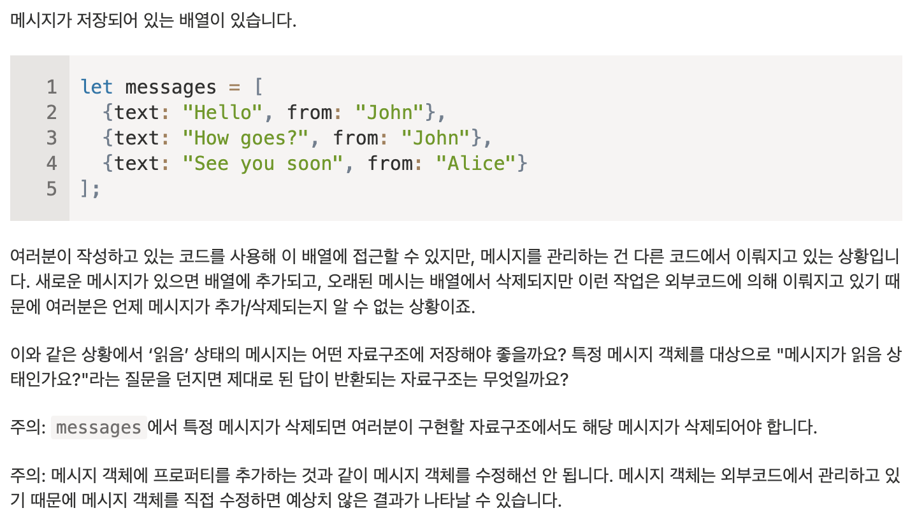

위와 같은 상황에선 WeakMap 자료구조를 사용하여 메시지가 읽혔는지 판단할 수 있다. WeakMap 자료구조를 쓴다면 메시지가 삭제됐을 때 메시지의 읽힘 값이 저장되어 있는 자료구조에서 값이 자동으로 삭제되기에 이 상황에서 사용하기 좋다.

해답

```js
let messages = [
  { text: "Hello", from: "John" },
  { text: "How goes?", from: "John" },
  { text: "See you soon", from: "Alice" },
];

let readMessages = new WeakSet();

// 메시지 두 개가 읽음 상태로 변경되었습니다.
readMessages.add(messages[0]);
readMessages.add(messages[1]);
// readMessages엔 요소 두 개가 저장됩니다.

// 첫 번째 메시지를 다시 읽어봅시다!
readMessages.add(messages[0]);
// readMessages에는 요소 두 개가 여전히 저장되어 있습니다(중복 요소 없음).

// "'message[0]'은 읽음 상태인가요?"에 대한 답변
alert("message 0은 읽음 상태인가요?: " + readMessages.has(messages[0])); // true

messages.shift();
// 이제 readMessages에는 요소가 하나만 남게 되었습니다(실제 메모리에서 사라지는 건 나중이 되겠지만 말이죠).
```

해답에선 읽은 메세지들은 readMessages WeakSet 객체에 담는 식으로 구현되어 있다.

2. 읽은 날짜 저장하기

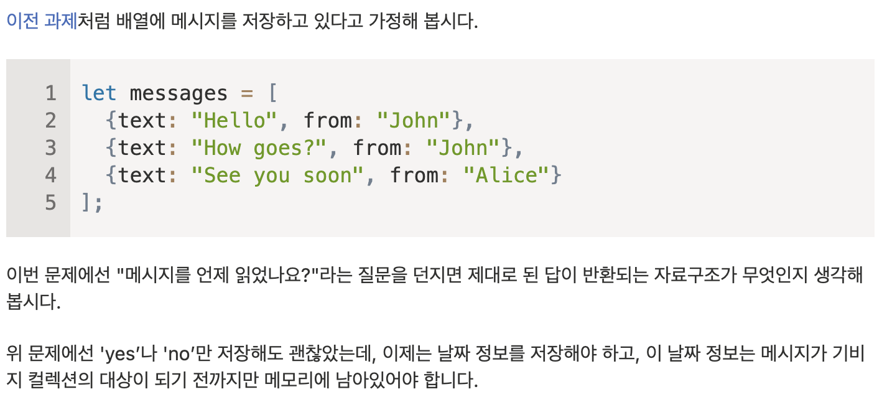

```js
let messages = [
  { text: "Hello", from: "John" },
  { text: "How goes?", from: "John" },
  { text: "See you soon", from: "Alice" },
];

let readMessages = new WeakMap();

// 읽은 메세지들은 WeakMap 객체에 날짜와 함께 저장함
readMessages.set(messages[0], new Date());
readMessages.set(messages[1], new Date());

// 읽은 메세지면 읽힌 날짜를 반환하고 안 읽었다면 undefined를 반환함
function getReadDate(index) {
  return readMessages.get(messages[index]);
}

alert(getReadDate(0)); // 날짜
alert(getReadDate(2)); // undefined

messages[0] = null; // 0번째 메시지 삭제
alert(getReadDate(0)); // undefined
```

## 5.9 Object.keys, values, entries

keys(), values(), entries() 메서드를 사용할 수  있는 자료구조는 다음과 같다.
- Map
- Set
- Array

일반 객체에도 keys()나 values() 같은 순회 관련 메서드가 존재하지만 문법에 차이가 있다.

### Object.keys, values, entries

- `Object.keys(obj)` - 객체의 키만 담은 배열을 반환함
- `Object.values(obj)` - 객체의 값만 듬은 배열을 반환함
- `Object.entries(obj)` - `[키, 값]` 쌍을 담은 배열을 반환함

맵은 기준으로 일반 객체의 순회 관련 메서드를 비교하면 다음과 같다

| | 맵 | 객체 |
| -- | -- | -- |
| 호출 문법 | map.keys() | Object.keys(obj) |
| 반환 값 | iterable 객체 | '진짜' 배열 |
첫번째 차이는 일반 객체는 obj.keys()가 아닌 Object.keys(obj)로 호출해야한다는 점이다.

이렇게 문법이 다른 이유는 유연성 때문이다. 자바스크립트에선 많은 복잡한 자료구조들이 객체에 기반한다.<br>
그러다 보니 객체에 자체적으로 values()나 keys() 메서드가 구현되어 있는 경우가 있을 수 있기에 Object.values(obj)나 Object.keys(obj) 형태로 호출하게 한 것이다.

두번째 차이는 Object.*는 이터러블 객체가 아닌 배열을 반환한다는 점이다.<br>
배열을 반환하는 이유는 하위 호환성 때문이다.<br>
이 메서드가 나올 당시엔 이터러블 객체가 없었기 때문이다.<br>
배열로 반환한다면 배열 메서드를 바로 사용할 수 있기에 기능면에서도 유리하다.

또 다른 차이점은 Object.keys(), Object.values(), Object.entries()는 심볼형 키를 무시한다.<br>
심볼형 키를 연산 대상에 포함하는 건 좋지 않다.<br>
만약 심볼형 키를 반환받고 싶다면 Object.getOwnPropertySymbols()를 사용해 심볼형 키만 가지고 올 수 있다.<br>
만약 심볼형 키를 포함한 모든 키를 배열 형태로 받고 싶을 땐 Reflect.ownKeys(obj)를 사용하면 된다.

### 5.9 과제
1. 프로퍼티 값 더하기

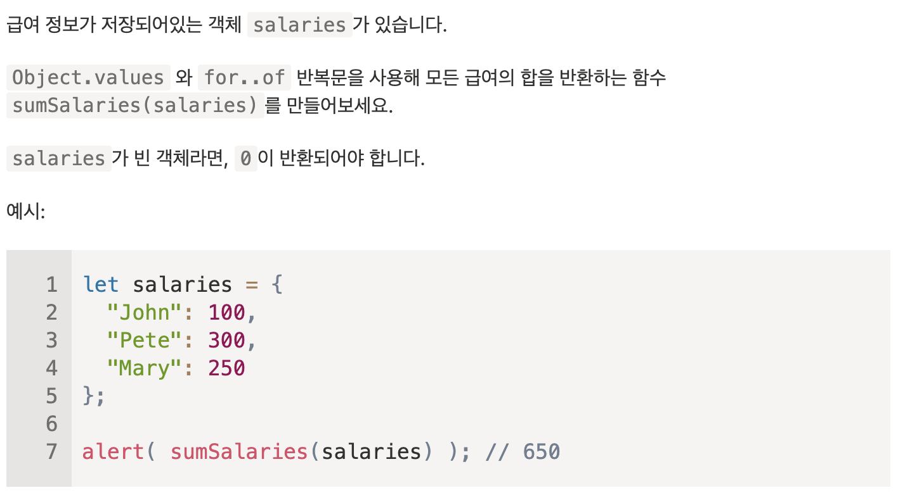

```js
function sumSalaries(salaries) {
  return Object.values(salaries).reduce((sum, current) => sum + current, 0);
}
```

2. 프로퍼티 개수 세기

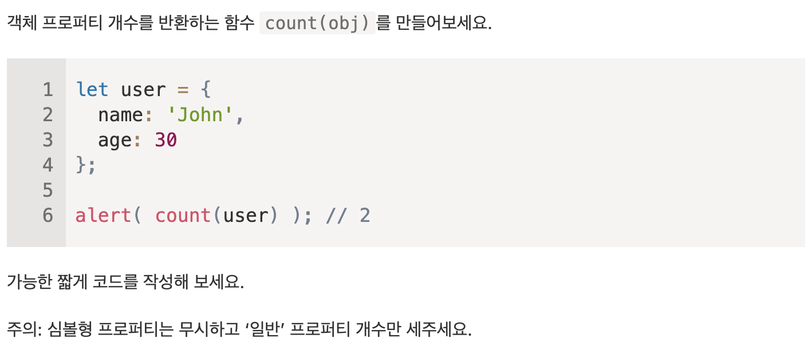

```js
function count(user) {
  return Object.keys(user).length;
}
```

## 5.10 구조 분해 할당

구조 분해 할당은 객체와 배열에서 값을 변수로 분해하여 할당할 때 사용할 수 있는 기능이다.<br>
다음과 같이 사용핤 수 있다.
```js
let obj = {
  name: "James",
  age: 18
};

let fruits = ['apple', 'banana', 'cherry']

const {name, age} = obj;
const [apple, banana, cherry] = fruits;
```

### 구조 분해 할당 특징

쉼표를 사용하면 요소를 무시할 수 있다.

```js
let fruits = ['apple', 'banana', 'cherry']

const [apple, , cherry] = fruits; // banana가 무시됨
alert(cherry); // cherry
```

할당 연산자의 오른쪽엔 모든 이터러블이 올 수 있다.

```js
const [apple, banana, cherry] = "abc"; // ["a", "b", "c"]

const [date, eggfruit, fig] = new Set(["date", "eggfruite", "fig"]);
```

할당할 수 있으면 할당 연산자 좌측엔 뭐든지 올 수 있다.

```js
const user = {};
[user.name, user.age] = ["James", 18]

alert(user.name); // James
alert(user.age); // 18
```

다음처럼 하면 한 줄로 변수끼리 값을 교환할 수도 있다.

```js
let user1 = "James";
let usre2 = "Jake";

[user1, user2] = [user2, user1];

alert(user1); // Jake
alert(user2); // James
```

할당하고자 하는 변수의 개수보다 분해하고자 하는 배열의 길이가 짧아도 에러가 발생하진 않는다.<br>
대신 undefined가 변수에 할당된다.

구조 분해 할당할 때 기본값을 줄 수 있다.
```js
const [name = "James", age=18] = ["Jake"];
alert(name); // Jake
alert(age); // 18
```

```js
const {name = "John", age = 42} = {age: 30};
alert(name); // John
alert(age); // 30
```

이때 기본값을 어떤 함수의 반환값으로 받는다고 할 때 우측에 값이 제공되지 않았을 때만 함수가 실행된다.

```js
// "이름을 입력하세요."라는 프롬프트만 출력됨
const [name = prompt("이름을 입력하세요."), age = prompt("나이를 입력하세요")] = [, 18];
```

위 상황은 객체를 분해했을 때도 마찬가지다.

### 5.10 과제

1. 구조 분해 할당

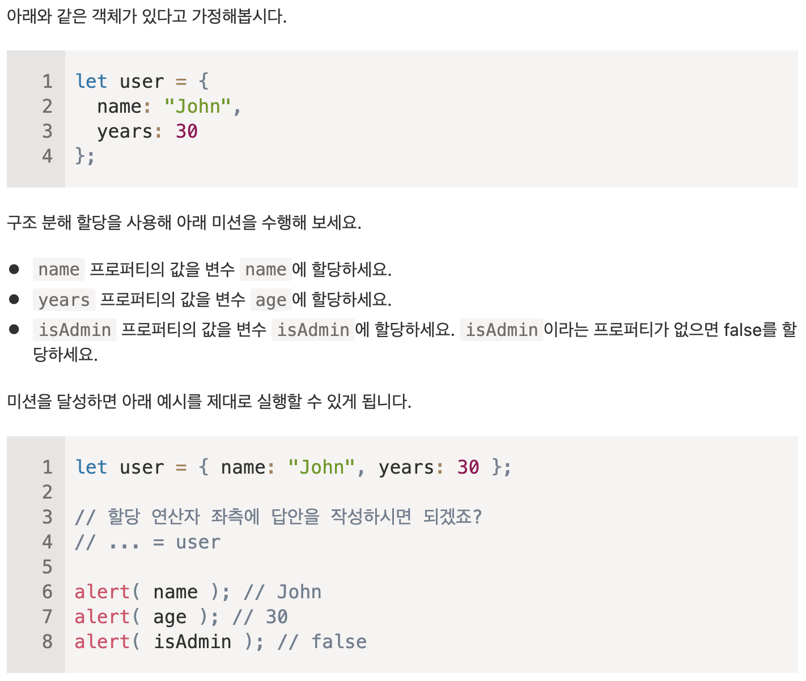

```js
const { name, years: age, isAdmin = false } = user;
```

2. 최대 급여 계산하기

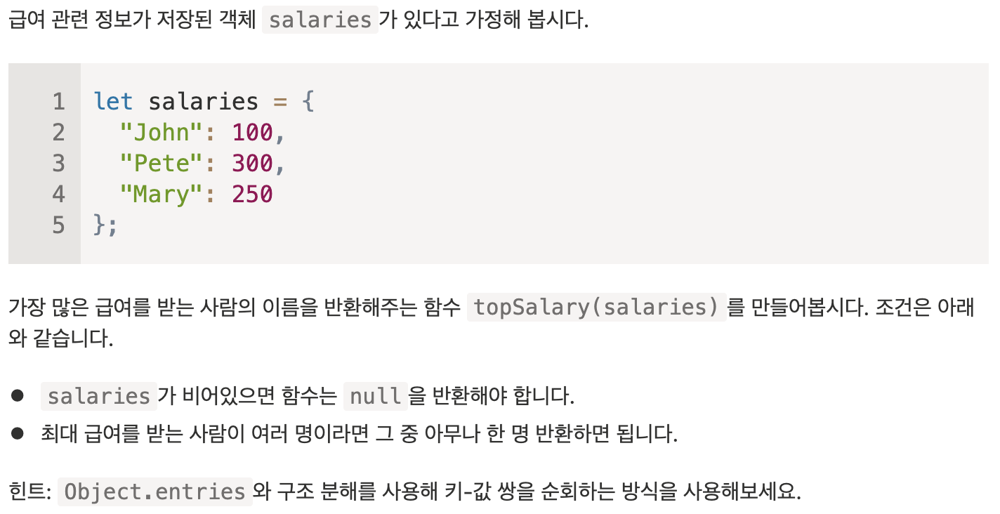

```js
function topSalary(salaries) {
  if (Object.keys(salaries).keys().length === 0) {
    return null;
  }

  let max = 0;
  let name;

  Object.entries(salaries).forEach(([curName, salary]) => {
    if (max < salary) {
      max = salary;
      name = curName;
    }
  });

  return name;
}
```

해답

```js
function topSalary(salaries) {

  let max = 0;
  let maxName = null;

  for(const [name, salary] of Object.entries(salaries)) {
    if (max < salary) {
      max = salary;
      maxName = name;
    }
  }

  return maxName;
}
```

## 5.11 Date 객체와 날짜

Date는 날짜 관련 메서드를 제공해주는 내장 객체이다.

### 객체 생성하기

#### **new Date()**

인수 없이 `new Date()` 로 호출하면 현재 날짜, 시간이 저장된 객체가 반환된다.

```js
let now = new Date();
alert(now) // Sat Apr 22 2023 20:44:29 GMT+0900 (한국 표준시)
```

#### **new Date(milliseconds)**

UTF 기준(UTF+0) 1970년 1월 1일 0시 0분 0초에서 milliseconds 밀리초 후의 시점이 저장된 Date 객체가 반환된다.

```js
let Jan01_1970 = new Date(0);
alert(Jan01_1970); // Thu Jan 01 1970 09:00:00 GMT+0900 (한국 표준시)

// 1년 뒤의 날짜
let Jan01_1971 = new Date(1000 * 3600 * 24 * 365);
alert(Jan01_1971); // Fri Jan 01 1971 09:00:00 GMT+0900 (한국 표준시)
```

음수 값을 넣으면 1970년 1월 1일 이전의 날짜를 가져올 수 있다.

```js
let Jan01_1969 = new Date(-1000 * 3600 * 24 * 365);
alert(Jan01_1969); // Wed Jan 01 1969 09:00:00 GMT+0900 (한국 표준시)
```

#### **new Date(datestring)**

만약 인수로 문자열이 들어간다면 자동으로 구문 분석된다. 이 때 적용되는 알고리즘은 Date.parse에서 사용하는 알고리즘과 동일하다.

```js
let date = new Date("2017-01-26");
alert(date);
```

#### **new Date(year, month, date, hours, minutes, seconds, ms)**

여러개의 인수로 날짜를 지정할 수도 있다. 이때 아래의 조건과 특징을 갖는다.

- `year` 는 반드시 네자리 숫자여야 한다.
- `month` 는 0(1월)부터 11(12월) 사이의 숫자여야 한다.
- `date` 는 일을 나타내고 값이 없다면 1일로 처리된다.
- `hours`부터 `ms`에 값이 없는 경우엔 0으로 처리된다.

```js
let date = new Date(2023, 3, 28); // 2023년 4월 28일
alert(date); // Fri Apr 28 2023 00:00:00 GMT+0900 (한국 표준시)
```

### 날짜 구성요소 얻기

Date 객체에서 아래의 메서드로 연, 월, 일 등의 값을 얻을 수 있다.

- `getFullYear()` 연도 네 자릿수가 반환된다.
- `getMonth()` 월을 반환한다. (0부터 11사이)
- `getDate()` 일을 반환한다. (1부터 31사이)
- `getHours(), getMinutes(), getSeconds(), getMilliseconds()` 시, 분, 초, 밀리초를 반환한다.

>getYear()는 더이상 사용되지 않는 비 표준 메서드기 때문에 getFullYear()를 사용해야한다.

> 추가로 `getUTCFullYear()`, `getUTFDate()` 처럼 'get' 뒤에 'UTF'를 붙이면 표준시(UTF+0)을 기준으로 하는 날짜를 반환해준다.

- `getDay()` 0부터 6까지 일요일을 시작으로 각각의 요일을 나타내는 숫자를 반환한다.


- `getTime()` 1970년 1월 1일 0시 0분 0초부터 사이의 간격을 밀리초 단위의 타임스탬프를 반환한다.

- `getTimezoneOffset()` 현지 시간과 표준 시간의 차이를 분으로 반환한다. 한국은 표준 시간보다 9시간 빠르므로 분으로 -540이 반환된다.

### 날짜 구성요소 설정하기

아래 메서드를 이용하면 날짜 구성요소를 설정할 수 있다.

- `setFullYear(year, [month], [date])`
- `setMonth(month, [date])`
- `setDate(date)`
- `setHours(hour, [min], [sec], [ms])`
- `setMinutes(min, [sec], [ms])`
- `setSeconds(sec, [ms])`
- `setMilliseconds(ms)`
- `setTime(milliseconds)` 1970년 1월 1일 0시 0분 0초터 밀리초 이후의 날짜를 설정한다.

위 메서드에서 setTime() 제외한 모든 메서드는 set뒤에 UTC를 붙여 표준시에 따라 날짜 구성 요소를 설정할 수 있다.

### 자동 고침

Date 객체는 범위가 벗어나는 날짜를 자동으로 고쳐주는 기능이 있다.

```js
let date = new Date(2023, 2, 32); // 3월 32일은 존재하지 않으므로 4월 1일로 고쳐짐
alert(date); // Sat Apr 01 2023 00:00:00 GMT+0900 (한국 표준시)
```

날짜 구성요소를 설정하는 set으로 시작하는 메서드에서도 범위를 넘어가는 값을 넣으면 자동으로 고쳐진다.

```js
let date = new Date(2023, 2, 31); // 3월 31일
date.setDate(32); // 3월 32일은 존재하지 않으므로 4월 1일로 고쳐짐

alert(date); // Sat Apr 01 2023 00:00:00 GMT+0900 (한국 표준시)
```

위 예시와 반대로 1일보다 작은 값으로 설정하면 이전 달로 고쳐진다.

```js
let date = new Date(2023, 2, 1); // 3월 31일
date.setDate(0); // 3월 0일은 존재하지 않으므로 2월 28일로 고쳐짐

alert(date); // Tue Feb 28 2023 00:00:00 GMT+0900 (한국 표준시)
```

### Date 객체, 숫자로 변경해 시간차 측정하기

date객체를 숫자형으로 변경하면 getTime()을 호출할 때 나오는 값으로 변경된다.<br>
이를 토대로 성능 테스트를 위한 시간차 측정을 할 수 있다.

```js
let start = new Date();

let multiplesOf13 = 0;

for (let i = 13; i <= 1000000; i += 13) {
  multiplesOf13++;
}

let end = new Date();

alert(`백만까지 13의 배수의 개수를 구하는데 걸린 시간은 ${end - start}ms 입니다.`);
```

### Date.now()

new Date().getTime()과 동일하지만 객체를 생성하지 않는다는 점이 다르다. 때문에 가비지 컬렉터의 일을 덜어 성능이 좋고 빠르다.

```js
let start = Date.now();

let multiplesOf13 = 0;

for (let i = 13; i <= 1000000; i += 13) {
  multiplesOf13++;
}

let end = Date.now();

alert(`백만까지 13의 배수의 개수를 구하는데 걸린 시간은 ${end - start}ms 입니다.`);
```

### Date.parse()
Date.parse(str)를 사용하면 문자열에서 날짜를 읽어올 수 있다.<br>
`YYYY-MM-DDTHH:mm:ss.sssZ` 형식의 문자열이 들어와야한다.

- `YYYY-MM-DD` 는 연-월-일을 나타냄
- `T` 는 구분 기호로 쓰임
- `HH:mm:ss.sss` 는 시:분:초.밀리초를 나타냄
- `Z` 는 옵션으로 `+hh:mm` 또는 `-hh:mm` 로 기준을 정할 수 있다. (기본 Z=UTC+0)

Date.parse(str)는 타임스탬프를 반환하며 형식에 맞지 않은 경우엔 NaN을 반환한다.<br>
Date.parse(str)를 활용하여 타입스탬프만으로 새로운 Date 객체를 만들 수 있다.

```js
let date = new Date(Date.parse("2023-03-31T01:13:41.143+12:00"));
alert(date);
```

### 5.11 과제

1. 날짜 생성하기

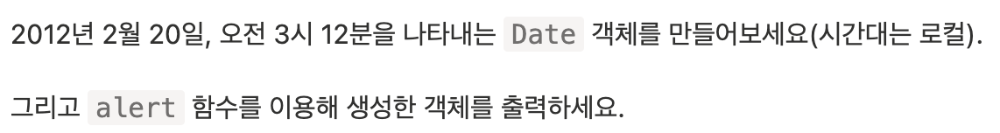

```js
let date = new Date(2012, 1, 20, 3, 12);
alert(date);
```

2. 요일 보여주기

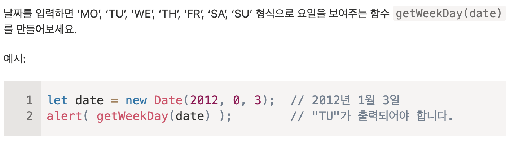

```js
function getWeekDay(date) {
  let week = ['SA', 'SU', 'MO', 'TU', 'WE', 'TH', 'FR'];
  return week[date.getDay()];
}
```

3. 유럽 기준 달력

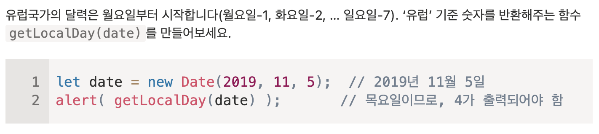

```js
function getLocalDay(date) {
  return date.getDay() || 7;
}
```

4. n일 전 '일' 출력하기

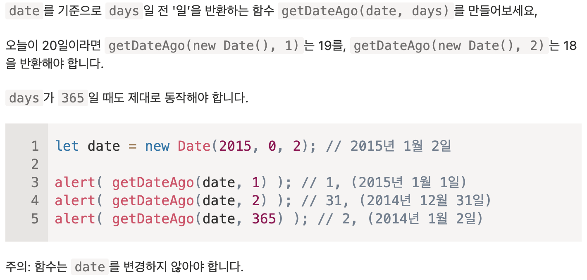

```js
function getDateAgo(date, ago) {
  const newDate = new Date(date);
  newDate.setDate(newDate.getDate() - ago);
  return newDate;
}
```

5. 달의 마지막 일

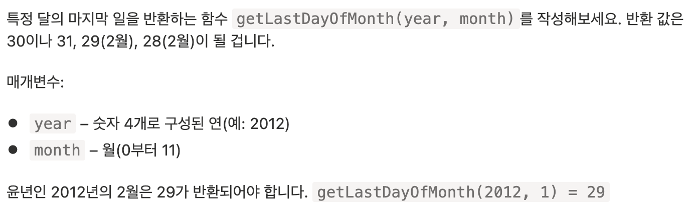

```js
function getLastDayOfMonth(year, month) {
  return new Date(year, month+1, 0).getDate();
}
```

6. 몇 초나 지났을까요?

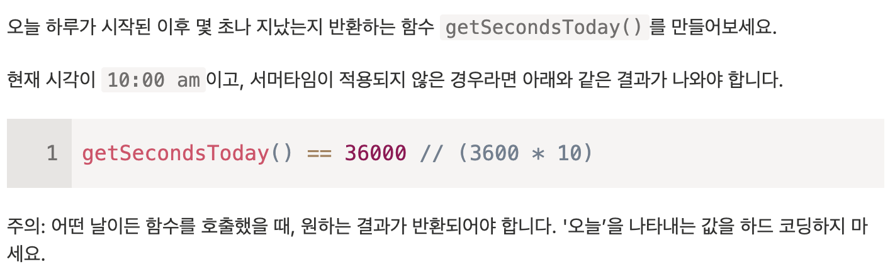

```js
function getSecondsToday() {
  const start = new Date();
  start.setHours(0, 0, 0, 0);
  const end = new Date();
  return Math.floor((end - start) / 1000);
}
```

해답

```js
function getSecondsToday() {
  const d = new Date();
  return d.getHours() * 3600 + d.getMinutes() * 60 + d.getSeconds();
}
```

7. 몇 초나 남았을까요?

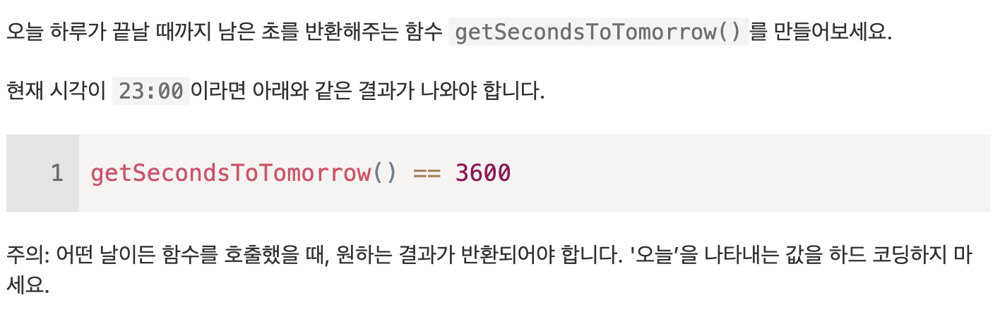

```js
function getSecondsToTomorrow() {
  const now = new Date();
  
  const tomorrow = new Date(now.getFullYear(), now.getMonth(), now.getDate() + 1);
  return Math.ceil((tomorrow - now) / 1000);
}
```

8. 상대 날짜 출력하기

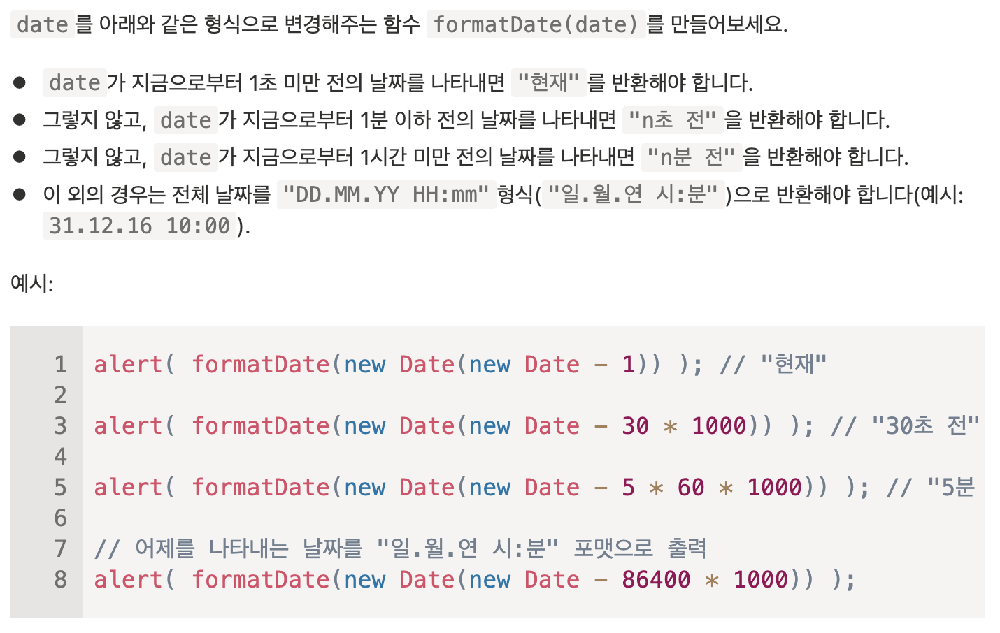

```js
function formatDate(date) {
  const diff = new Date() - date;
  if (diff < 1000) return "현재";

  if (diff < 1000 * 60)
    return Math.floor((diff) / 1000) + "초 전";

  if (diff < 1000 * 60 * 60)
    return Math.floor((diff) / 1000 / 60) + "분 전";

  const times = [
    date.getDate(),
    date.getMonth() + 1,
    date.getFullYear(),
    date.getHours(),
    date.getMinutes()
  ].map(str => `${str}`.padStart(2, '0'));
  
  return `${times.slice(0, 3).join(".")} ${times.slice(3).join(":")}`;
}
```

## 5.12 JSON과 메서드
객체를 네트워크를 통해 어디론가 보낼때 객체를 문자열 형태로 변경해야 한다.<br>
이때 자바스크릡트에 내장된 JSON을 사용하면 문자열로 변경하는 작업을 손쉽게 할 수 있다.

자바스크립트가 제공하는 JSON 관련 메서드는 아래와 같다.
- `JSON.stringify` 객체를 JSON으로 바꿔준다.
- `JSON.parse` JSON을 객체로 바꿔준다.

### JSON.stringify

아래 객체에 JSON.stringify를 적용해보면

```js
let user = {
  name: 'Jackson',
  age: 19,
  isFamous: true,
  langs: ["JS", "Python", "Java", "C#", "Dart"],
  child: null
}

const json = JSON.stringify(user);

alert(typeof json); // string

alert(json); // JSON 타입 데이터가 잘 출력됨
```

JSON에 들어올 수 있는 타입은 아래와 같다.
- 객체
- 배열
- 원시형:
  - 문자형
  - 숫자형
  - 불린형
  - null

이 외에 함수 프로퍼티나 심볼형 프로퍼티, 값이 undefined인 프로퍼티는 무시된다.

```js
let a = {
  p1() {
    alert("asdf");
  },
  [Symbol("id")]: "adsf",
  asdf: undefined
};
alert(JSON.stringify(a)); // {}
```

또한 순환 참조가 있는 객체에 JSON.stringify를 사용하는 건 불가능하다.

```js
let a = {};
let b = {};

a.prop = b;
b.prop = a;

JSON.stringify(a); // TypeError: Converting circular structure to JSON
```

#### replacer로 원하는 프로퍼티만 직렬화하기
JSON.stringify의 전체 문법은 아래와 같다.
```js
const json = JSON.stringify(value[, replacer, space]);
```
value는 인코딩하려는 값<br>
replacer는 인코딩 하길 원하는 프로퍼티들의 배열 또는 매핑 함수 `function(key, value)`<br>
space는 서식 변경으로 사용할 공백 문자 수를 의미한다.<br>
대개의 경우 JSON.stringify 엔 하나의 인수만을 넣어 사용하지만<br>
순환 참조같은 경우를 다룰 때는 정교하게 조정할 때는 두번째 인자를 사용해야 한다.

```js
let orders = {
  users: [
    { name: "James" },
    { name: "John" }
  ]
};
let books = {
  books: [
    {title: 'good adventure book'},
    {title: 'nice horror book'}
  ]
};

orders.books = books;
books.orders = orders;

alert(JSON.stringify(orders, ['users', 'books', 'name', 'title']));
// {"users":[{"name":"James"},{"name":"John"}],"books":{"books":[{"title":"good adventure book"},{"title":"nice horror book"}]}}
```

위처럼 books 객체의 orders를 제외한 프로퍼티만을 배열에 넣어서 순환 참조 문제를 해결할 수 있다.<br>
위 코드는 JSON.stringify의 두번째 인자에 함수를 넣으면 더 간단하게 할 수 있다.

```js
let orders = {
  users: [
    { name: "James" },
    { name: "John" }
  ]
};
let books = {
  books: [
    {title: 'good adventure book'},
    {title: 'nice horror book'}
  ]
};

orders.books = books;
books.orders = orders;

alert(JSON.stringify(orders, (key, value) => {
  alert(`${key}: ${value}`);
  return key === "orders" ? undefined : value;
}));
/*
: [object Object]
users: [object Object],[object Object]
0: [object Object]
name: James
1: [object Object]
name: John
books: [object Object]
books: [object Object],[object Object]
0: [object Object]
title: good adventure book
1: [object Object]
title: nice horror book
orders: [object Object]
*/
```

처음에 `: [object Object]` 가 출력되는 까닭은 함수가 최초로 호출될 때 `{"": orders}` 형태의 wrapper 객체가 만들어지기 때문이다.<br>
위 코드에서 key가 orders인 프로퍼티는 value가 아닌 undefined를 반환하게 했으므로 순환 참조가 끊기게 된다.

#### space로 가독성 높이기

JSON.stringify()의 세번째 인수 space에는 가독성을 높이기 위한 공백 문자 수가 들어온다.

```js
let a = { b: ['asdf', 'qwer', 'xzcv' ] };
```

위 코드를 JSON.stringify로 번환하면 아래의 문자열이 나온다.

```js
alert(JSON.stringify(a)); // {"b":["asdf","qwer","xzcv"]}
```

이때 세번째 인자에 값을 넣으면 아래와 같이 출력된다.

```js
alert(JSON.stringify(a, null 2));
/*
{
  "b": [
    "asdf",
    "qwer",
    "xzcv"
  ]
}
*/
```

세번째 인자에 2는 공백문자 2개씩 띄워서 출력해달라는 의미이다.

### 커스텀 "toJSON"
toJSON은 toString처럼 반환값을 인코딩될 값으로 정한다.<br>

```js
let a = {
  toJSON() {
    return {
      name: "Jackson",
      age: 19
    }
  }
}
alert(JSON.stringify(a)); // {"name":"Jackson","age":19}
```

### JSON.parse

JSON.parse의 형식은 아래와 같다.

```js
let obj = JSON.parse(str[, reviver]);
```

str에는 JSON 형식의 문자열,<br>
revivier에는 `function(key, value)` 형태의 함수가 들어온다.

#### reviver 사용하기
JSON.parse의 두번째 인자인 reviver는 JSON.stringify의 두번째 인자에 들어오는 `function(key, value)` 와 동일한 기능을 하는 함수가 들어온다.

아래와 같은 datestring을 자바스크립트 Date 객체 값으로 바꾼다면 아래처럼 할 수 있다.
```js
let book = `{
  "title": "goodBook",
  "published": "2023-01-01T12:34:56.789Z"
}`;

let bookObj = JSON.parse(book, (key, value) => {
  if (key === "published") return new Date(value);
  return value;
});

alert(bookObj.published.getDate()); // date 객체로 잘 변환된 것을 확인할 수 있다.
```

### 5.12 과제

1. 객체를 JSON으로 바꾼 후 다시 객체로 바꾸기

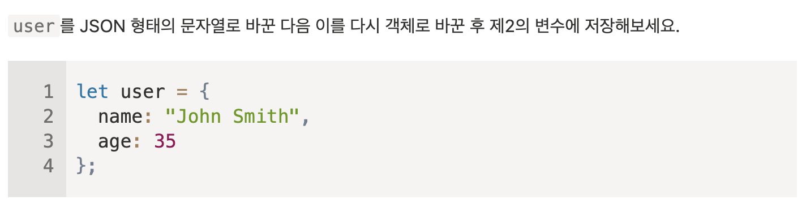

```js
let user = {
  name: "John Smith",
  age: 35
};

let user2 = JSON.parse(JSON.stringify(user));
```

2. 역참조 배제하기

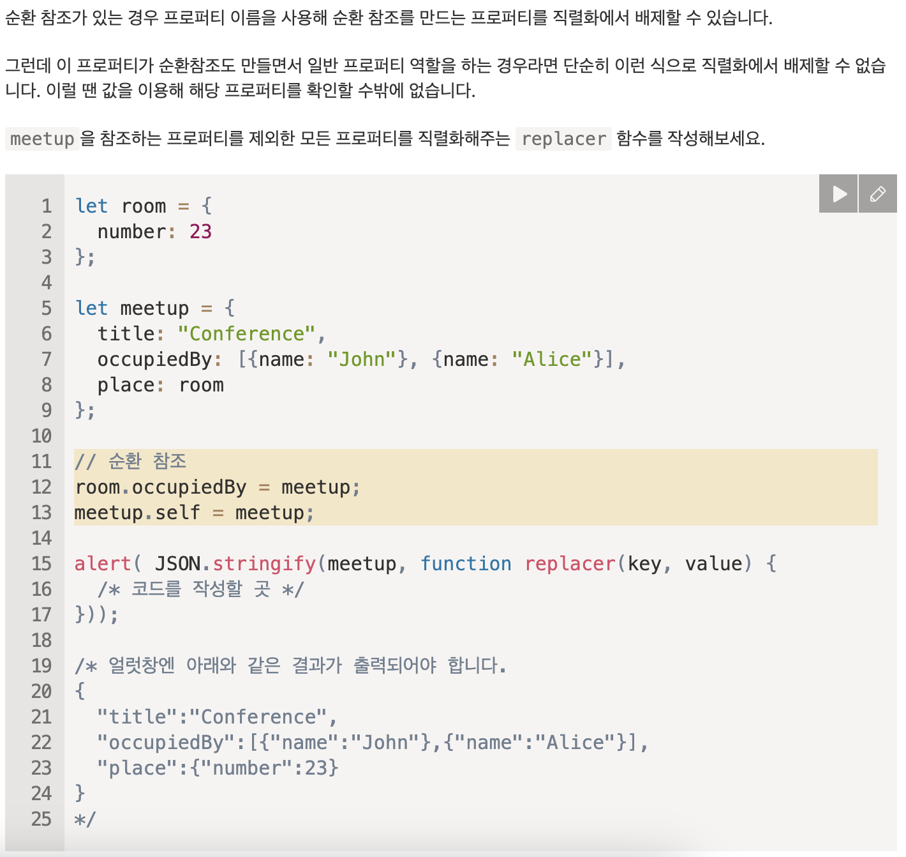

```js
let cache = [];

alert(JSON.stringify(meetup, function replacer(key, value) {
  if (cache.includes(value)) return undefined;
  cache.push(value);
  return value;
}));
```

잘못된 부분이 있으면 알려주세요😁