## 6.1 재귀와 스택

재귀는 함수가 자기 자신을 호출하는 것을 의미합니다.

예를 들어 1부터 n까지의 곱을 반환하는 함수 factorial(n)이 있다고 해봅시다.<br>
위 함수를 구현하는 방법에는 아래 두 가지가 있습니다.

1. 반복적인 사고를 통한 방법: for 루프

```js
function factorial(n) {
  let result = 1;

  for (let i = 2; i <= n; i++) {
    result *= i;
  }

  return result;
}

alert(factorial(4)); // 24
```

2. 재귀적인 사고를 통한 방법: 자기 자신을 호출함

```js
function factorial(n) {
  if (n == 1) {
    return 1;
  } else {
    return n * factorial(n - 1);
  }
}

alert(factorial(4)); // 24
```

> 재귀를 용한 코드는 짧습니다.<br>
> 위 코드에서 if문 대신 삼항 연산자를 사용하면 간결하게 만들 수 있습니다.

```js
function factorial(n) {
  return n == 1 ? 1 : n * factorial(n - 1);
}
```

### 실행 컨텍스트와 스택

실행 컨텍스트는 함수 실행에 대한 세부 정보를 담고 있는 내부 데이터 구조입니다.<br>
함수 내에서 일어나는 제어 흐름의 현위치, 변수의 현재 값, this의 값 등 상세 정보들이 실행 컨텍스트에 저장됩니다.

함수 호출 1회 당 하나의 실행 컨텍스트가 생성됩니다.

함수 내부에 중첩 호출이 있을 때는 아래와 같은 절차가 수행됩니다.

1. 현재 함수의 실행이 일시 중지됩니다.
2. 중지된 함수와 연관된 실행 컨텍스트는 실행 컨텍스트 스택(execution context stack) 이라는 특별한 자료구조에 저장됩니다.
3. 중첩 호출이 실행됩니다.
4. 중첩 호출 실행이 끝난 이후 실행 컨텍스트 스택에서 일시 중단한 함수의 실행 컨텍스트를 꺼내오고, 중단한 함수의 실행을 다시 이어갑니다.

예를 들어 factorial(4)를 호출했을 때 실행 컨텍스트에서는 아래와 같은 일들이 일어납니다.

#### factorial(4)

```js
function factorial(n) {
  if (n == 1) {
    return 1;
  } else {
    return n * factorial(n - 1);
  }
}
```

위 함수를 사용했을 때는 예를 들어 보겠습니다.

factorial(4)를 호출하는 순간, 실행 컨텍스트엔 변수 n = 4가 저장됩니다.<br>
첫 번째 if문을 보고 조건에 맞지 않으므로 실행흐름은 else 문에서 자기자신을 호출하는 위치인 5번째 줄에 위치하게 됩니다.<br>
그럼 실행 컨텍스트는 다음과 같이 생성됩니다.<br>

- `Context: { n: 4, 다섯 번째 줄 } call: factorial(4)`

다섯 번째 줄에 n \* factorial(n-1)을 계산하려면 새로운 인수가 들어가는 factorial의 서브호출 `facotrial(3)` 이 만들어져야 합니다.

#### factorial(3)

자바스크립트는 중첩 호출을 하기 위해 실행 컨텍스트 스택에 현재 실행 컨텍스트를 저장 후 호출합니다.

이때 앞으로 일어나는 모든 중첩 함수에 대해 아래 동작이 똑같이 적용됩니다.

1. 스택 최상단에 현재 컨텍스트가 기록됨
2. 서브 호출을 위한 새로운 컨텍스트가 만들어짐
3. 서브 호출이 완료되면 기존 컨텍스트를 스택에서 꺼내 실행을 이어감

`factorial(3)` 서브 호출이 시작될 때 실행 컨텍스트는 다음과 같습니다.

- `Context: { n: 3, 첫 번째 줄 } call: factorial(3)`
- `Context: { n: 4, 다섯 번째 줄 } call: factorial(4)`

이전 컨텍스트에 변수, 일시 중단된 줄에 대한 정보가 저장돼 있기 때문에 서브 호출이 끝났을 때 문제 없이 다시 이어서 실행됩니다.

> 실제로는 줄이라는 단위를 사용하지 않습니다.<br>
> 한 줄에 여러 서브 호출이 있을 수 있기에 서브 호출 바로 직후에 시작된다고 봐야합니다.

나머지 서브 호출 동작도 위와 유사합니다.

### 6.1 과제

1. 주어진 숫자까지의 모든 숫자 더하기

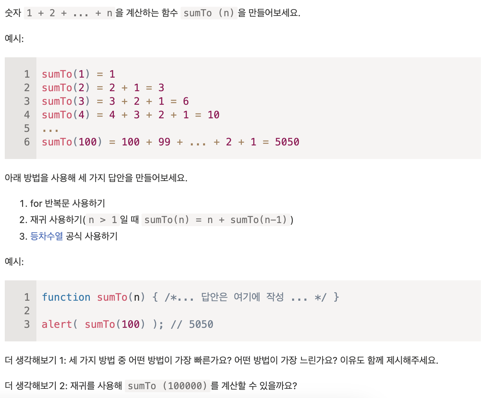

```js
// 1. for 반복문 사용하기
function sumTo(n) {
  let sum = 0;

  for (let i = 1; i <= n; i++) sum += i;

  return sum;
}

// 2. 재귀 사용하기(n > 1일 때 sumTo(n) = n + sumTo(n-1))
function sumTo(n) {
  if (n > 1) return n + sumTo(n - 1);
  return 0;
}

// 3. 등차수열 공식 사용하기
function sumTo(n) {
  return (n * (n + 1)) / 2;
}
```

더 생각해보기 1<br>
세가지 방법 중에 가장 빠른 방법은 3번, 가장 느린 방법은 1번일 것 같다.<br>
3번은 O(1)의 실행 속도를 가지기 때문에 가장 빠르고 1번과 2번은 동작하는 실행 횟수는 같지만 변수를 새로 선언한다는 점에서 더 느릴 것 같다고 생각하기 때문이다.

더 생각해보기 2<br>
계산하다가 실행 컨텍스트 스택을 넘어 버려서 에러가 터질 것 같다.

2. 팩토리얼 계산하기

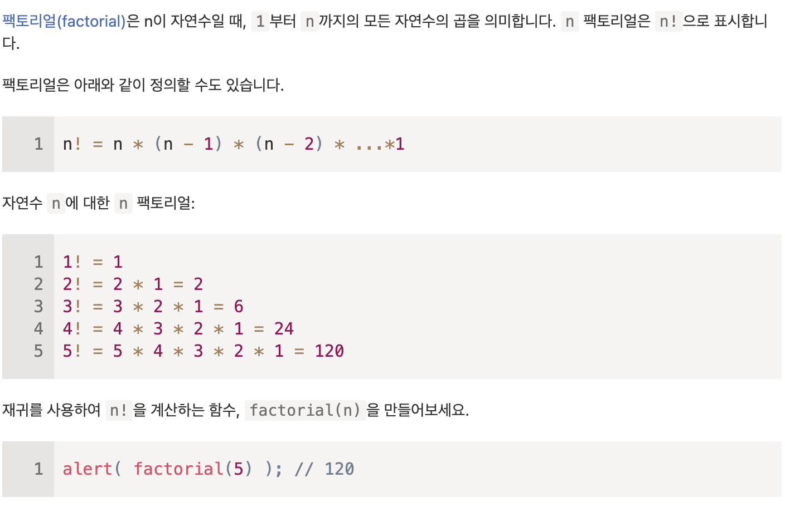

```js
function factorial(n) {
  if (n === 1) return 1;
  return n * factorial(n - 1);
}
```

3. 피보나치 수 계산하기

```js
let mem = {};

function fib(n) {
  if (mem[n]) return mem[n];
  if (n <= 2) return 1;
  mem[n] = fib(n - 1) + fib(n - 2);
  return mem[n];
}
```

4. 단일 연결 리스트 출력하기

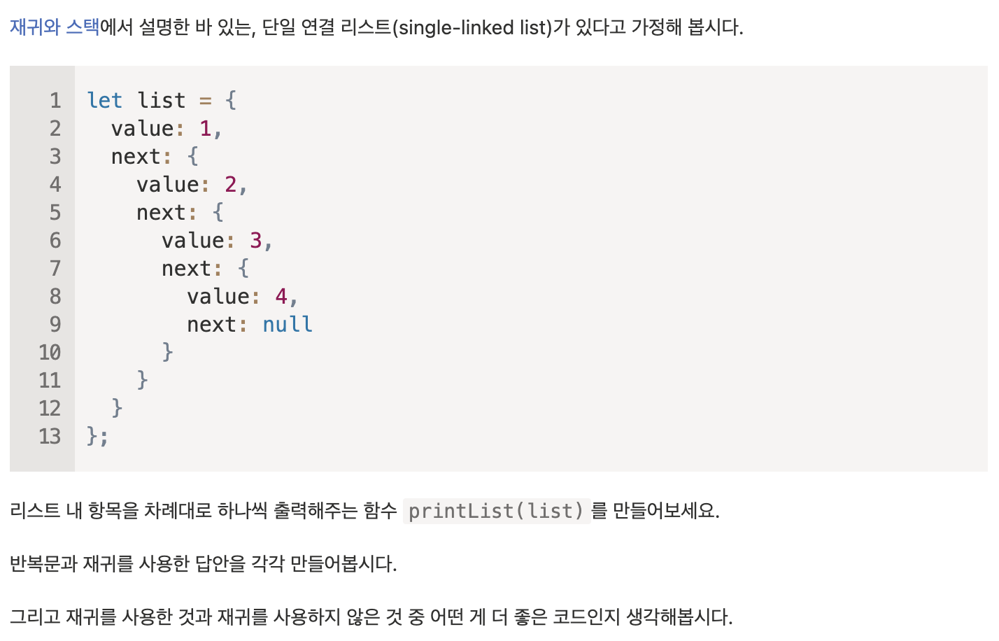

```js
// 반복문
function printList(list) {
  for (; list; list = list.next) {
    console.log(list.value);
  }
}

// 재귀
function printList(list) {
  console.log(list.value);
  if (list.next) printList(list.next);
}
```

5. 단일 연결 리스트를 역순으로 출력하기

```js
// 반복문
function printList(list) {
  const arr = [];
  for (; list; list = list.next) {
    arr.unshift(list.value);
  }
  arr.forEach((value) => console.log(value));
}

// 재귀
function printList(list) {
  if (list.next) printList(list.next);
  console.log(list.value);
}
```

## 6.3 변수의 유효범위와 클로저

### 중첩 함수

함수 내부에 선언한 함수를 중첩 함수라고 합니다.

```js
function greet(fruit, price) {
  function getPrice(n) {
    return `${n} ${fruits}s are ${n * price} dollars`;
  }
  console.log(getPrice(5));
  console.log(getPrice(10));
}
```

위처럼 자바스크렙트에선 중첩 함수가 흔히 사용됩니다.

아래 getCounter 함수는 호출될 때마다 1씩 늘어나는 숫자를 반환하는 함수를 반환합니다.

```js
function getCounter() {
  let count = 0;
  return function () {
    return ++count;
  };
}

let counter = getCounter();

alert(counter()); // 1
alert(counter()); // 2
alert(counter()); // 3
```

이때 getCounter()로 여러개의 counter를 만들었을 때 각 함수들은 독립적인지, 함수와 중첩 함수 내 count 변수에 어떤 값이 할당되는지는 알기 위해선 아래 내용을 알아야 합니다.

### 렉시컬 환경

자바스크립트에서는 실행 중인 함수, 코드 블럭, 스크랩트 전체에 렉시컬 환경이라 불리는 **"내부 숨김 연관 객체(internal hidden associated object)"**를 갖습니다.

렉시컬 환경 객체는 아래 두 부분으로 구성됩니다.

- 환경 레코드(Environment Record): 모든 지역 변수를 프로퍼티로 저장하고 있는 객체. this 값과 같은 기타 정보도 여기에 저장됨
- 외부 렉시컬 환경(Outer Lexical Environment)

아래 4 단계를 통해 렉시컬 환경을 이해할 수 있습니다.

#### 1. 변수

**변수는 특수 내부 객체인 '환경 레코드'의 프로퍼티일 뿐이며, 변수를 가져오거나 변경하는 것은 '환경 레코드의 프로퍼티를 가져오거나 변경'하는 것을 의미합니다.**

아래 코드는 스크립트 전체와 관련된 렉시컬 환경인 전역 렉시컬 환경 하나만 존재합니다.

```js
// Lexical Environment { name: "James" } outer: null
let name = "James";
alert(name);
```

위 코드에서 null을 가리키는 화살표는 전역 렉시컬 환경이 외부 참조를 갖고 있지 않기 때문에 null을 가리킨다는 것을 의미합니다.

만약 변수를 초기화를 하지 않았을 때 실행 흐름 다음과 같습니다.

```js
// Lexical Environment { name: <uninitialized> } outer: null
let name; // { name: undefined }
```

1. 스크립트가 시작되면 스크립트 내서 선언한 모든 변수가 렉컬 환경에 올라갑니다.

   - 이때 변수의 상태는 툭수 내부 상태(special internal state)인 'uninitialized'가 됩니다. 자바스크립트는 uninitialized 상태인 변수를 인지하긴 하지만 let 키워드를 만나기 전까진 이 변수를 참조할 수 없습니다.

2. let 키워드를 만나면 변수의 값은 undefined가 됩니다. 이 시점 이후부터 해당 변수는 사용 가능해집니다.

#### 2. 함수 선언문

함수도 변수와 마찬가지로 값입니다.

다만 함수 선언문은 일반 변수와 달리 바로 초기화된다는 차이점이 있습니다.

변수는 let을 만나기 전까진 사용할 수 없지만 함수 선언문은 렉시컬 환경이 만들어지는 즉시 사용할 수 있습니다.

아래 스크립트에서 전역 렉시컬 환경의 초기 상태는 다음과 같습니다.

```js
// Lexical Environment { name: <uninitialized>, say: function } outer: null
let name = "James";

function greet() {
  alert(`Hello, I'm ${name}`);
}
```

위 상태는 함수 선언문으로 정의한 함수에만 적용되고, 함수 표현식은 해당되지 않습니다.

#### 3. 내부와 외부 렉시컬 환경

함수를 호출하면 호출할 때 넘겨받는 매개변수와 함수내 지역 변수가 저장되는 새로운 렉시컬 환경이 만들어집니다.

```js
let age = 18;

// Lexical Environment of the call
// { name: "John" } outer: { greet: function, age: 18 } outer: null
function greet(name) {
  alert(`Hello, I'm ${name} and ${age} years old.`);
}

greet("John");
```

greet 함수 내에서 변수에 접근할 때 먼저 내부 렉시컬 환경을 검색 범위로 잡습니다.<br>
이때 내부 렉시컬 환경에서 원하는 변수를 찾지 못하면 검색 범위를 내부 렉시컬 환경이 참조하는 외부 렉시컬 환경으로 확장합니다.<br>
이 과정은 검색 범위가 전역 렉시컬 환경에 도달할 때까지 반복됩니다.

전역 렉시컬 환경에 도달할 때까지 변수를 찾지못했다면 엄격 모드에선 에러, 비엄격모드에선 새로운 변수가 만들어집니다.<br>
새로운 변수가 만들어지는 건 하위 호환성을 위해 남아있는 기능입니다.

#### 4. 함수를 반환하는 함수

위에서 봤던 getCounter 함수를 예시로 든다면

```js
function getCounter() {
  let count = 0;
  return function () {
    return ++count;
  };
}

let counter = getCounter();
```

getCounter()를 호출할 때 새로운 렉시컬 환경 객체가 만들어지고, 여기에 필요한 변수들이 저장됩니다.

greet() 함수와의 차이점은 함수 실행 도중에 `return ++count` 코드가 있는 중첩 함수가 만들어진다는 점입니다.

여기서 중요한 사실이 하나 있는데, 모든 함수는 함수가 생성된 곳의 렉시컬 환경을 기억한다는 점입니다.<br>
이때 함수는 \[\[Environment]]라는 숨김 프로퍼티를 같는데 이 함수가 만들어진 곳의 렉시컬 환경에 대한 참조가 저장됩니다.

```js
function getCounter() {
  let count = 0;
  return function () {
    // [[Environment]] -> { count: 0 } outer:
    // { makeCounter: function, counter } outer: null
    return ++count;
  };
}

let counter = getCounter();
```

\[\[Environment]]는 함수가 생성될 때 한 번만 값이 세팅되고 영원히 변하지 않습니다.<br>
또한 위 코드에서 counter()를 호출하면 새로운 렉시컬 환경이 생성되는데<br>
이 렉시컬 환경은 \[\[Environment]]에 저장된 렉시컬 환경을 외부 렉시컬 환경으로서 참조합니다.

```js
function getCounter() {
  let count = 0;
  // empty outer: { count: 0 } outer:
  // { makeCounter: function, counter: function } outer: null
  return function () {
    return ++count;
  };
}

let counter = getCounter();
```

첫번째로 `function() { return ++count; }` 내에는 지역 / 매개 변수가 없으므로 `<empty>` 인 상황입니다. 이 함수의 \[\[Environment]] 를 외부 렉시컬 환경으로서 참조하므로 먼저 { count: 0 } 를 참조합니다.

따라서 counter()가 호출 된 후 상태는 다음과 같습니다.

```js
function getCounter() {
  let count = 0;
  // empty outer: { count: 1 } outer:
  // { makeCounter: function, counter: function } outer: null
  return function () {
    return ++count;
  };
}

let counter = getCounter();
counter();
```

> **클로저**<br>
> 클로저란 외부 변수를 기억하고 이 외부 변수에 접근할 수 있는 함수를 의미합니다.<br>
> 몇몇 언어에선 클로저를 구현하는 게 불가능하거나 특수한 방식을 사용해야 클로저를 만들 수 있습니다.

렉시컬 환경 객체도 다른 객체와 마찬가지로 도달할 수 없을 때 메모리에서 삭제됩니다.

```js
function getCounter() {
  let count = 0;
  return function () {
    return ++count;
  };
}

let counter = getCounter();
counter = null;
```

counter의 외부 렉시컬 환경 겍체 `{ count: 0 }` 를 접근할 방법이 사라져 삭제된다.

#### 최적화 프로세스

앞서 보았듯이, 함수가 살아있는 동안엔 이론상으론 모든 외부 변수는 메모리에 유지된다.<br>
그러나 자바스크립트 엔진은 변수 사용을 분석하고 외부 변수가 사용되지 않는다고 판단되면 이를 메모리에서 제거한다.

최적화 과정을 통해 변수를 사용할 수 없다는 점은 V8 엔진의 주요 부작용이다.

```js
function f() {
  let value = "렉시컬 환경 객체에 저장된 변수";

  return function () {
    debugger; // 콘솔에 실행 후 alert(value)를 입력하면 선언되지 않았다고 에러가 발생함
  };
}
let g = f();
g();
```

### 6.3 과제

1. Does a function pickup latest changes?

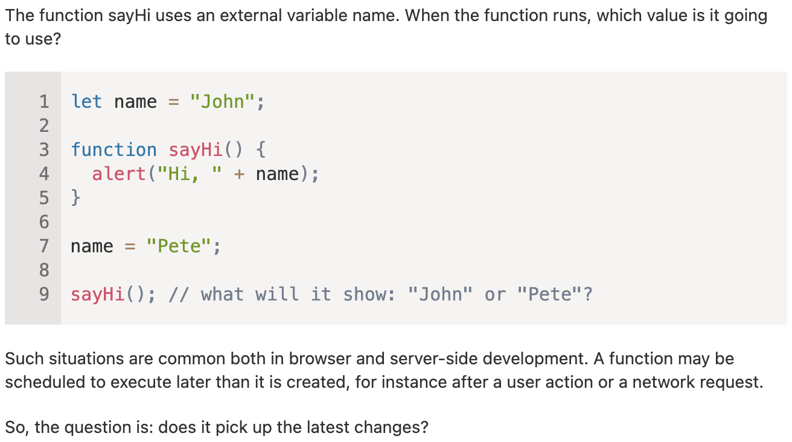

Pete가 보여질 것이다. 전역 렉시컬 환경에 name이 변경된 후 sayHi()를 호출했기 때문이다.

2. Which variables are available?

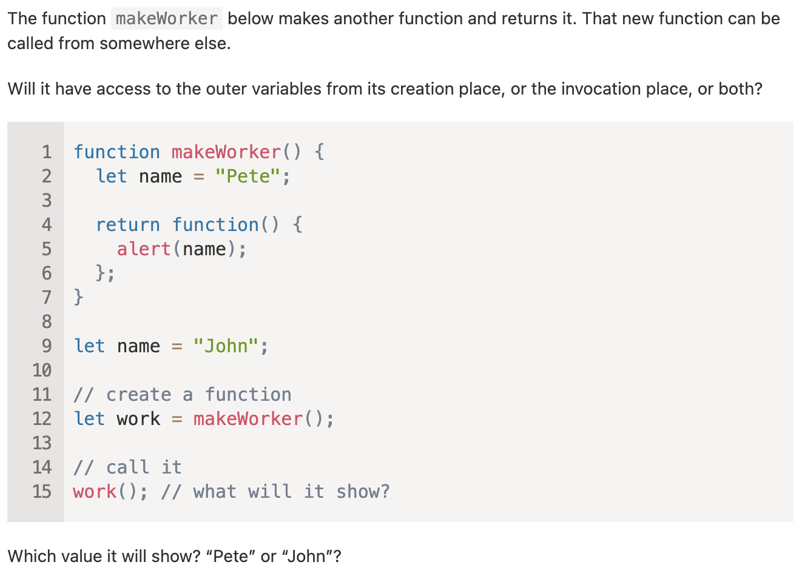

Pete가 출력될 것 같다.<br>
중첩 함수의 바로 바깥에 있는 외부 렉시컬 환경은 그 함수가 선언된 렉시컬 환경을 가리키므로 alert() 함수 내 name은 'Pete'가 저장된 name을 먼저 만나기 때문이다.

3. counter는 독립적일까요?

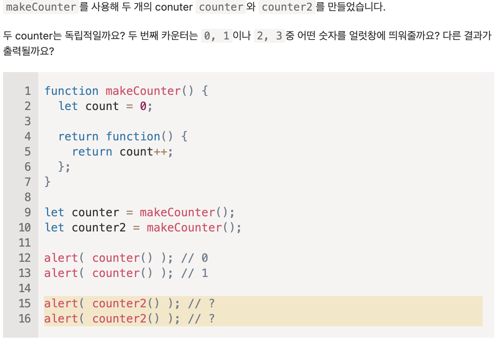

0, 1을 띄워줄 것 같다.<br>
counter와 counter2는 각각의 함수를 반환받으므로 각각의 외부 렉시컬 환경을 가질 것 같기 때문이다.

4. counter 객체

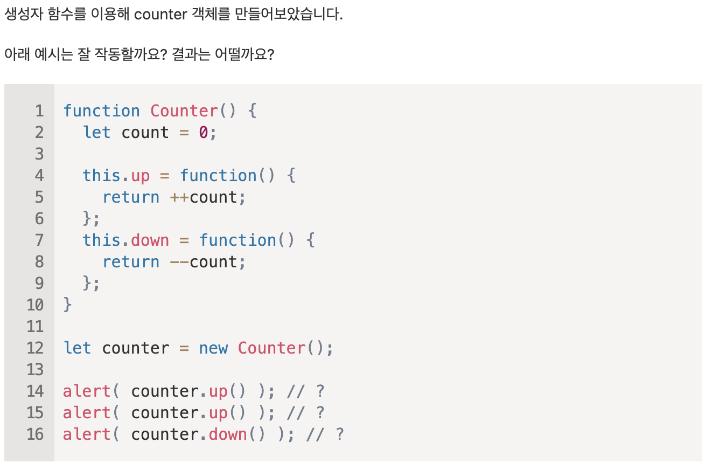

잘 작동할 것 같다.<br>
결과는 각각 1, 2, 1 이 출력될 것 같다.

5. if 문 안의 함수

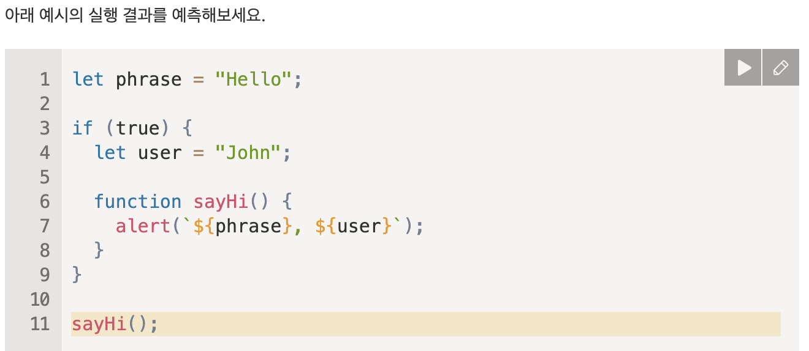

에러가 날 것 같다.

function sayHi()는 if 문 블럭 안에 선언되어 있으므로 전역 렉시컬 환경에서 호출된 sayHi()가 접근할 수 없을 것 같기 때문이다.

6. 클로저를 이용하여 합 구하기

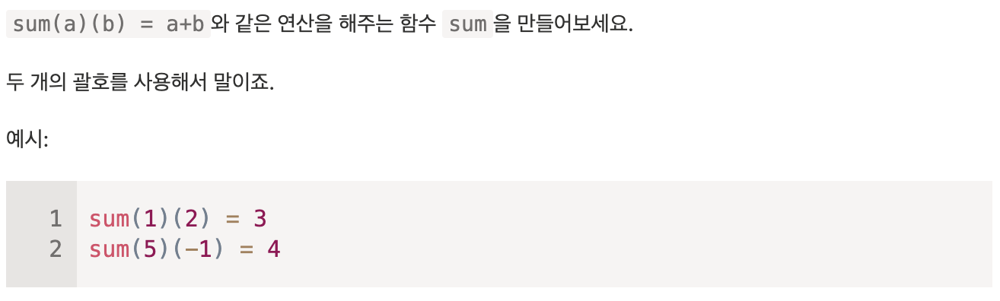

```js
function sum(firstNum) {
  return function (secondNum) {
    return firstNum + secondNum;
  };
}
```

7. Is variable visible?

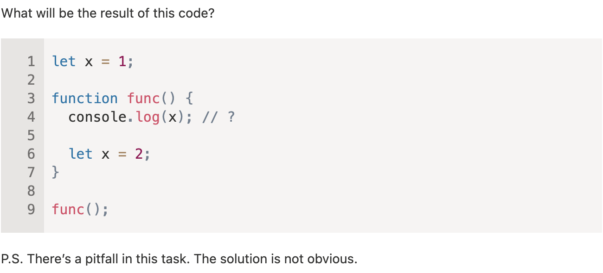

1이 출력될 것이다.<br>
func() 함수 내에서 `let x = 2` 는 console.log() 메서드가 실행된 후에 선언됐기 때문에 console.log() 내 x는 외부 렉시컬 환경에 있는 x 를 가리킬 것이기 때문이다.

해답<br>
에러가 발생한다.

함수가 실행될 때 변수는 uninitialized 상태를 가진다.<br>
이때 변수는 let을 만나지 전가진 위 상태를 유지하기 때문에 초기화 되지 않은 변수를 사용했으므로 에러가 발생한다.

추가로 변수를 일시적으로 사용할 수 없는 이 영역(코드 블록 시작부터 let 까지)을 '데드 영역'이라고 한다.

8. 함수를 이용해 원하는 값만 걸러내기

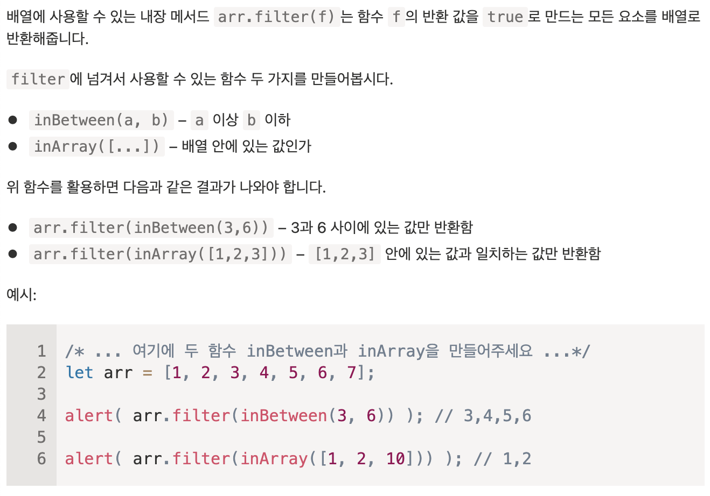

```js
function inBetween(start, end) {
  return (value) => start <= value && value <= end;
}

function inArray(arr) {
  return (value) => arr.includes(value);
}
```

9. 필드를 기준으로 정렬하기

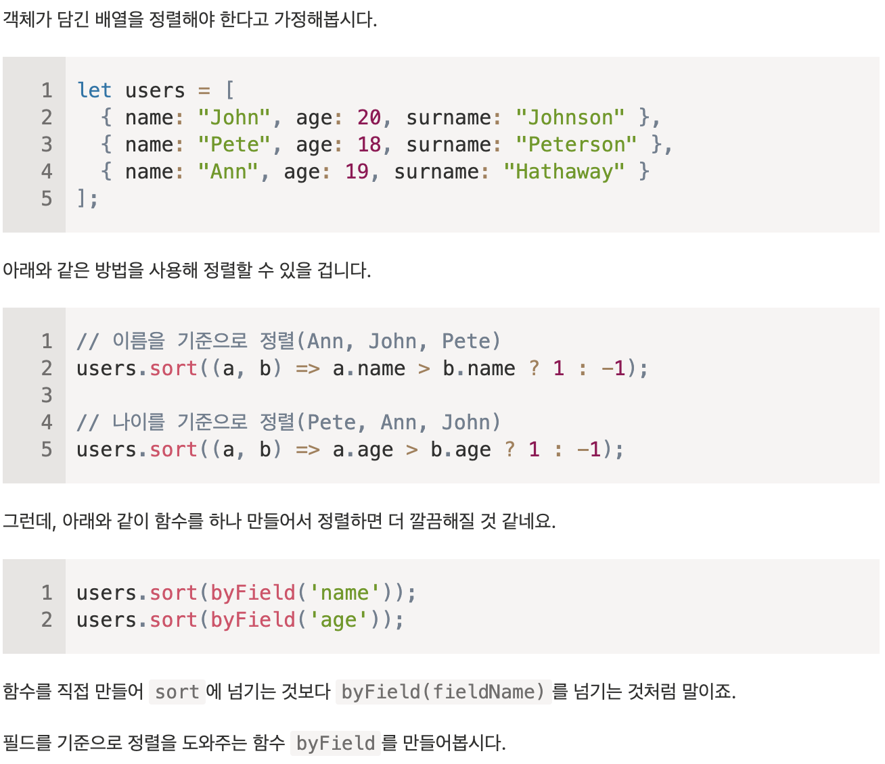

```js
function byField(field) {
  return (a, b) => (a[field] > b[field] ? 1 : -1);
}
```

10. 함수를 사용해 군대 만들기

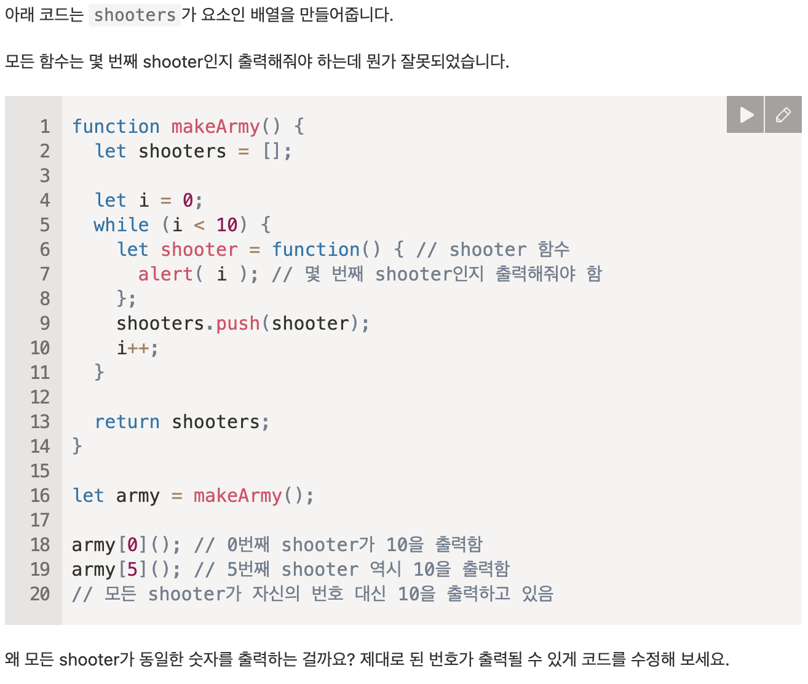

makeArmy가 호출될 때 새로 만들어진 렉시컬 환경에는 shooters, i 라는 변수가 있다.<br>
이때 while문 내에 10번 선언된 함수 표현식 shooter는 함수 내에 i가 모두 동일한 외부 렉시컬 환경의 i이므로 10개의 함수 표현식이 10번 더해진 i를 가리키게 된다.

아래처럼 수정하면 제대로 출력된다.

```js
function makeArmy() {
  let shooters = [];

  let i = 0;
  while (i < 10) {
    let j = i;
    let shooter = function () {
      // shooter 함수
      alert(j); // 몇 번째 shooter인지 출력해줘야 함
    };
    shooters.push(shooter);
    i++;
  }

  return shooters;
}
```

j는 while문 내에서 i값을 복사한 변수로 10개의 함수 표현식이 외부 렉시컬 환경의 i가 아닌 while문 내에 j를 가리키면 각각 다른 값이 출력되게 되므로 제대로 출력된다.

## 6.6 객체로서의 함수와 기명 함수 표현식

함수는 객체입니다.<br>
호출이 가능한 행동 객체라고 이해하면 쉽습니다. 때문에 함수에 프로퍼티를 추가하거나 삭제, 참조를 통해 전달할 수 있습니다.

### name 프로퍼티

name 프로퍼티로 함수 이름을 가져올 수 있습니다.

```js
function foo() {}
let baz = function () {};
let fee = () => {};

alert(foo.name);
alert(baz.name);
alert(fee.name);
```

위에서 익명함수도 이름을 가지고 올 수 있는데 자바스크립트 명세서에서 이 기능을 'contextual name'이라고 부릅니다.<br>
익명 함수의 이름을 지정할 땐 컨텍스트에서 이름을 가지고 옵니다.

그래도 객체 메서드 이름을 추론하는게 불가능한 상황이 있는데 이때는 name 프로퍼티에 빈 문자열이 저장됩니다.

```js
let arr = [function () {}];
alert(arr[0].name); // ''
// 엔진이 이름을 설정할 수 없어 빈 문자열을 저장함
```

### length 프로퍼티

함수에서 length는 함수 매개변수의 개수를 반환합니다.

```js
function f1(a) {}
function f2(a, b) {}
function f2NOthers(a, b, ...more) {}

alert(f1.length); // 1
alert(f2.length); // 2
alert(f2NOthers.length); // 2
```

이때 나머지 매개변수는 개수에 포함되지 않습니다.

### 커스텀 프로퍼티

아래처럼 커스텀 프로퍼티를 만들어서 함수 호출 횟수를 저장하는 프로퍼티를 만들 수 있습니다.

```js
function call() {
  alert("호출됨");

  call.counter++;
}
call.counter = 0;

call();
call();

alert(`호출 횟수: ${call.counter}회`); // 호출 횟수: 2회
```

> 프로퍼티와 변수는 다릅니다.<br>
> 함수내에 let counter와 call.counter는 전혀 관계가 없습니다.

### 기명 함수 표현식

기명 함수 표현식(Named Function Expression, NFE)은 이름이 있는 함수 표현식을 나타냅니다.

일반적인 함수 표현식은 아래와 같습니다.

```js
let call = function (name) {
  alert(`Hello, ${name}`);
};
```

여기에 이름이 붙은게 기명 함수 표현식입니다.

```js
let call = function func(name) {
  alert(`Hello, ${name}`);
};
```

기명 함수 표현식을 사용하면 함수 표현식 내부에서 자기 자신을 참조할 수 있습니다.

```js
let call = function func(name) {
  if (name) {
    alert(`Hello, ${name}`);
  } else {
    func("Anonymous");
  }
};

call(); // Hello, Anonymous
```

위 코드에서 함수 표현식 내에 call()을 넣는다면 아래 상황에서 에러가 발생합니다.

```js
let call = function (name) {
  if (name) {
    alert(`Hello, ${name}`);
  } else {
    call("Anonymous"); // TypeError: call is not a function
  }
};
let greet = call;
call = null;

greet();
```

함수 표현식 내에 call이 없기 때문에 외부 렉시컬 환경에서 call을 찾는데, 함수가 호출되는 시점에서 call에는 null이 저장되어 있기 때문에 에러가 발생합니다.

때문에 아래처럼 바꿔주면 문제를 해결할 수 있습니다.

```js
let call = function func(name) {
  if (name) {
    alert(`Hello, ${name}`);
  } else {
    func("Anonymous");
  }
};
let greet = call;
call = null;

greet(); // Hello, Anonymous
```

### 6.6 과제

1. 숫자 설정과 감소가 가능한 counter 만들기

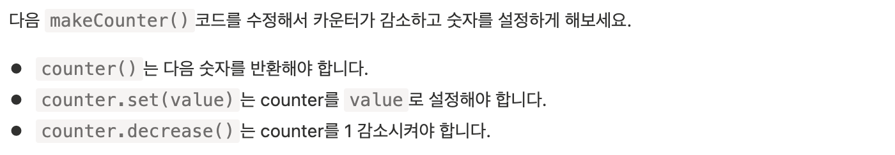

```js
function makeCounter() {
  function counter() {
    return ++counter.count;
  }
  counter.count = 0;
  counter.set = (value) => {
    counter.count = value;
  };
  counter.decrease = () => {
    counter.count--;
  };

  return counter;
}
```

2. 임의의 수만큼 있는 괄호를 이용해 합계 구하기

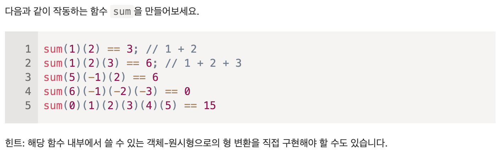

```js
function sum(num) {
  sum.num += num;
  return sum;
}
sum.num = 0;
sum[Symbol.toPrimitive] = () => {
  let result = sum.num;
  sum.num = 0;
  return result;
};

console.log(sum(1)(2));
console.log(sum(1)(2)(3));
console.log(sum(5)(-1)(2));
console.log(sum(6)(-1)(-2)(-3));
console.log(sum(0)(1)(2)(3)(4)(5));
```

해답

```js
function sum(a) {
  let currentSum = a;

  function f(b) {
    currentSum += b;
    return f;
  }

  f.toString = function () {
    return currentSum;
  };

  return f;
}

alert(sum(1)(2)); // 3
alert(sum(5)(-1)(2)); // 6
alert(sum(6)(-1)(-2)(-3)); // 0
alert(sum(0)(1)(2)(3)(4)(5)); // 15
```

## 6.7 new Function 문법

new Function 문법을 사용하면 인수만으로 함수를 만들 수 있습니다.

```js
let func = new Function([arg1, arg2, ...argN], functionBody);
```

함수의 인수는 arg1부터 argN에 정의하고, 함수 본문은 functionBody에 정의합니다.

```js
let sum = new Function("a", "b", "return a + b");
// 또는 let sum = new Function("a, b", "return a + b"); 처럼 쉼표로 구분해줘도 된다.
alert(sum(1, 2)); // 3
```

함수의 본문만 집어넣을 수도 있다.

```js
let greet = new Function('alert("Hello")');
greet(); // Hello
```

서버에서 받은 코드를 실행시키거나 템플릿을 사용해 함수를 동적으로 컴파일할 때 new Function()을 사용할 수 있다.

### 클로저

new Function을 이용해 함수를 만들면 함수의 \[\[Environment]] 프로퍼티가 함수의 현재 렉시컬 환경이 아닌 전역 렉시컬 환경을 참조하게 됩니다.

```js
function fooBaz() {
  let name = "James";
  let func = new Function("alert(name)");
  return func;
}

fooBaz()(); // ReferenceError: name is not defined
```

덕분에 에러를 예방해준다는 장점이 있습니다.<br>
new Function()은 구조상으론 매개변수를 사용해 값을 받는게 낫습니다.<br>
압축기에 의해 코드가 압축될 때 변수명이 변경되면서 생기는 에러를 방지할 수 있기 때문입니다.

## 6.8 setTimeout과 setInterval을 이용한 호출 스케줄링

일정 시간이 지난 후 원하는 함수를 예약 실행할 수 있게 하는 것을 '호출 스케줄링(scheduling a call)'이라고 합니다.

호출 스케줄링에는 아래 두가지가 있습니다.

1. setTimeout
2. setInterval

자바스크립트 명세서엔 명시되어있지 않지만 시중에 나와 있는 모든 브라우저, Node.js를 포함한 환경 대부분이 이와 유사한 메서드와 내부 스케줄러를 지원합니다.

### setTimeout

문법은 다음과 같습니다.

```js
let timerId = setTimeout(func|code, [delay], [arg1], [arg2], ...);
```

- `func|code` 실행하고자 하는 함수 혹은 문자열, 대개는 함수가 들어감, 하위 호환성을 위해 문자열도 받을 수 있게 해놨지만 추천하진 않음
- `delay` 밀리초 단위의 대기 시간
- `arg1, arg2, ...` 함수에 전달할 인수들

위 문법을 토대로 아래 예시처럼 쓸 수 있다.

```js
function greet(name, phrase) {
  alert(name + "님, " + phrase);
}
let timerId = setTimeout(greet, 1000, "James", "안녕하세요"); // James님, 안녕하세요
```

이때 clearTimeout() 함수로 예약된 타이머를 취소할 수 있다.

```js
function greet(name, phrase) {
  alert(name + "님, " + phrase);
}
let timerId = setTimeout(greet, 1000, "James", "안녕하세요"); // 아무거도 출력 안됨
clearTimeout(timerId);
```

### setInterval

setInterval의 인자도 setTimeout과 동일합니다.<br>
setInterval도 예약을 취소할 때 clearInterval() 함수를 사용하면 됩니다.

추가로 alert 창이 떠 있더라도 타이머는 멈추지 않습니다.

### 중첩 setTimeout

아래처럼 중첩 setTimeout으로 setInterval을 대신할 수 있습니다.

```js
let timerId = setTimeout(function tick() {
  alert("Hi!");
  timerId = setTimeout(tick, 2000);
}, 2000);
```

위 코드는 2초마다 `alert("Hi!")` 를 실행합니다.<br>
위처럼 중첩 setTimeout을 사용하면 딜레이를 원하는 방식으로 제때제때 정할 수 있습니다.

서버에 5번 요청을 보내는데 각각 10초, 20초, 40초, ... 간격으로 요청을 보낸다고 할 때 아래처럼 만들 수 있습니다.

```js
let delay = 1000;

let timerId = setTimeout(function request() {
  // ...요청 보내기
  if (/*서버 응답 실패*/) {
    delay *= 2;
  }
  timerId = setTimeout(request, delay);
})
```

추가로 중첩 setTimeout은 setInterval과 다르게 지연 간격을 보장합니다.

```js
setTimeout(function func() {
  // 2초 걸리는 작업 (3초마다 동작)
  setTimeout(func, 3000);
}, 3000);
```

위 코드에서 `2초 걸리는 작업` 은 작업이 끝난 후 3초 뒤에 작업이 또다시 시작됩니다.<br>
그러나 아래의 setInterval 같은 경우엔 작업의 시작을 기준으로 초를 재기 때문에<br>
`2초 걸리는 작업` 은 작업이 끝난 후 1초 뒤에 작업이 또다시 시작됩니다.

```js
setInterval(() => {
  // 2초 걸리는 작업 (1초마다 동작)
}, 3000);
```

> 가비지 컬렉션과 setTimeout, setInterval
>
> setTimeout이나 setInterval에 함수를 넘기면, 내부에 함수에 대한 참조가 만들어지는데 때문에 함수를 참조하는 것이 없어도 메모리에서 사라지지 않습니다.
>
> setInterval의 경우엔 clearInterval가 호출되기 전까진 함수가에 대한 참조가 메모리에 유지돼 사라지지 않습니다.
>
> 만약 이 함수가 외부 렉시컬 환경을 참조하고 있다면 외부 렉시컬 환경 전체 또한 함수가 사라질때까지 메모리에 남게 됩니다.
>
> 이런 부작용을 방지하고 싶다면 필요없는 스케줄링은 clearTimeout, clearInterval를 호출해서 취소해줘야 합니다.

### 6.8 과제

1. 일초 간격으로 숫자 출력하기

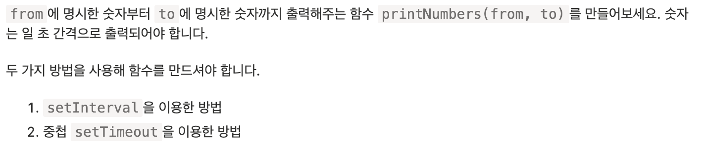

```js
// setInterval
function printNumbers(from, to) {
  const id = setInterval(() => {
    console.log(from++);
    if (from > to) clearInterval(id);
  }, 1000);
}

// setTimeout
function printNumbers(from, to) {
  setTimeout(function run() {
    console.log(from++);
    if (from <= to) {
      setTimeout(run, 1000);
    }
  }, 1000);
}
```

2. setTimeout 은 무엇을 보여줄까요?

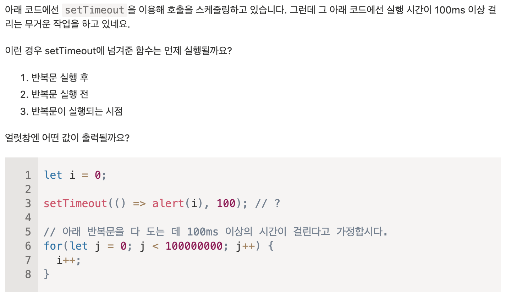

100000000 이 출력될 것이다.<br>
setTimeout(), setInterval() 내에 함수는 모든 실행이 끝난 후 실행되기 때문이다.

잘못된 부분이 있으면 알려주세요😁
