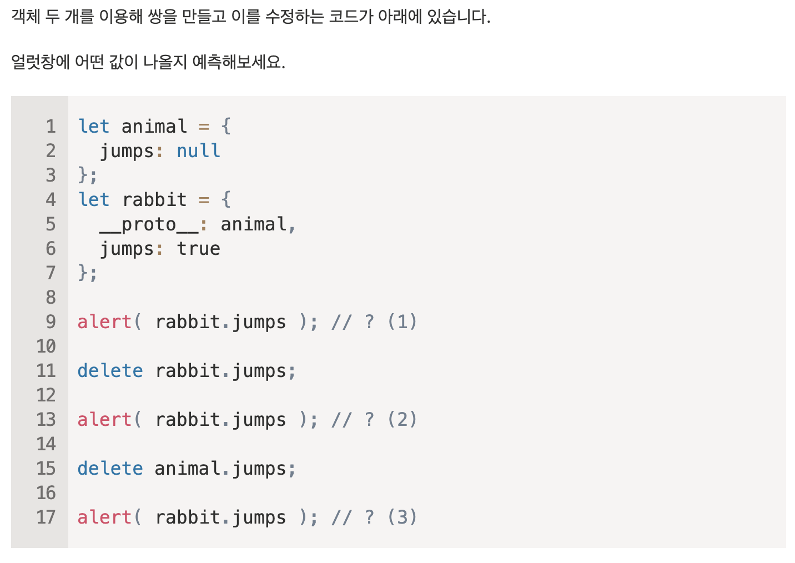
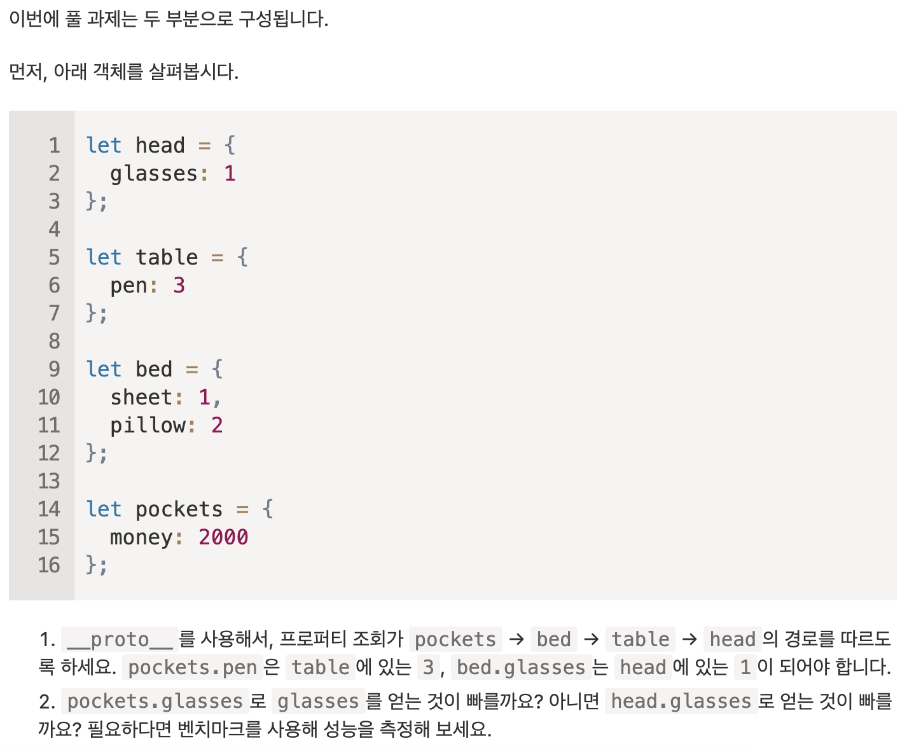
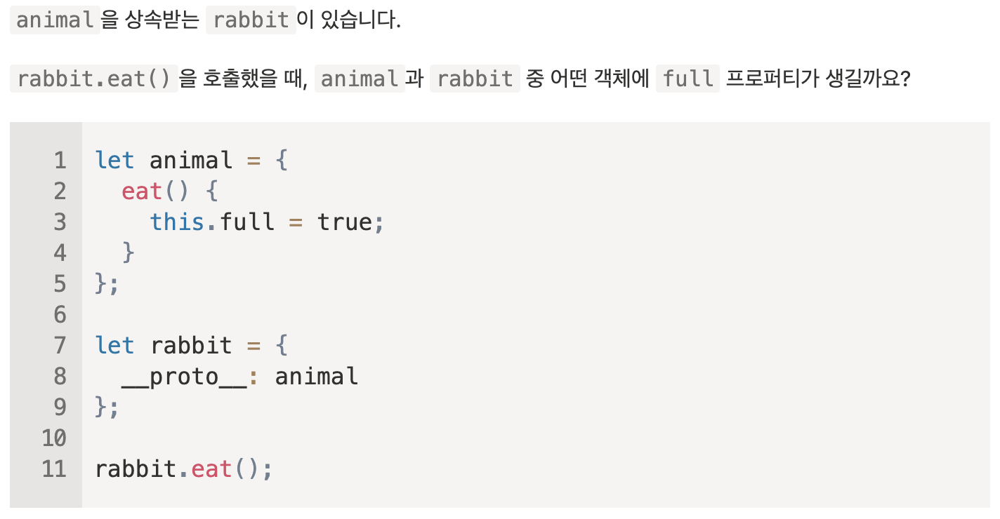
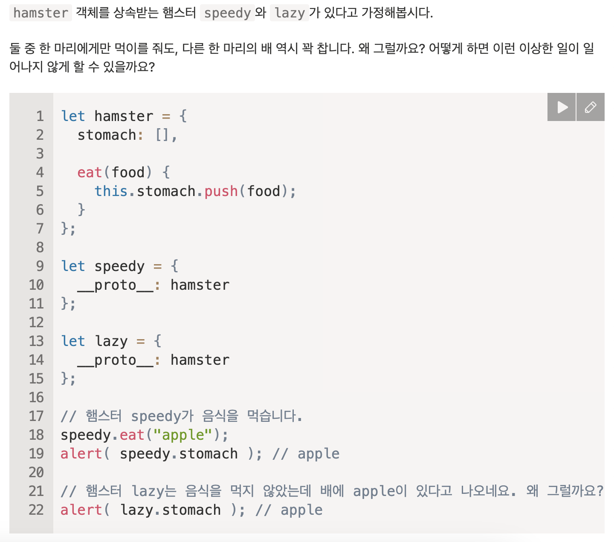
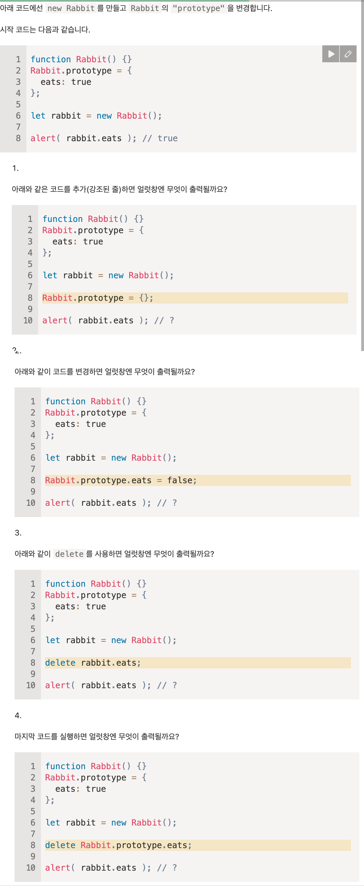
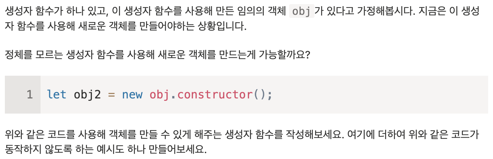
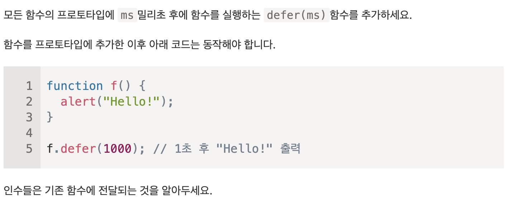

## 8.1 프로토타입 상속

user라는 객체에서 user객체와 유사한 admin과 guest라는 객체를 만들 때 자바스크립트 고유 기능인 프로토타입 상속을 사용할 수 있습니다.

### \[\[Prototype]]

자바스크립트의 객체는 명세서에서 명명한 \[\[Proptotype]] 이라는 숨김 프로퍼티를 갖습니다.  
이 숨김 프로퍼티는 null 값이거나 다른 객체를 참조하는데, 이때 참조하는 객체를 '프로토타입'이라고 부릅니다.

```js
object[[Prototype]] -> [prototype object]
```

프로토타입 상속이란?  
객체에 없는 프로퍼티를 읽을 때 자동으로 프로토타입에서 프로퍼티를 찾는 동작 방식을 말합니다.

\[\[Prototype]]은 내부 / 숨김 프로퍼티지만 다양한 방법으로 값을 설정할 수 있습니다.

다음처럼 **proto**를 사용하면 값을 설정할 수 있습니다.

```js
let app = {
    name: "Nice app",
}
let admin = {
    salary: 2000
},
admin.__proto__ = app;
console.log(admin.name); // Anonymous
```

admin에서 name을 읽으려 했는데 프로퍼티가 존재하지 않습니다. 이때 JS는 \[\[Prototype]]이 참조하고 있는 객체인 app에서 name을 가져옵니다.  
이렇게 프로토타입에서 상속받은 프로퍼티를 '상속 프로퍼티(inherited property)'라고 합니다.

> **proto**는 \[\[Prototype]]용 getter, setter입니다. > **proto**는 하위 호환성 때문에 여전히 사용할 순 있지만  
> 근래엔 **proto**대신 Object.getPrototypeOf()와 Object.setPrototypeOf()를 써서 프로토타입을 획득 / 설정할 수 있습니다. **proto**는 구식 방식이라 만약 실제로 사용할 때는 안 사용하는게 좋습니다.
>
> JS 명세서에선 **proto**는 브라우저 환경에서만 지원하도록 규정했는데, 실상은 서버 사이드 포함 모든 호스트 환경에서 **proto**를 지원합니다.

다음처럼 객체 내에서 바로 상속받을 수도 있습니다.

```js
let app = {
  name: "Nice app",
};

let admin = {
  salary: 2000,
  __proto__: app,
};

let serverAdmin = {
  tech: "Node.js",
  __proto__: admin,
};
```

프로토타입 체이닝엔 아래 두 가지 제약사항이 있습니다.

1. 순환 참조는 허용되지 않습니다.
2. **proto**의 값은 객체 또는 null만 들어가며 다른 자료형(숫자, 문자, 불린, BigInt, Symbol, undefined)은 무시됩니다.

### 프로토타입은 읽기 전용이다

프로토타입은 프로퍼티를 읽을 때만 사용됩니다.  
아래의 경우엔 run 메서드는 admin에 생성됩니다.

```js
let app = {
  name: "Nice app",
  run() {
    console.log("App is running...");
  },
};

let admin = {
  __proto__: app,
};

admin.run = function () {
  console.log("Another log");
};
```

아래처럼 admin에 함수가 생깁니다.

```
admin { run: function } [[Prototype]] ->
app { run: function, name: "Nice app" }
```

그런데 프로토타입의 접근자 프로퍼티에 값을 할당한다면 상속 받는 객체에 새로운 프로퍼티가 생기지 않고, 프로토타입의 setter가 호출됩니다.

```js
let app = {
  _name: "Nice app",

  get name() {
    return this._name;
  },
  set name(value) {
    this._name = value;
  },
};

let admin = {
  __proto__: app,
};

admin.name = "Good app"; // app에 setter가 잘 호출됨

console.log(admin.name); // Good app
console.log(app.name); // Nice app
```

이상하게 app.name과 admin.name의 값이 다릅니다. 이건 admin은 console.log()로 출력해보면 알 수 있습니다.

```js
console.log(admin); // { _name: "Good app" }
```

admin에 \_name이라는 프로퍼티가 하나 생겼습니다.  
app 객체에네 setter와 getter도 메서드와 마찬가지로 호출한 객체가 this가 되기 때문입니다.  
admin.name에 "Good app" 값을 할당하거나 가져올 때 this는 admin을 가리키기 때문에 app과 admin의 \_name 프로퍼티가 다른 값을 가지게 된 것입니다.

이를 통해 우리는 메서드는 공유되지만, 상태는 공유되지 않는다는 것을 알 수 있습니다.

### for..in 반복문

for..in은 상속 프로퍼티도 순회대상에 포함시킵니다.

```js
let app = {
  name: "Nice app",
};

let admin = {
  salary: 2000,
  __proto__: app,
};
console.log(Object.keys(app)); // ['name']

for (let key in admin) console.log(key); // salary, name
```

추가로 obj.hasOwnProperty(key)를 이용하면 프로토타입이 아닌 객체에 직접 키가 구현돼 있는지 확인할 수 있습니다.

```js
let app = {
  name: "Nice app",
};

let admin = {
  salary: 2000,
  __proto__: app,
};

for (let key in admin) {
  let isOwnProp = admin.hasOwnProperty(key);

  if (isOwnProp) {
    console.log("객체 자신의 프로퍼티:", key);
  } else {
    console.log("상속 프로퍼티:", key);
  }
}
```

위 예시의 상속 관계는 아래와 같습니다.

```
admin
    { salary: 2000 } [[Prototype]] ->
app
    { name: "Nice app" } [[Prototype]] ->
Object.prototype
    { toString: function, hasOwnProperty: function, ... } [[Prototype]] ->
null
```

app이 Object.prototype을 상속받고 있는 것을 볼 수 있는데 이유는 app이 객체 리터럴 방식으로 선언되었기 때문입니다.

for..in은 상속 프로퍼티도 출력한다고 했는데 Object의 메서드들이 출력되지 않은 이유는 Object의 모든 메서드들의 enumerable 플래그가 false이기 때문입니다.

추가로 키: 값을 순회하는 메서드들(Object.keys(), Object.values(), ...) 대부분은 상속 프로퍼티를 제외하고 동작합니다.

### 8.1 과제

1. 프로토타입 이해하기



순서대로 true, null, undefined가 출력될 것 같다.

2. 검색 알고리즘



2-1.

```
pockets.__proto__ = bed;
bed.__proto__ = table;
table.__proto__ = head;
```

를 추가하면 된다.

2-2. (해답)
모던 엔진에선 프로퍼티가 어디서 발견됐는지 기억하고 있다가 요청 시 이 정보를 재사용하기에 성능적인 차이는 없다고 합니다.  
위 예시에서 엔진은 glasses가 발견된 곳, head를 기억하고 있다가 요청시 이 프로퍼티가 발견된 곳에서 검색을 합니다.

3. 어디에 프로퍼티가 추가될까요



full 프로퍼티는 rabbit 객체에 생길 것입니다.

메서드내 this는 이 메서드를 호출한 객체를 가리키기 때문입니다.

4. 왜 햄스터 두 마리 모두 배가 꽉 찼을까요



speedy와 lazy 객체를 보면 stomach이라는 프로퍼티가 존재하지 않습니다.  
때문에 두 객체에서 stomach이라는 프로퍼티를 가져올 때 두 객체의 프로토타입인 hamster에서 프로퍼티를 가져오게 됩니다.  
둘 다 같은 프로토타입을 상속 받으므로 둘 중 한 마리만 먹이를 먹어도 다른 한 마리 또한 똑같이 배가 차게 되는 것입니다.

해결하려면 두 객체에 `stomach: []` 프로퍼티를 추가하면 됩니다.

해답:  
eat() 메서드의 내용을 아래처럼 변경하면 됩니다.

```js
let hamster = {
  stomach: [],

  eat(food) {
    this.stomach = [food];
  },
};
```

`this.stomach=` 은 객체 자체의 프로퍼티를 가리키기 때문입니다.

## 8.2 함수의 prototype 프로퍼티

객체는 리터럴 뿐만 아니라 생성자 함수로도 만들 수 있다는 것을 알고 있을 겁니다.  
생성함수와 리터럴 방식의 차이점은 생성자 함수의 프로토타입이 객체인 경우, new 연산자로 객체를 생성할 때, 그 객체는 생성자 함수의 프로토타입 정보를 사용해 \[\[Prototype]]을 설정한다는 것입니다.

> 옛날에는 프로토타입에 직접 접근할 수 있는 방법이 없었습니다. 때문에 생성자 함수의 prototype 프로퍼티를 이용하는 방법 밖에 없었습니다. 이것이 아직도 많은 스크립트가 이 방법을 사용하는 이유입니다.

생성자 함수의 객체의 프로토타입을 설정하는 프로퍼티 prototype은 앞에 **proto**과 다른 생성자 함수의 일반적인 프로퍼티입니다.

```js
let app = {
  name: "Nice app",
};

function Admin(salary) {
  this.salary = salary;
}

Admin.prototype = app;

let admin = new Admin(2000); // admin.__proto__ = app

console.log(admin.name); // Nice app
```

`Admin.prototype = app` 은 new Admin으로 생성한 객체의 \[\[Prototype]]을 app으로 설정하라는 의미입니다.

위 예시의 구조를 나타내면 다음과 같습니다.

```js
Admin { prototype: app }
app { name: "Nice app" }
admin { salary: 2000, [[Prototype]]: app }
```

> .prototype은 new로 호출할 때만 사용됩니다.
>
> .prototype 프로퍼티가 바뀌면 기존의 \[\[Prototype]]은 그대로 유지됩니다.

### 함수의 디폴트 프로퍼티 prototype과 constructor 프로퍼티

모든 함수는 기본적으로 Foo.prototype = { constructor: Foo } 형태의 prototype 프로퍼티를 갖습니다.  
기본적으로 prototype 프로퍼티는 constructor 프로퍼티 하나만 있는 객체를 가리키는데 이 constructor 프로퍼티는 함수 자기 자신을 가리킵니다.

```js
function Foo() {}
/*
기본 prototype
Foo.prototype = { constructor: Foo }
*/
```

그렇기 때문에 생성자 함수 자기자신과 생성자 함수.prototype.constructor를 비교해보면 true가 출력됩니다.

```js
function Foo() {}

console.log(Foo === Foo.prototype.constructor); // true
```

당연히 constructor 프로퍼티가 있는 객체는 생성자를 통해 생성한 객체의 프로토타입으로 상속됩니다.

```js
function Foo() {}

let foo = new Foo();

console.log(foo.constructor === Foo); // true
```

덕분에 객체에 기본 프로토타입에 constructor 프로퍼티로 또 다른 객체를 생성할 수 있습니다.

```js
function Foo() {}

let foo = new Foo();

let foo2 = new foo.constructor();
```

이 방법으로 어떤 객체가 기본 프로토타입을 상속받고 있는 상태에서  
객체가 어떤 생성자로 생성되었는지 모를 때 유용하게 쓸 수 있습니다.

### 8.2 과제

1. 'prototype' 변경하기



3번에 delete는 객체에 직접 적용된다. 때문에 프로토타입의 eats가 아니라 rabbit의 eats를 삭제하는 것이므로 프로토타입에 아무 영향을 주지 않아 true가 출력됩니다.

2. 동일한 생성자 함수로 객체 만들기



불가능할 수도 있다.
obj의 프로토타입이 기본 프로토타입이 아니라면 불가능합니다.

## 8.3 내장 객체의 프로토타입

prototype 프로퍼티는 모든 내장 생성자 함수에 존재합니다.

이번 챕터로 어떻게 prototype 프로퍼티 응용할 수 있는지 알아봅시다.

### Object.prototype

빈 객체를 출력해보면 "[object Object]"라는 문자열이 출력됩니다.  
toString이 따로 보이지 않은데 해당 문자열이 출력되는 까닭은 다음과 같습니다.

```js
console.log({}); // "[object Object]"
```

위 코드는 아래처럼 늘릴 수 있는데

```js
console.log(new Object()); // "[object Object]"
```

여기서 Object는 내장 생성자 함수입니다.  
Object의 prototype에는 toString을 비롯한 여러가지 메서드가 구현되어 있기에 위처럼 문자열로 변환될 수 있었던 것입니다.  
때문에 아래 코드는 전부 true가 출력됩니다.

```js
console.log({}.__proto__ === Object.prototype); // true
console.log({}.toString === {}.__proto__.toString); // true
console.log({}.toString === Object.prototype.toString); // true
```

이때 Object.prototype 위쪽엔 \[\[Prototype]] 체인 없다는 점을 주의해야 합니다.

```js
console.log(Object.prototype.__proto__); // null
console.log({}.__proto__.__proto__); // null
```

### 다양한 내장 객체의 프로토타입

자바스크립트 명세서에선 모든 내장 프로토타입의 상속 꼭대기엔 Object.prototype이 있어야 한다고 규정합니다. 때문에 몇몇 사람들은 모든 것은 객체를 상속받는다고 말하기도 합니다.

### 네이티브 프로토타입 변경하기

아래처럼 Number.prototype에 메서드를 추가하면 모든 숫자에 메서드를 사용할 수 있게 됩니다.

```js
Number.prototype.getThirteen = function () {
  return 13;
};

(1).getThirteen(); // 13
```

모던 프로그래밍에선 네이티브 프로토타입을 추가/변경하는 경우는 폴리필을 만들 때를 제외하곤 추천하지 않습니다.

폴리필은 자바스크립트 명세서에 있는 메서드와 동일한 기능을 하는 메서드 구현체를 말합니다.

```js
if (!String.prototype.repeat) {
  String.prototype.repeat = function (n) {
    return new Array(n + 1).join(this);
  };
}
```

### 프로토타입에서 메서드 빌려오기

아래처럼 유사 배열 객체를 만들고 유사 배열 객체에 join 메서드 기능을 사용하고 싶은 때 아래처럼 빌려올 수 있습니다.

```js
let obj = {
  0: "Hello",
  1: "world!",
  length: 2,
};

obj.join = Array.prototype.join;

console.log(obj.join(", ")); // Hello, world!
```

메서드 빌리기는 여러 객체에서 필요한 기능을 가져와 섞는 것을 가능하게 해주기에 유연한 개발을 가능하게 해줍니다.

### 8.3 과제

1. 메서드"f.defer(ms)"를 함수에 추가하기



```js
Function.prototype.defer = function (ms) {
  setTimeout(this, ms);
};
```

2. 데코레이팅 "defer()"를 함수에 추가하기

```js
Function.prototype.defer = function (ms) {
  const func = function (...args) {
    setTimeout(() => this(...args), ms);
  };
  return func.bind(this);
};
```

잘못된 부분이 있으면 알려주세요😁
